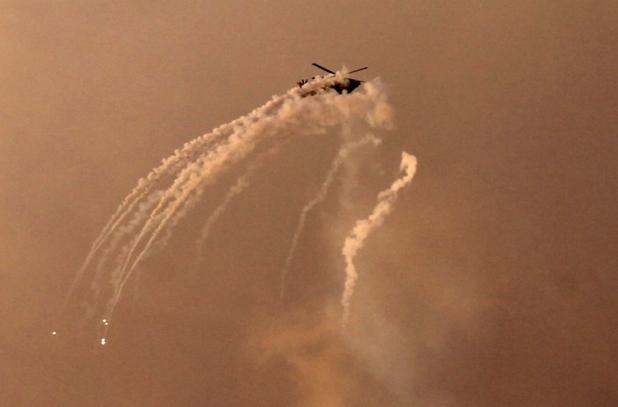
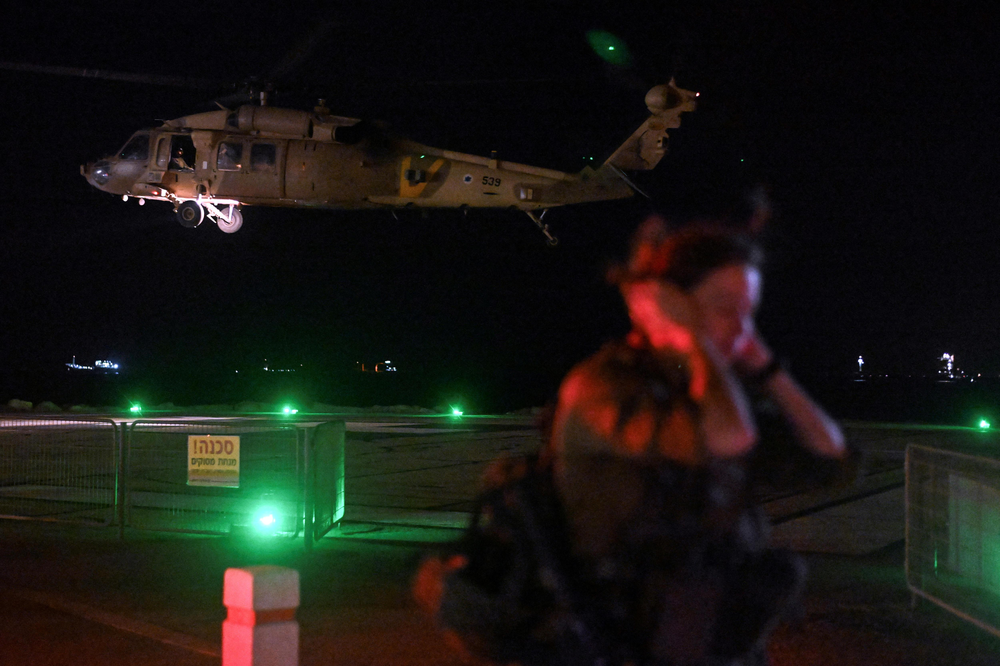
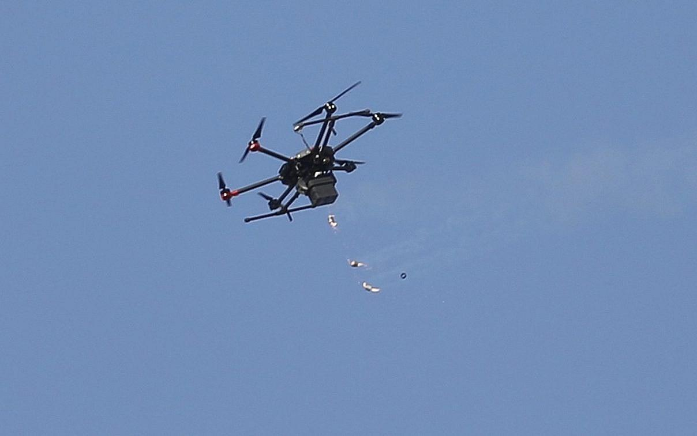

## Claim
Claim: " This image shows an Israeli helicopter shot down by Hezbollah amid clashes in Southern Lebanon on November 23, 2024."

## Actions
```
reverse_search()
image_search("Israeli helicopter shot down Lebanon")
```

## Evidence
### Evidence from `reverse_search`
The image () appears in an article from The Times of Israel, which states that a Palestinian Islamic Jihad cell attempted to down an Israeli military helicopter near Gaza City on May 5, 2019, but the attack failed. The same image is also used in an article from PesaCheck, which states that the image is not of an Israeli helicopter shot down in southern Lebanon. Another article from Arab News PK includes an image of an Israeli helicopter shooting flares over the Gaza Strip on March 25, 2019.

The articles can be found at the following URLs: [https://www.timesofisrael.com/hamas-tried-to-down-an-idf-helicopter-during-fighting-this-month-report/](https://www.timesofisrael.com/hamas-tried-to-down-an-idf-helicopter-during-fighting-this-month-report/), [https://pesacheck.org/archive/2024/12/03](https://pesacheck.org/archive/2024/12/03), and [https://www.arabnews.pk/node/1472406/middle-east](https://www.arabnews.pk/node/1472406/middle-east).


### Evidence from `image_search`
Al Jazeera reports that Hezbollah downed an Israeli helicopter (). The ABC News website published an article on October 14, 2024, about Hezbollah drone attacks, including an image of an Israeli helicopter (). The Times of Israel published an article about Hezbollah claiming to shoot down an Israeli drone ().

Relevant URLs: [https://www.aljazeera.com/news/2006/8/13/hezbollah-downs-israeli-helicopter](https://www.aljazeera.com/news/2006/8/13/hezbollah-downs-israeli-helicopter), [https://www.abc.net.au/news/2024-10-14/hezbollah-drone-attack-kills-four-israeli-soldiers/104469176](https://www.abc.net.au/news/2024-10-14/hezbollah-drone-attack-kills-four-israeli-soldiers/104469176), [https://www.timesofisrael.com/hezbollah-claims-to-shoot-down-israeli-drone-that-crossed-border/](https://www.timesofisrael.com/hezbollah-claims-to-shoot-down-israeli-drone-that-crossed-border/).


## Elaboration
The claim is not supported by the evidence. The image in the claim () is not of an Israeli helicopter shot down in Lebanon. The image has been used in articles about an attempted attack near Gaza in 2019. The evidence also includes reports of Hezbollah downing an Israeli helicopter and claiming to shoot down an Israeli drone, but these events are not connected to the image in the claim.


## Final Judgement
The image in the claim has been used in articles about an attempted attack near Gaza in 2019, and not in the context of an Israeli helicopter shot down in Lebanon. Therefore, the claim is false. `false`

### Verdict: FALSE

### Justification
The image in the claim (