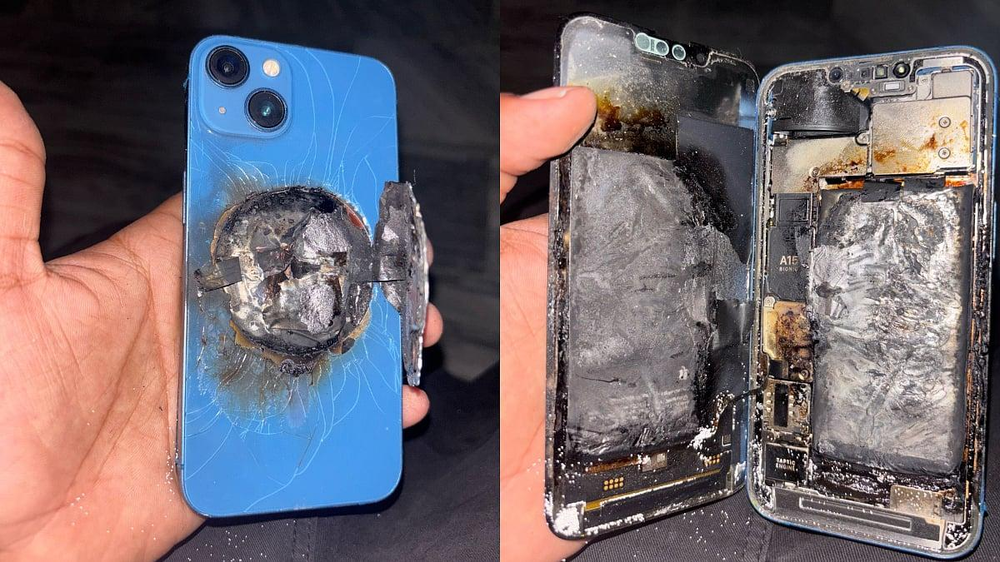
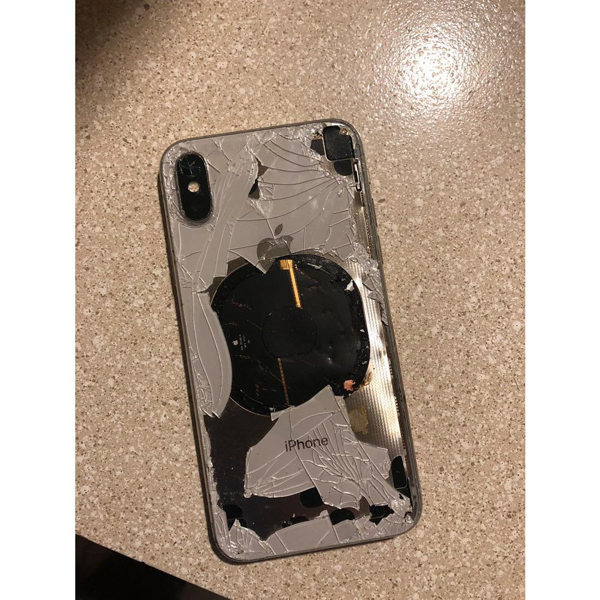

## Claim
Claim: " This image shows an Iphone that exploded during the pager attacks on Hezbollah devices in Lebanon in September 2024, blowing up random people."

## Actions
```
reverse_search()
image_search("exploded iphone")
```

## Evidence
### Evidence from `reverse_search`
The image of the exploded iPhone (

### Evidence from `image_search`
The Apple Support Communities website contains an image of an exploded iPhone (). The Free Press Journal reports on an iPhone 13 exploding in a youth's pocket, causing serious burn injuries ().

AppleInsider published an article about an iPhone X that exploded after updating to iOS 12.1 ().


## Elaboration
The evidence confirms that iPhones can explode. However, the provided evidence does not support the claim that the image shows an iPhone that exploded during pager attacks on Hezbollah devices in Lebanon in September 2024, blowing up random people. The search results show other instances of exploded iPhones, but none of them are related to the claim.

To verify the claim, I would need information about the specific incident, including the date, location, and cause of the explosion.


## Final Judgement
The image search results confirm that iPhones can explode, but there is no evidence to support the claim that the image shows an iPhone that exploded during pager attacks on Hezbollah devices in Lebanon in September 2024. The evidence does not provide any information about the context of the image.

`false`

### Verdict: FALSE

### Justification
The image depicts an exploded iPhone, and while there are documented cases of iPhones exploding, the provided evidence does not support the claim that the image is related to pager attacks on Hezbollah devices in Lebanon in September 2024. The search results show other instances of exploded iPhones, such as the one reported on the Apple Support Communities website and the one reported by the Free Press Journal, but none of them are related to the claim.
