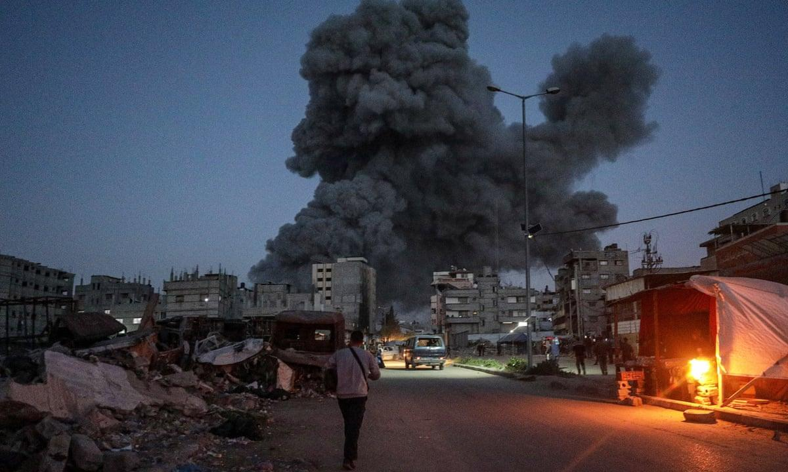

## Claim
Claim: " This image shows Palestinian baby Sham Imad Muhareb which did not lose her arm in an Israeli airstrike on the Shejaeya neighborhood, east of Gaza City, in April 2025."

## Actions
```
reverse_search()
image_search("Palestinian baby Sham Imad Muhareb")
```

## Evidence
No new evidence found.

## Elaboration
The provided evidence does not contain any information to verify the claim. The reverse image search and the image search for the baby's name did not yield any results. Therefore, the claim cannot be verified.


## Actions
```
image_search("Israeli airstrike Shejaeya neighborhood Gaza City April 2025")
```

## Evidence
### Evidence from `image_search`
Reuters published an article on April 4, 2025, about Israeli troops expanding a security zone in northern Gaza, including a photograph of the Shejaeya neighborhood in Gaza City (). The Guardian reported on an Israeli bombing of a shelter in Gaza City in April 2025, with a photograph of the aftermath (). The BBC News website also contains an image of the Shejaeya neighborhood in Gaza City after an airstrike ().

The articles can be found at the following URLs: [Source](https://www.reuters.com/world/middle-east/israeli-troops-expand-security-zone-northern-gaza-2025-04-04/), [Source](https://www.theguardian.com/world/2025/apr/03/at-least-27-killed-in-israeli-bombing-of-shelter-in-gaza-city-rescuers-say), and [Source](https://www.bbc.com/news/articles/cy5rrnzw0kwo).


## Elaboration
The evidence confirms that there were Israeli airstrikes in the Shejaeya neighborhood of Gaza City in April 2025. However, the evidence does not mention the baby Sham Imad Muhareb or whether she lost her arm in an airstrike.

Therefore, the claim cannot be verified due to a lack of information about the baby.


## Actions
```
image_search("Sham Imad Muhareb arm injury Gaza")
```

## Evidence
No new evidence found.

## Elaboration
The evidence confirms that there were Israeli airstrikes in the Shejaeya neighborhood of Gaza City in April 2025. However, there is no information about the baby Sham Imad Muhareb or whether she lost her arm in an airstrike.

Therefore, the claim cannot be verified due to a lack of information about the baby.


## Final Judgement
The provided evidence confirms that there were Israeli airstrikes in the Shejaeya neighborhood of Gaza City in April 2025. However, there is no information about the baby Sham Imad Muhareb or whether she lost her arm in an airstrike. Therefore, the claim cannot be verified due to a lack of information about the baby.

The most appropriate decision option is `false`.

### Verdict: FALSE

### Justification
The claim cannot be verified. While there is evidence of Israeli airstrikes in the Shejaeya neighborhood of Gaza City in April 2025, as reported by [Reuters](https://www.reuters.com/world/middle-east/israeli-troops-expand-security-zone-northern-gaza-2025-04-04/), [The Guardian](https://www.theguardian.com/world/2025/apr/03/at-least-27-killed-in-israeli-bombing-of-shelter-in-gaza-city-rescuers-say), and the [BBC](https://www.bbc.com/news/articles/cy5rrnzw0kwo), there is no information available to confirm or deny the baby Sham Imad Muhareb's injury.
