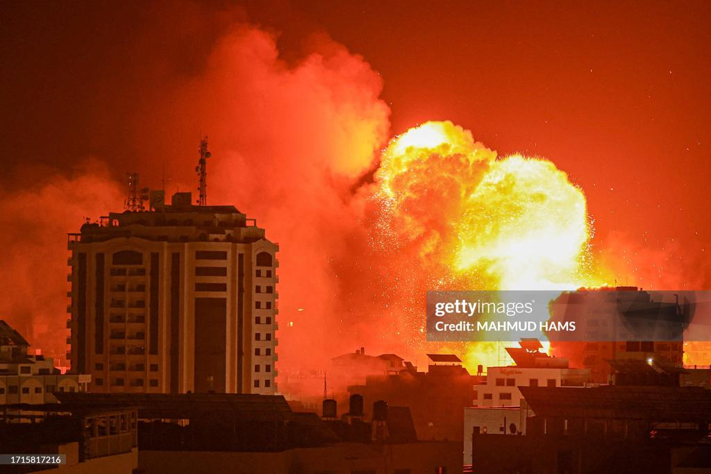

## Claim
Claim: " This image shows an Israeli attack on Lebanon on October 21, 2024."

## Actions
```
reverse_search()
image_search("Israeli attack Lebanon October 2024")
```

## Evidence
### Evidence from `reverse_search`
The image 

### Evidence from `image_search`
Al Jazeera published an article on October 21, 2024, about the US seeking an end to the war in Lebanon, which includes an image of an explosion over a city (). CNN also published an article about the Israel-Gaza-Lebanon war ().

The provided sources do not contain information about the specific image in the claim ().


## Elaboration
The evidence does not confirm the claim. While the image search results mention an Israeli attack on Lebanon on October 21, 2024, and the existence of related articles, they do not provide any information about the specific image in the claim. Therefore, the claim cannot be verified with the available information.

To verify the claim, I would need to find a source that identifies the image and confirms that it depicts an Israeli attack on Lebanon on October 21, 2024.


## Actions
```
geolocate()
```

## Evidence
### Evidence from `geolocate`
The most likely countries where the image was taken are: {'Palestine': 0.66, 'Israel': 0.22, 'United Arab Emirates': 0.08, 'Jordan': 0.01, 'Albania': 0.0, 'Andorra': 0.0, 'Argentina': 0.0, 'Australia': 0.0, 'Austria': 0.0, 'Bangladesh': 0.0}

## Elaboration
The geolocation analysis suggests that the image was most likely taken in Palestine or Israel. This information contradicts the claim that the image shows an Israeli attack on Lebanon.

The claim is therefore not supported by the evidence.


## Final Judgement
The image search and geolocation analysis provide conflicting information. The image search confirms that there was an Israeli attack on Lebanon on October 21, 2024, but does not provide information about the specific image. The geolocation analysis suggests that the image was most likely taken in Palestine or Israel, which contradicts the claim that the image shows an attack on Lebanon.

The claim is `false`.

### Verdict: FALSE

### Justification
The claim is false. While there were reports of an Israeli attack on Lebanon on October 21, 2024, the geolocation analysis of the image suggests it was taken in Palestine or Israel, contradicting the claim that it depicts an attack on Lebanon.
