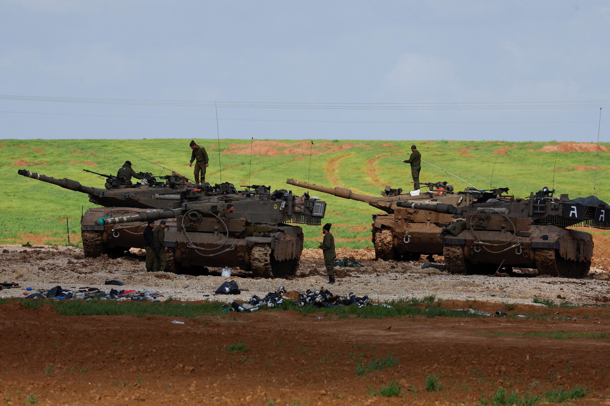
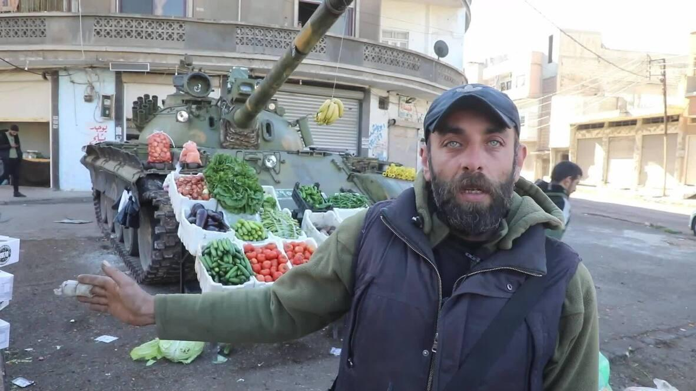

## Claim
Claim: " This image shows a vegetable stand in Gaza in January 2025 with a Merkava tank, the pride of the Israeli army, as its decor."

## Actions
```
reverse_search()
image_search("vegetable stand tank Gaza")
```

## Evidence
### Evidence from `reverse_search`
From [Source](https://en.haberler.com/in-syria-an-abandoned-tank-has-become-a-fruit-and-2027395/): Found exact image on website with title: In Syria, an abandoned tank has become a fruit and vegetable stand.
Content: The search result is from a Turkish news website and contains an image of a tank used as a fruit and vegetable stand. The article states that the image was taken in Syria. The article is dated December 15, 2024. 


### Evidence from `image_search`
Al Jazeera published an image of Merkava tanks (). The Associated Press published an image of a market in Gaza (). A video shows a Syrian market vendor selling fruits and vegetables from an abandoned tank ().


## Elaboration
The claim that the image shows a vegetable stand in Gaza with a Merkava tank is inaccurate. The reverse image search indicates that the image is from Syria, not Gaza. The tank in the image is not identified as a Merkava tank, and the evidence suggests it is an abandoned tank used as a fruit and vegetable stand in Syria.


## Final Judgement
The image is not from Gaza, but from Syria. The tank is not identified as a Merkava tank. The claim misrepresents the location and the type of tank.

`false`

### Verdict: FALSE

### Justification
The image depicts a fruit and vegetable stand using an abandoned tank, but the location is Syria, not Gaza, as indicated by a Turkish news website ([Source](https://en.haberler.com/in-syria-an-abandoned-tank-has-become-a-fruit-and-2027395/)). The claim also incorrectly identifies the tank as a Merkava tank.
