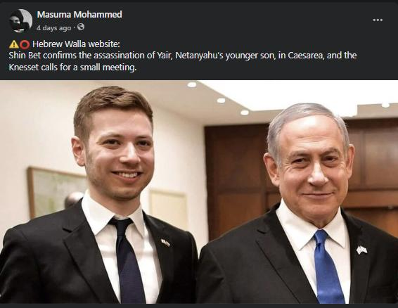
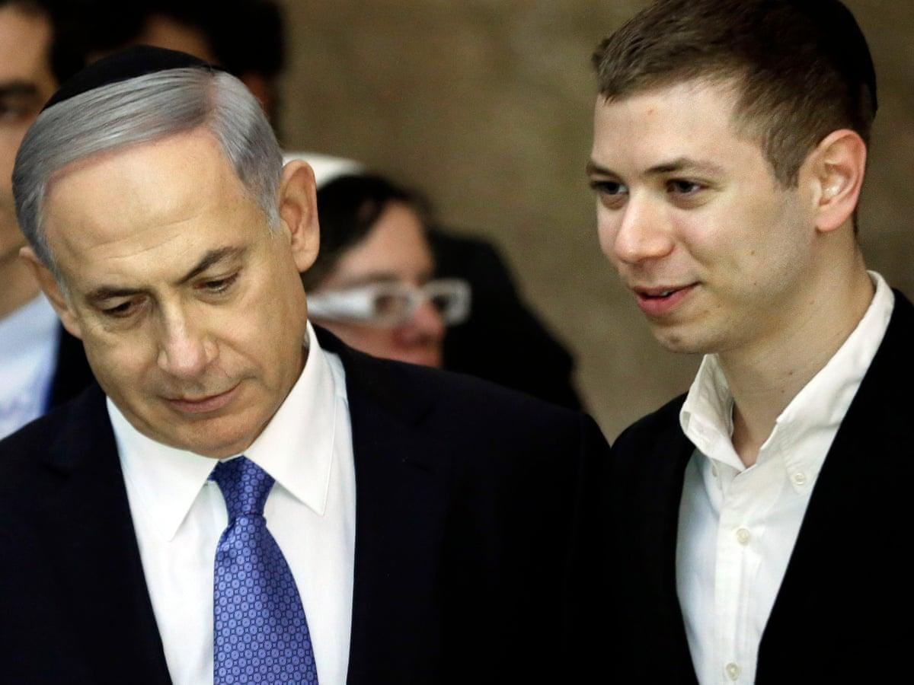
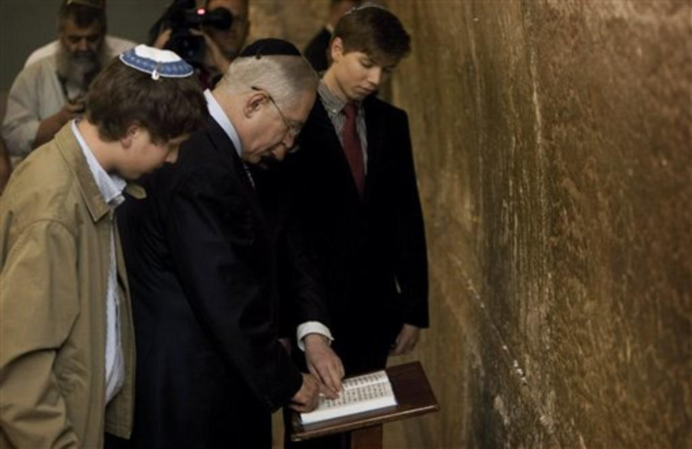

## Claim
Claim: "Netanyahu’s son Yair was killed in a drone attack on October 19, 2024 that targeted the Israeli PM’s home in Caesarea, Israel."

## Actions
```
image_search("Yair Netanyahu drone attack Caesarea October 19 2024")
```

## Evidence
### Evidence from `image_search`
The Times of Israel ([https://www.timesofisrael.com/drones-moans-and-groans-hezbollah-attacks-pms-home-petty-politics-continue-unintercepted/](https://www.timesofisrael.com/drones-moans-and-groans-hezbollah-attacks-pms-home-petty-politics-continue-unintercepted/)) provides an image of people standing behind a barrier . NewsMobile.in ([https://www.newsmobile.in/nm-fact-checker/fact-check-israeli-pm-benjamin-netanyahus-son-yair-killed-in-hezbollah-drone-attack-heres-the-truth/](https://www.newsmobile.in/nm-fact-checker/fact-check-israeli-pm-benjamin-netanyahus-son-yair-killed-in-hezbollah-drone-attack-heres-the-truth/)) includes an image with text stating that Shin Bet confirms the assassination of Yair Netanyahu in Caesarea .


## Elaboration
The evidence presents conflicting information. One source ([https://www.timesofisrael.com/drones-moans-and-groans-hezbollah-attacks-pms-home-petty-politics-continue-unintercepted/](https://www.timesofisrael.com/drones-moans-and-groans-hezbollah-attacks-pms-home-petty-politics-continue-unintercepted/)) shows an image related to a drone attack on the PM's home. However, another source ([https://www.newsmobile.in/nm-fact-checker/fact-check-israeli-pm-benjamin-netanyahus-son-yair-killed-in-hezbollah-drone-attack-heres-the-truth/](https://www.newsmobile.in/nm-fact-checker/fact-check-israeli-pm-benjamin-netanyahus-son-yair-killed-in-hezbollah-drone-attack-heres-the-truth/)) includes an image with text stating that Shin Bet confirmed the assassination of Yair Netanyahu.

The claim cannot be fully verified. The evidence suggests a drone attack on the PM's home and an assassination of Yair Netanyahu, but it does not explicitly link the two events. More information is needed to confirm if Yair Netanyahu was killed in a drone attack.


## Actions
```
image_search("Yair Netanyahu death confirmation")
```

## Evidence
### Evidence from `image_search`
The Guardian ([https://www.theguardian.com/world/2018/dec/17/netanyahus-son-banned-from-facebook-over-hate-speech](https://www.theguardian.com/world/2018/dec/17/netanyahus-son-banned-from-facebook-over-hate-speech)) includes an image of Benjamin Netanyahu and his son, Yair . The Times of Israel ([https://www.timesofisrael.com/yair-netanyahu-hints-those-who-put-father-on-trial-should-face-death-penalty/](https://www.timesofisrael.com/yair-netanyahu-hints-those-who-put-father-on-trial-should-face-death-penalty/)) provides an image of Yair Netanyahu . NBC News ([https://www.nbcnews.com/id/wbna43527563](https://www.nbcnews.com/id/wbna43527563)) provides an image of Yair Netanyahu with his father .


## Elaboration
The evidence does not provide any confirmation of Yair Netanyahu's death. The images show Yair Netanyahu, but they do not provide any information about his death.


## Actions
```
image_search("Yair Netanyahu death hoax")
```

## Evidence
### Evidence from `image_search`
From [Source](https://www.voanews.com/a/middle-east_israeli-leaders-son-takes-center-stage-corruption-sagas/6192260.html): 
Content: The Voice of America ([https://www.voanews.com/a/middle-east_israeli-leaders-son-takes-center-stage-corruption-sagas/6192260.html](https://www.voanews.com/a/middle-east_israeli-leaders-son-takes-center-stage-corruption-sagas/6192260.html)) provides an image of Yair Netanyahu with his father .


## Elaboration
The evidence suggests that the claim is false. The search results do not provide any credible information about Yair Netanyahu's death. The images show Yair Netanyahu alive.


## Final Judgement
The initial search revealed conflicting information, with one source mentioning a drone attack and another a claim of assassination. However, subsequent searches did not provide any confirmation of Yair Netanyahu's death. The images show Yair Netanyahu alive. Therefore, the claim is not factually accurate. `false`


### Verdict: FALSE

### Justification
The claim is false. While there were reports of a drone attack and an assassination claim, subsequent searches did not confirm Yair Netanyahu's death. Images show him alive, and no credible sources support the claim.
