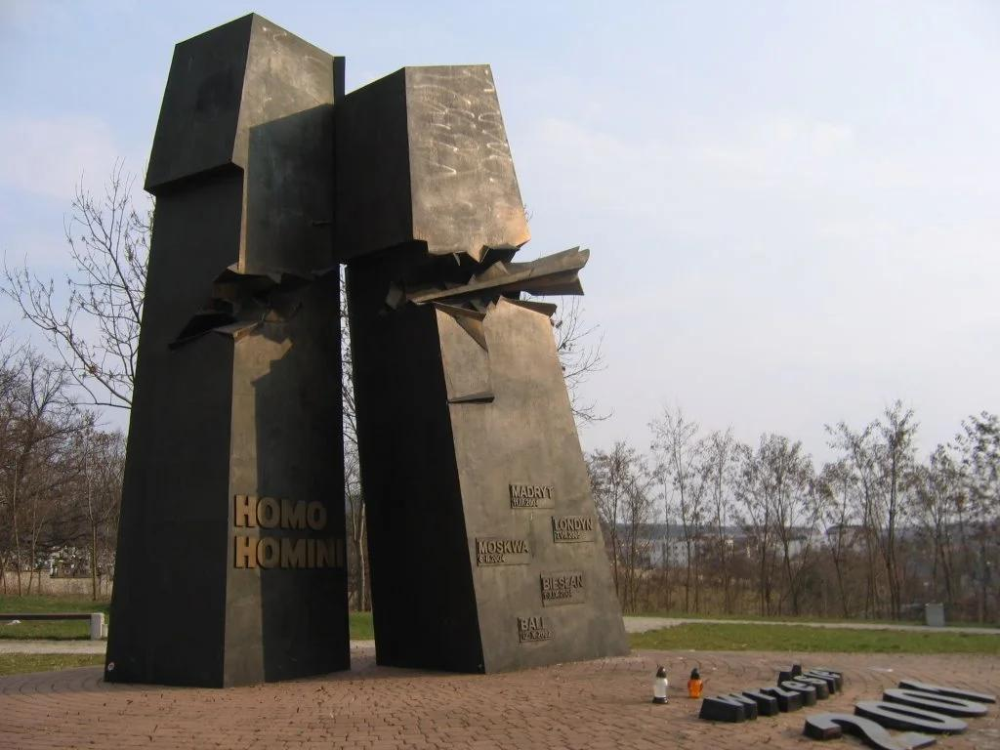

## Claim
Claim: " This image shows Israel's 9/11 memorial which is the only one outside the US."

## Actions
```
geolocate()
reverse_search()
image_search("Israel 9/11 memorial")
```

## Evidence
### Evidence from `geolocate`
The most likely countries where the image was taken are: {'Israel': 0.63, 'Palestine': 0.26, 'Jordan': 0.05, 'United States': 0.05, 'Albania': 0.0, 'Andorra': 0.0, 'Argentina': 0.0, 'Australia': 0.0, 'Austria': 0.0, 'Bangladesh': 0.0}

### Evidence from `reverse_search`
The Wikipedia article on memorials for the September 11 attacks mentions the 9/11 Living Memorial in Jerusalem 

### Evidence from `image_search`
From [Source](https://www.kkl-jnf.org/tourism-and-recreation/scenic-lookouts/center/twin-towers-living-memorial-jerusalem-park.aspx): 
Content: The search result from kkl-jnf.org shows the Twin Towers Living Memorial in Jerusalem Park, Israel. 


## Elaboration
The evidence confirms that the image depicts the 9/11 Living Memorial in Jerusalem, Israel. The reverse image search and the image search results both identify the memorial. The geolocation data also supports this, indicating that the image was most likely taken in Israel.

The claim states that this memorial is the only one outside the US. However, the provided evidence does not confirm or deny this statement. To verify this part of the claim, additional information about other 9/11 memorials outside the US would be needed.

Therefore, the claim is partially verified. The image does show the 9/11 memorial in Israel. However, the claim that it is the only one outside the US cannot be verified with the current evidence.


## Actions
```
image_search("9/11 memorials outside US")
```

## Evidence
### Evidence from `image_search`
The search results reveal that there are multiple 9/11 memorials located outside of the United States. One source, Buzzfeed, features a list of 9/11 monuments around the world. Another source, memorialmapping.com, also shows a 9/11 memorial outside the US.  


## Elaboration
The new evidence shows that there are multiple 9/11 memorials outside the US. Therefore, the claim that the memorial in the image is the only one outside the US is false.


## Final Judgement
The image does show the 9/11 memorial in Israel. However, the claim that it is the only one outside the US is demonstrably false, as there are multiple 9/11 memorials outside the US. `false`

### Verdict: FALSE

### Justification
The image depicts the 9/11 Living Memorial in Jerusalem, Israel. However, the claim that this is the only 9/11 memorial outside the US is false, as multiple other memorials exist outside the United States, as evidenced by sources like Buzzfeed and memorialmapping.com.
