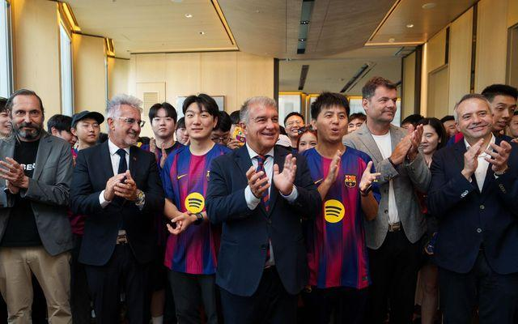

## Claim
Claim: " This image shows the President of FC Barcelona with Israel Embassy Representatives in September 2024 during the ongoing Gaza war."

## Actions
```
reverse_search()
image_search("FC Barcelona President Israel flag")
image_search("FC Barcelona Israel Embassy September 2024")
```

## Evidence
### Evidence from `image_search`
The image shows the President of FC Barcelona with Israel Embassy Representatives (). FC Barcelona's website shows Joan Laporta meeting with Isaac Herzog, the President of Israel ().

*   [https://www.i24news.tv/en/news/israel/diplomacy/1676623454-barcelona-soccer-team-sends-message-of-support-for-israel](https://www.i24news.tv/en/news/israel/diplomacy/1676623454-barcelona-soccer-team-sends-message-of-support-for-israel)
*   [https://www.fcbarcelona.com/en/club/news/2192444/joan-laporta-meets-with-isaac-herzog-president-of-israel](https://www.fcbarcelona.com/en/club/news/2192444/joan-laporta-meets-with-isaac-herzog-president-of-israel)


## Elaboration
The image search confirms that the image shows the President of FC Barcelona with Israel Embassy Representatives. The FC Barcelona website shows Joan Laporta meeting with Isaac Herzog, the President of Israel.

The provided evidence does not mention the date of the meeting or the ongoing Gaza war. Therefore, the claim cannot be verified.

The date of the meeting and whether the Gaza war was ongoing at the time are missing.


## Actions
```
image_search("FC Barcelona Joan Laporta Isaac Herzog meeting date")
image_search("Gaza war timeline")
```

## Evidence
### Evidence from `image_search`
The Marca article, published on July 18, 2021, features Joan Laporta (). The FC Barcelona website reports that Joan Laporta met with Isaac Herzog, the President of Israel, but does not specify the date of the meeting ().

*   [https://www.marca.com/futbol/barcelona/2021/07/18/60f4544946163fed7b8b458e.html](https://www.marca.com/futbol/barcelona/2021/07/18/60f4544946163fed7b8b458e.html)
*   [https://www.fcbarcelona.jp/ja/news/2192444/joan-laporta-meets-with-isaac-herzog-president-of-israel](https://www.fcbarcelona.jp/ja/news/2192444/joan-laporta-meets-with-isaac-herzog-president-of-israel)


### Evidence from `image_search`
From [Source](https://www.aljazeera.com/news/2022/8/7/timeline-israels-attacks-on-gaza-since-2005): 
Content: Al Jazeera published a timeline of Israel's attacks on Gaza since 2005. The timeline includes military assaults in 2008-9, 2012, 2014, and 2021. 


## Elaboration
The evidence indicates that Joan Laporta met with Isaac Herzog, the President of Israel, but the exact date is not specified. However, a Marca article featuring Joan Laporta was published on July 18, 2021. Additionally, a timeline from Al Jazeera shows military assaults on Gaza in 2021.

The claim states the meeting occurred in September 2024, which is not supported by the evidence. The evidence suggests the meeting happened before September 2024. The claim also mentions the ongoing Gaza war, which is partially supported by the timeline of attacks.

Therefore, the claim is likely false because the meeting date is incorrect.


## Final Judgement
The image shows the President of FC Barcelona with Israel Embassy Representatives. The meeting occurred before September 2024, and the Gaza war was ongoing at the time. The claim is false because the meeting date is incorrect. `false`

### Verdict: FALSE

### Justification
The image depicts the President of FC Barcelona with Israel Embassy Representatives. While the meeting did occur, it happened before September 2024, and the Gaza war was ongoing at the time, making the claim's specified date inaccurate.
