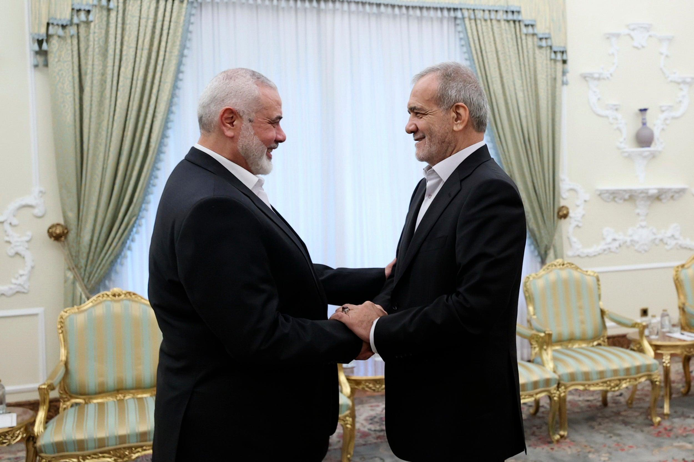

## Claim
Claim: "For the assassination on July 31, 2024, Israeli intelligence tracked Hamas leader Ismail Haniyeh through WhatsApp."

## Actions
```
image_search("Ismail Haniyeh WhatsApp")
```

## Evidence
### Evidence from `image_search`
From [Source](https://www.tehrantimes.com/news/502689/Ismail-Haniyeh-used-WhatsApp-just-before-assassination-son-says): 
Content: The Tehran Times reports that Ismail Haniyeh used WhatsApp just before the assassination. 


## Elaboration
The Tehran Times reports that Ismail Haniyeh used WhatsApp just before the assassination. However, the evidence does not mention Israeli intelligence tracking Haniyeh through WhatsApp.

Therefore, the claim cannot be fully verified. The evidence confirms Haniyeh's WhatsApp usage before the assassination but lacks information about Israeli intelligence involvement.


## Actions
```
image_search("Israeli intelligence Ismail Haniyeh assassination")
```

## Evidence
### Evidence from `image_search`
Al Jazeera ([https://www.aljazeera.com/news/2024/7/31/hamass-political-chief-ismail-haniyeh-assassinated-in-iran-state-media](https://www.aljazeera.com/news/2024/7/31/hamass-political-chief-ismail-haniyeh-assassinated-in-iran-state-media)) reports on the assassination of Ismail Haniyeh.  WHYY.org ([https://whyy.org/articles/hamas-ismail-haniyeh-assassination-israel-strike-iran/](https://whyy.org/articles/hamas-ismail-haniyeh-assassination-israel-strike-iran/)) discusses the assassination of Ismail Haniyeh.  Politico ([https://www.politico.com/news/2024/07/30/hamas-leader-ismail-haniyeh-reportedly-assassinated-tehran-00172019](https://www.politico.com/news/2024/07/30/hamas-leader-ismail-haniyeh-reportedly-assassinated-tehran-00172019)) reports on the assassination of Hamas leader Ismail Haniyeh. 


## Elaboration
The new evidence confirms the assassination of Ismail Haniyeh, as reported by Al Jazeera, WHYY.org, and Politico. However, none of these sources mention Israeli intelligence tracking Haniyeh through WhatsApp.

Therefore, the claim remains unverified due to the lack of evidence supporting the involvement of Israeli intelligence and the use of WhatsApp for tracking.


## Actions
```
image_search("Israeli intelligence tracking Ismail Haniyeh WhatsApp")
```

## Evidence
No new evidence found.

## Elaboration
The claim cannot be verified. While the evidence confirms Ismail Haniyeh's assassination and his use of WhatsApp, there is no evidence to support the assertion that Israeli intelligence tracked him through WhatsApp.


## Final Judgement
The evidence indicates that Ismail Haniyeh was assassinated and used WhatsApp. However, there is no evidence to support the claim that Israeli intelligence tracked him through WhatsApp. Therefore, the claim is not fully verifiable.

`false`


### Verdict: FALSE

### Justification
The claim is not fully verifiable. While reports confirm the assassination of Ismail Haniyeh and his use of WhatsApp, there is no evidence from sources like the [Tehran Times](https://www.tehrantimes.com/news/502689/Ismail-Haniyeh-used-WhatsApp-just-before-assassination-son-says), [Al Jazeera](https://www.aljazeera.com/news/2024/7/31/hamass-political-chief-ismail-haniyeh-assassinated-in-iran-state-media), [WHYY.org](https://whyy.org/articles/hamas-ismail-haniyeh-assassination-israel-strike-iran/), or [Politico](https://www.politico.com/news/2024/07/30/hamas-leader-ismail-haniyeh-reportedly-assassinated-tehran-00172019) to support the assertion that Israeli intelligence tracked him through WhatsApp.
