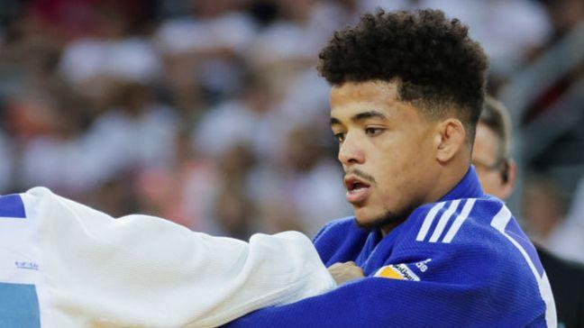
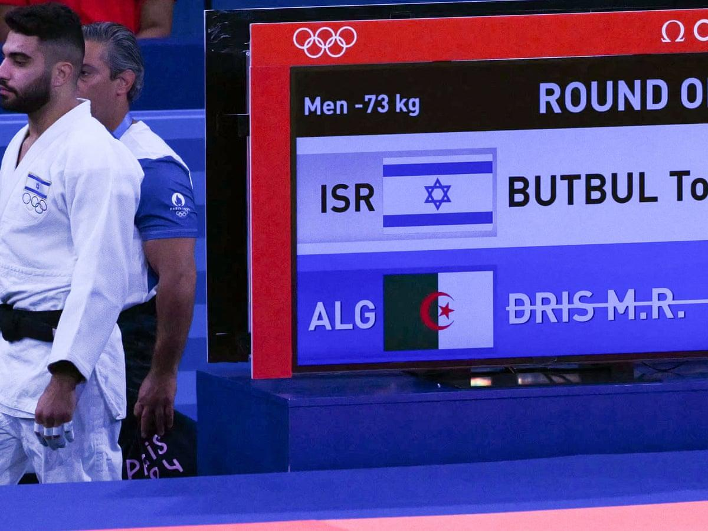

## Claim
Claim: "An Algerian judo athlete withdrew from his Olympics 2024 match against an Israeli opponent."

## Actions
```
image_search("Algerian judo athlete withdraws Olympics 2024 Israeli opponent")
```

## Evidence
### Evidence from `image_search`
The BBC Sport website contains an image of a judo athlete (). The Guardian reports that an Algerian judoka, Dris M.R., was investigated after failing to make weight for a bout with Israeli judoka Butbul To ().

*   [https://www.bbc.com/sport/olympics/articles/cp68x1xp05eo](https://www.bbc.com/sport/olympics/articles/cp68x1xp05eo)
*   [https://www.theguardian.com/sport/article/2024/jul/29/algerian-judoka-investigated-after-failing-to-make-weight-for-bout-with-israeli](https://www.theguardian.com/sport/article/2024/jul/29/algerian-judoka-investigated-after-failing-to-make-weight-for-bout-with-israeli)
*   [https://www.france24.com/en/sport/20240729-algerian-judoka-disqualified-ahead-of-olympic-fight-against-israeli-opponent](https://www.france24.com/en/sport/20240729-algerian-judoka-disqualified-ahead-of-olympic-fight-against-israeli-opponent)


## Elaboration
The evidence indicates that an Algerian judoka, Dris M.R., was investigated after failing to make weight for a match against Israeli judoka Butbul To. The France24 article states that the Algerian judoka was disqualified.

Based on the evidence, the claim is likely true.


## Final Judgement
The search results confirm that an Algerian judoka, Dris M.R., was disqualified from a match against an Israeli opponent, Butbul To, at the Olympics. This aligns with the claim that an Algerian judo athlete withdrew from a match against an Israeli opponent.

`true`

### Verdict: TRUE

### Justification
An Algerian judoka, Dris M.R., was disqualified from a match against Israeli judoka Butbul To at the Olympics, as reported by sources like the [Guardian](https://www.theguardian.com/sport/article/2024/jul/29/algerian-judoka-investigated-after-failing-to-make-weight-for-bout-with-israeli) and [France24](https://www.france24.com/en/sport/20240729-algerian-judoka-disqualified-ahead-of-olympic-fight-against-israeli-opponent).
