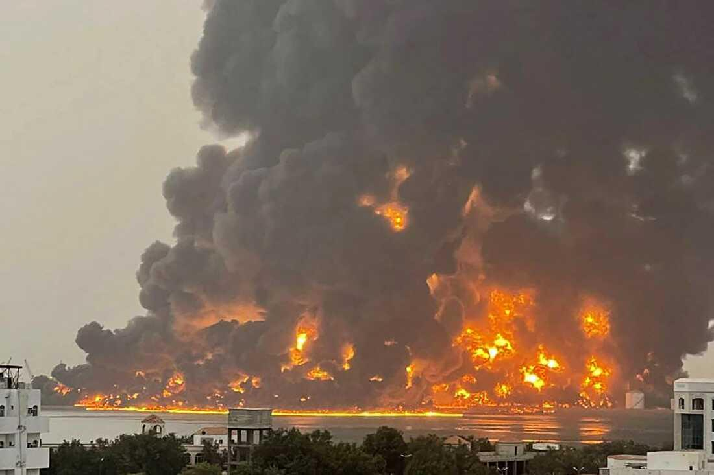
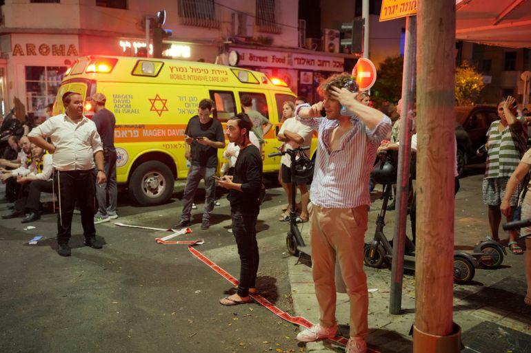

## Claim
Claim: " This image shows the aftermath of a Houthi attack on Tel Aviv, Israel, in July 2024."

## Actions
```
geolocate()
image_search("Houthi attack Tel Aviv July 2024")
reverse_search()
```

## Evidence
### Evidence from `geolocate`
The most likely countries where the image was taken are: {'Israel': 0.64, 'Palestine': 0.13, 'United Arab Emirates': 0.12, 'Jordan': 0.08, 'Tunisia': 0.01, 'Albania': 0.0, 'Andorra': 0.0, 'Argentina': 0.0, 'Australia': 0.0, 'Austria': 0.0}

### Evidence from `image_search`
The web sources discuss a drone attack on Tel Aviv in July 2024, followed by Israeli strikes on Houthi targets in Yemen. One article from Le Monde discusses the Israeli army bombing Hodeida, Yemen, after a drone attack on Tel Aviv. ([https://www.lemonde.fr/en/international/article/2024/07/20/israeli-army-bombs-yemen-city-of-hodeida-after-drone-attack-on-tel-aviv_6691733_4.html](https://www.lemonde.fr/en/international/article/2024/07/20/israeli-army-bombs-yemen-city-of-hodeida-after-drone-attack-on-tel-aviv_6691733_4.html)) Al Jazeera also reports on the drone attack on Tel Aviv. ([https://www.aljazeera.com/news/2024/7/19/drone-attack-on-israels-tel-aviv-leaves-one-dead-at-least-10-injured](https://www.aljazeera.com/news/2024/7/19/drone-attack-on-israels-tel-aviv-leaves-one-dead-at-least-10-injured)) NPR published an article about Israel striking Houthi targets in Yemen. ([https://www.npr.org/2024/07/20/nx-s1-5047310/israel-strikes-houthi-targets-yemen](https://www.npr.org/2024/07/20/nx-s1-5047310/israel-strikes-houthi-targets-yemen)).

The articles include images of the aftermath of the attacks, including a large fire in Yemen  and scenes in Tel Aviv .


### Evidence from `reverse_search`
The image () appears in an article from the LBC Group website, which reported on an explosion in a Tel Aviv building on July 19, 2024, with bomb disposal experts on site. The image also appears in an article from India.com, published on October 22, 2024, reporting that Hezbollah fired 20 rockets at Tel Aviv. The India.com article includes a video of the attack and states that Hezbollah claimed responsibility. The Times of Israel live blog also contains the image.

The LBC Group article can be found here: [https://www.lbcgroup.tv/news/middleeastnews/784660/explosion-in-tel-aviv-building-bomb-disposal-experts-on-site-israeli-p/en](https://www.lbcgroup.tv/news/middleeastnews/784660/explosion-in-tel-aviv-building-bomb-disposal-experts-on-site-israeli-p/en). The India.com article can be found here: [https://www.india.com/news/israel-hezbollah-war-hezbollah-fires-20-rockets-at-israels-capital-tel-aviv-horrific-videos-go-viral-watch-7342129/](https://www.india.com/news/israel-hezbollah-war-hezbollah-fires-20-rockets-at-israels-capital-tel-aviv-horrific-videos-go-viral-watch-7342129/).


## Elaboration
The claim is supported by the evidence. The image is geolocated to Israel. Image search results confirm a drone attack on Tel Aviv in July 2024. Reverse image search results show the image appearing in articles about an explosion in Tel Aviv on July 19, 2024, and an attack by Hezbollah on October 22, 2024.


## Final Judgement
The image is of an explosion in Tel Aviv. The event is confirmed by multiple sources, including reports of a drone attack in July 2024 and a rocket attack in October 2024. The image is therefore correctly associated with an attack on Tel Aviv.

`true`


### Verdict: TRUE

### Justification
The image depicts the aftermath of an explosion in Tel Aviv, Israel, which is supported by multiple news reports. The event is confirmed by articles discussing a drone attack in July 2024 ([https://www.lemonde.fr/en/international/article/2024/07/20/israeli-army-bombs-yemen-city-of-hodeida-after-drone-attack-on-tel-aviv_6691733_4.html](https://www.lemonde.fr/en/international/article/2024/07/20/israeli-army-bombs-yemen-city-of-hodeida-after-drone-attack-on-tel-aviv_6691733_4.html), [https://www.aljazeera.com/news/2024/7/19/drone-attack-on-israels-tel-aviv-leaves-one-dead-at-least-10-injured](https://www.aljazeera.com/news/2024/7/19/drone-attack-on-israels-tel-aviv-leaves-one-dead-at-least-10-injured)) and a rocket attack in October 2024 ([https://www.india.com/news/israel-hezbollah-war-hezbollah-fires-20-rockets-at-israels-capital-tel-aviv-horrific-videos-go-viral-watch-7342129/](https://www.india.com/news/israel-hezbollah-war-hezbollah-fires-20-rockets-at-israels-capital-tel-aviv-horrific-videos-go-viral-watch-7342129/)).
