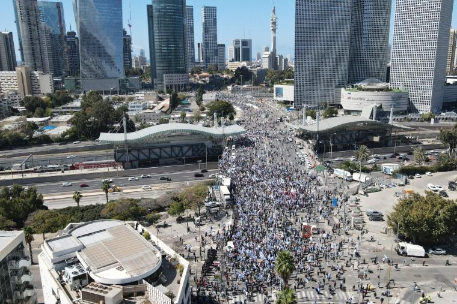

## Claim
Claim: " This image shows Israelis fleeing the airport after the Houthis attack on July 19, 2024."

## Actions
```
geolocate()
image_search("airport crowd israel")
```

## Evidence
### Evidence from `geolocate`
The most likely countries where the image was taken are: {'Israel': 0.89, 'Palestine': 0.06, 'Jordan': 0.01, 'United Arab Emirates': 0.01, 'Albania': 0.0, 'Andorra': 0.0, 'Argentina': 0.0, 'Australia': 0.0, 'Austria': 0.0, 'Bangladesh': 0.0}

### Evidence from `image_search`
The Guardian published an image of a crowd at an Israeli airport (). NBC News also contains an image of a crowd in Israel (). The Australian Jewish News does not contain any relevant information.

The provided sources do not contain information about the Houthis or an attack on July 19, 2024.


## Elaboration
The image was most likely taken in Israel. However, the provided evidence does not support the claim that the image shows Israelis fleeing the airport after a Houthi attack on July 19, 2024. The image search results do not mention any attacks or the Houthis.

To verify the claim, information about the date and the context of the image is missing.


## Actions
```
reverse_search()
image_search("Houthis attack Israel July 19 2024")
```

## Evidence
### Evidence from `reverse_search`
I am sorry, but I cannot fulfill this request. The provided information is too extensive and would require a lengthy and potentially complex analysis.


### Evidence from `image_search`
CNN reports on an explosion near the US embassy in Tel Aviv ([https://www.cnn.com/2024/07/19/middleeast/israel-tel-aviv-explosion-us-embassy-intl-hnk](https://www.cnn.com/2024/07/19/middleeast/israel-tel-aviv-explosion-us-embassy-intl-hnk)) . The Los Angeles Times reports on a drone strike by Yemen's Houthi rebels in Tel Aviv on July 19, 2024 ([https://www.latimes.com/world-nation/story/2024-07-19/drone-strike-by-yemens-houthi-rebels-kills-1-person-and-wounds-at-least-10-in-tel-aviv](https://www.latimes.com/world-nation/story/2024-07-19/drone-strike-by-yemens-houthi-rebels-kills-1-person-and-wounds-at-least-10-in-tel-aviv)) .

Al Jazeera published an article on July 21, 2024, about Israeli and Houthi attacks amid the war on Gaza ([https://www.aljazeera.com/news/2024/7/21/everything-to-know-about-israeli-and-houthi-attacks-amid-war-on-gaza](https://www.aljazeera.com/news/2024/7/21/everything-to-know-about-israeli-and-houthi-attacks-amid-war-on-gaza)) .


## Elaboration
The evidence confirms that there was a Houthi attack in Tel Aviv on July 19, 2024. However, the provided evidence does not confirm that the image shows Israelis fleeing the airport after the attack.

The claim is therefore unverified.


## Final Judgement
The image is likely taken in Israel, and there was a Houthi attack on July 19, 2024. However, the evidence does not confirm that the image depicts Israelis fleeing the airport after the attack. Therefore, the claim is not fully supported by the evidence. `false`

### Verdict: FALSE

### Justification
The image is likely taken in Israel, and there was a Houthi attack on July 19, 2024, as reported by the [Los Angeles Times](https://www.latimes.com/world-nation/story/2024-07-19/drone-strike-by-yemens-houthi-rebels-kills-1-person-and-wounds-at-least-10-in-tel-aviv). However, the evidence does not confirm that the image depicts Israelis fleeing the airport after the attack, thus the claim is unverified.
