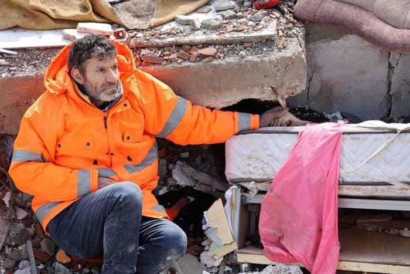
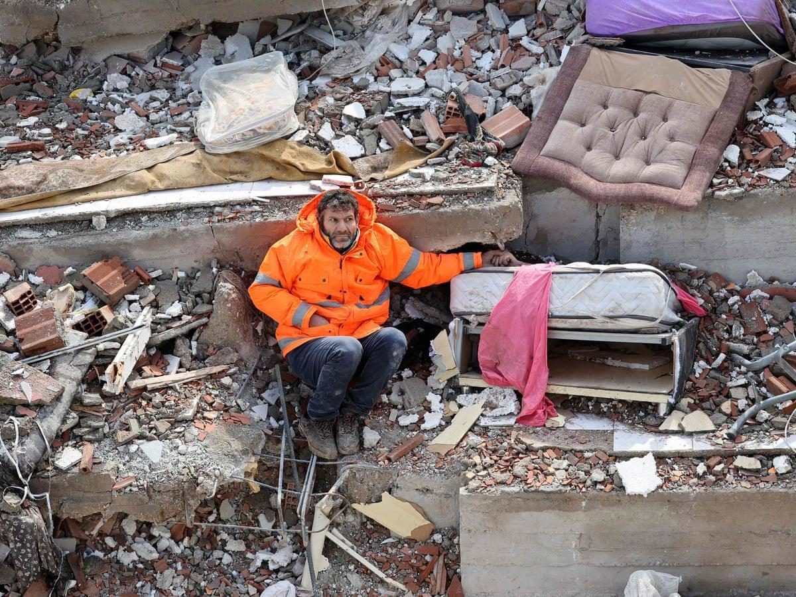

## Claim
Claim: " This image shows a man from Gaza holding the hand of his son killed in an Israeli bombing in July, 2024."

## Actions
```
reverse_search()
image_search("man rubble orange jacket")
```

## Evidence
### Evidence from `reverse_search`
The image (

### Evidence from `image_search`
The search results include an image of a man in an orange jacket sitting in rubble, published by BuzzFeed News (). Another result from Freepik shows three men in orange jackets in a rubble area (). Additionally, there is a result showing an orange padded jacket ().


## Elaboration
The image search results show that the man in the orange jacket is in a rubble area. The image search also shows that the image was published by BuzzFeed News. However, the evidence does not provide any information about the location, the man's identity, or the circumstances surrounding the image.

The claim states that the image is from Gaza and depicts a man holding the hand of his son killed in an Israeli bombing in July 2024. The evidence does not support this claim.

Insufficient information is available to verify the claim.


## Actions
```
geolocate()
image_search("man orange jacket rubble earthquake")
```

## Evidence
### Evidence from `geolocate`
The most likely countries where the image was taken are: {'Turkey': 0.8, 'Italy': 0.09, 'Albania': 0.01, 'Bulgaria': 0.01, 'France': 0.01, 'Netherlands': 0.01, 'Ukraine': 0.01, 'Andorra': 0.0, 'Argentina': 0.0, 'Australia': 0.0}

### Evidence from `image_search`
The Guardian published an image of a man in an orange jacket sitting in rubble, related to the Turkey earthquake (

## Elaboration
The evidence suggests that the image was taken in Turkey, not Gaza. The geolocation analysis indicates a high probability that the image was taken in Turkey. Furthermore, the image search results show that the image is related to the Turkey earthquake.

The claim that the image shows a man from Gaza is therefore false.


## Final Judgement
The image is of a man in Turkey, not Gaza. The image is related to the Turkey earthquake, not an Israeli bombing. The claim is therefore demonstrably false. `false`

### Verdict: FALSE

### Justification
The image depicts a man in Turkey, not Gaza, and is related to the Turkey earthquake, not an Israeli bombing, as evidenced by geolocation analysis and image search results, including a publication by The Guardian ([]()). Therefore, the claim is demonstrably false.
