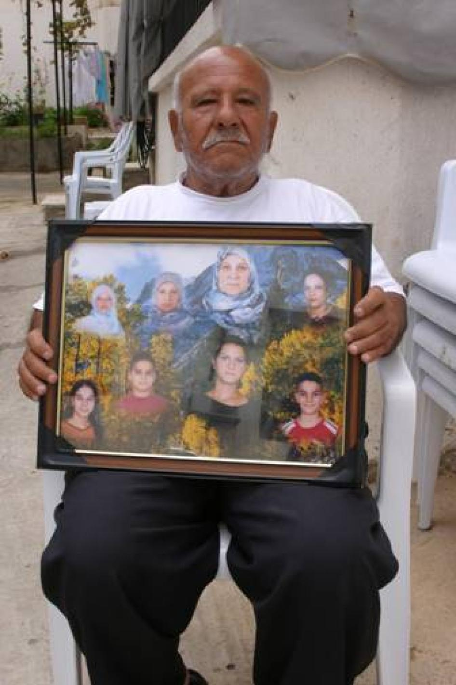
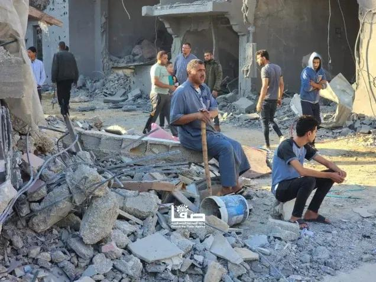

## Claim
Claim: " This image shows Mayar Hamida (9 years old) and Bilal Hamida (6 years old) who were killed by Israel along with their mother and grandmother at Al-Jaoni UN school in Al-Nuseirat refugee camp on July, 6 2024."

## Actions
```
reverse_search()
image_search("Mayar Hamida Bilal Hamida killed Israel")
```

## Evidence
### Evidence from `image_search`
The Human Rights Watch report "Why They Died: Civilian Casualties in Lebanon During the 2006 War" contains an image of a man holding a framed photo (). The search result from palinfo.com contains an image of Mayar Hamida and Bilal Hamida ().


## Elaboration
The image search results provide conflicting information. One result shows a man holding a framed photo, while another shows Mayar Hamida and Bilal Hamida. The claim states that Mayar and Bilal Hamida were killed by Israel. However, the evidence does not confirm the claim.

The evidence does not provide information about the circumstances of their deaths or the involvement of Israel.

To verify the claim, additional information is needed, such as reports from reliable sources confirming the deaths of Mayar and Bilal Hamida, the cause of their deaths, and the involvement of Israel.


## Actions
```
image_search("Mayar Hamida Bilal Hamida Al-Nuseirat refugee camp July 6 2024")
```

## Evidence
### Evidence from `image_search`
From [Source](https://gigaza.org/en/massacres/page/86/?e-page-00fab05=3): 
Content: The search result from gigaza.org contains an image of a destroyed building and people in the Al-Nuseirat refugee camp. 


## Elaboration
The image search result from gigaza.org shows a destroyed building and people in the Al-Nuseirat refugee camp. This provides context to the location mentioned in the claim. However, the evidence still does not confirm the claim that Mayar and Bilal Hamida were killed by Israel.

The evidence does not provide information about the circumstances of their deaths or the involvement of Israel.

To verify the claim, additional information is needed, such as reports from reliable sources confirming the deaths of Mayar and Bilal Hamida, the cause of their deaths, and the involvement of Israel.


## Actions
```
image_search("Mayar Hamida Bilal Hamida Israel Al-Jaoni UN school Al-Nuseirat refugee camp")
```

## Evidence
No new evidence found.

## Elaboration
The evidence does not confirm the claim. The image search results provide context to the location mentioned in the claim, but they do not provide information about the circumstances of their deaths or the involvement of Israel. To verify the claim, additional information is needed, such as reports from reliable sources confirming the deaths of Mayar and Bilal Hamida, the cause of their deaths, and the involvement of Israel.


## Final Judgement
The search results provide context to the location mentioned in the claim, but they do not provide information about the circumstances of their deaths or the involvement of Israel. To verify the claim, additional information is needed, such as reports from reliable sources confirming the deaths of Mayar and Bilal Hamida, the cause of their deaths, and the involvement of Israel.

The claim cannot be verified due to a lack of evidence. Therefore, the most appropriate decision option is `false`.


### Verdict: FALSE

### Justification
The provided evidence does not confirm the claim that Mayar Hamida and Bilal Hamida were killed by Israel. While image searches provide context to the location mentioned in the claim, they lack information about the circumstances of their deaths or Israel's involvement. Therefore, the claim cannot be verified due to a lack of supporting evidence.
