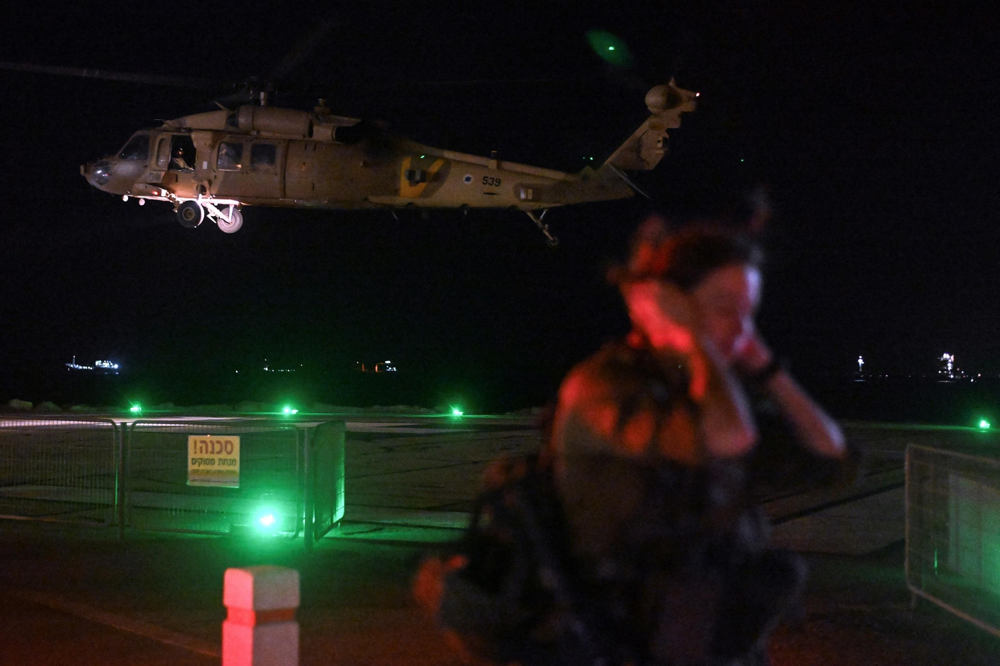

## Claim
Claim: "The chief of the Israeli Defense Forces (IDF), Herzi Halevi, was assassinated in a Hezbollah drone attack on an Israeli military base on October 13, 2024."

## Actions
```
image_search("Herzi Halevi Hezbollah drone attack October 13 2024")
```

## Evidence
### Evidence from `image_search`
CNN published an article that includes an image of Israeli soldiers (). ABC News contains an image of a helicopter (). NPR contains an image of an ambulance and military personnel at night ().

The provided sources are from [CNN](https://www.cnn.com/2024/10/14/middleeast/hezbollah-attack-israel-weaknesses-drones-intl-cmd), [ABC News](https://abcnews.go.com/International/live-updates/israel-hamas-hezbollah?id=114770972&entryId=114771236), and [NPR](https://www.npr.org/2024/10/13/g-s1-28089/hezbollah-drone-strike-israel-binyamina).


## Elaboration
The evidence includes images from CNN, ABC News, and NPR related to Hezbollah attacks on Israel. However, none of the provided sources mention the assassination of Herzi Halevi or a drone attack on an Israeli military base.

The claim cannot be verified with the available information. More information is needed to confirm the details of the claim.


## Actions
```
image_search("Herzi Halevi assassination drone attack October 13 2024")
```

## Evidence
### Evidence from `image_search`
The Long War Journal published an article discussing Hezbollah drone strikes on an IDF base, including an image of Israeli soldiers and an ambulance (). The Combating Terrorism Center at West Point published an article from October 2024 that includes an image of Israeli soldiers (). CNN published an article about a drone attack in Israel, including an image of an ambulance and military personnel at night ().

The sources are: [The Long War Journal](https://www.longwarjournal.org/archives/2024/10/hezbollah-drone-strikes-idf-base-as-israel-uncovers-weapons-in-lebanon.php), [Combating Terrorism Center at West Point](https://ctc.westpoint.edu/the-october-7-attack-an-assessment-of-the-intelligence-failings/), and [CNN](https://www.cnn.com/2024/10/13/world/video/drone-attack-israel-hezbollah-robertson-wedeman-digvid).


## Elaboration
The new evidence from the image search includes articles from The Long War Journal, the Combating Terrorism Center at West Point, and CNN. These articles discuss Hezbollah drone strikes and related events. However, none of the provided sources mention the assassination of Herzi Halevi.

The claim remains unverified. The evidence does not provide any information to support the claim that Herzi Halevi was assassinated in a Hezbollah drone attack.


## Actions
```
image_search("Herzi Halevi death October 13 2024")
```

## Evidence
### Evidence from `image_search`
The BBC News article includes an image of Herzi Halevi (). The Guardian published an article on January 21, 2025, about the resignation of Herzi Halevi (). The Wikipedia article on Herzi Halevi does not contain any content.


## Elaboration
The evidence from the image search includes articles from BBC News and The Guardian. The Guardian article, published on January 21, 2025, discusses Herzi Halevi's resignation. However, none of the provided sources mention his death or any assassination attempt.

The claim remains unverified. There is no evidence to support the claim that Herzi Halevi was assassinated on October 13, 2024.


## Final Judgement
The fact-check reveals that while there have been reports of Hezbollah drone attacks and related events, there is no evidence to support the claim that Herzi Halevi was assassinated in a drone attack on October 13, 2024. The search results did not yield any credible sources confirming the assassination.

`false`


### Verdict: FALSE

### Justification
The fact-check, based on searches from CNN, ABC News, NPR, The Long War Journal, the Combating Terrorism Center at West Point, BBC News, and The Guardian, found no evidence to support the claim that Herzi Halevi was assassinated in a Hezbollah drone attack on October 13, 2024. While the sources discuss Hezbollah attacks and Herzi Halevi's activities, none confirm the assassination. Therefore, the claim is rated as false.
