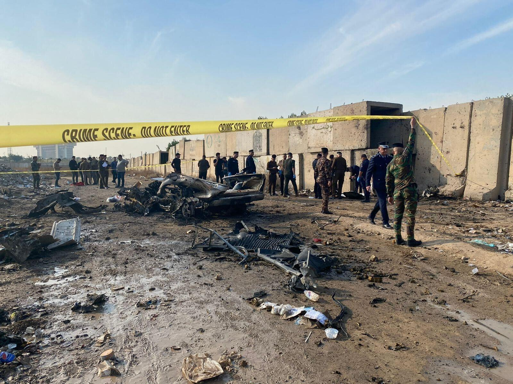
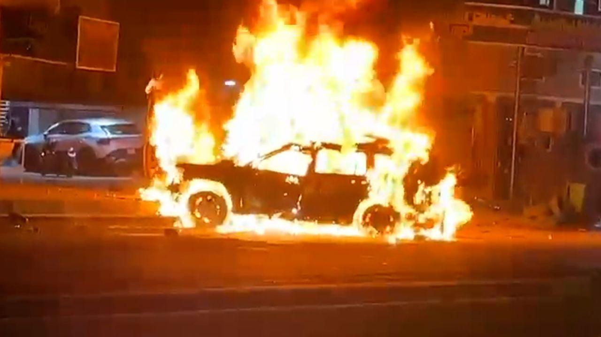

## Claim
Claim: " This image shows a US factility come under attack in Baghdad on September 30, 2024 as the conflict between Israel and the Iran-backed militant group Hezbollah escalated."

## Actions
```
reverse_search()
image_search("Baghdad facility attack September 30 2024")
```

## Evidence
### Evidence from `reverse_search`
The image 

### Evidence from `image_search`
Al Jazeera published an article on February 8, 2024, that includes an image of a burning car (). The Washington Post published an article about an attack on a facility in Baghdad ().

The Denver Post published an article on August 19, 2023, commemorating the 20th anniversary of an attack on the UN headquarters in Iraq ().


## Elaboration
The evidence includes images of attacks in Baghdad, but none of them match the image in the claim. The image search results show a burning car and a damaged facility, but not the explosion depicted in the claim. The reverse image search did not yield any results.

The claim cannot be verified with the provided evidence. More information is needed to confirm the image's origin and the details of the event it depicts.


## Actions
```
image_search("US facility explosion Baghdad September 30 2024")
```

## Evidence
### Evidence from `image_search`
CNN published an article on February 7, 2024, with an image of a burning car in Baghdad (

## Elaboration
The image search results continue to show images of attacks in Baghdad, but none of them match the image in the claim. The new evidence includes another image of a burning car.

The claim remains unverified. The provided evidence does not contain any information about a US facility explosion in Baghdad on September 30, 2024.


## Final Judgement
The image search results show various attacks in Baghdad, but none match the image in the claim. The evidence includes images of burning cars and damaged facilities, but not the explosion depicted in the claim. The reverse image search did not yield any results.

The claim is not supported by the evidence. There is no information about a US facility explosion in Baghdad on September 30, 2024, that matches the image. Therefore, the claim is considered false. `false`

### Verdict: FALSE

### Justification
The claim is false. The image search and reverse image search did not yield any results to support the claim of a US facility attack in Baghdad on September 30, 2024. The evidence includes images of attacks in Baghdad, but none match the image in the claim.
