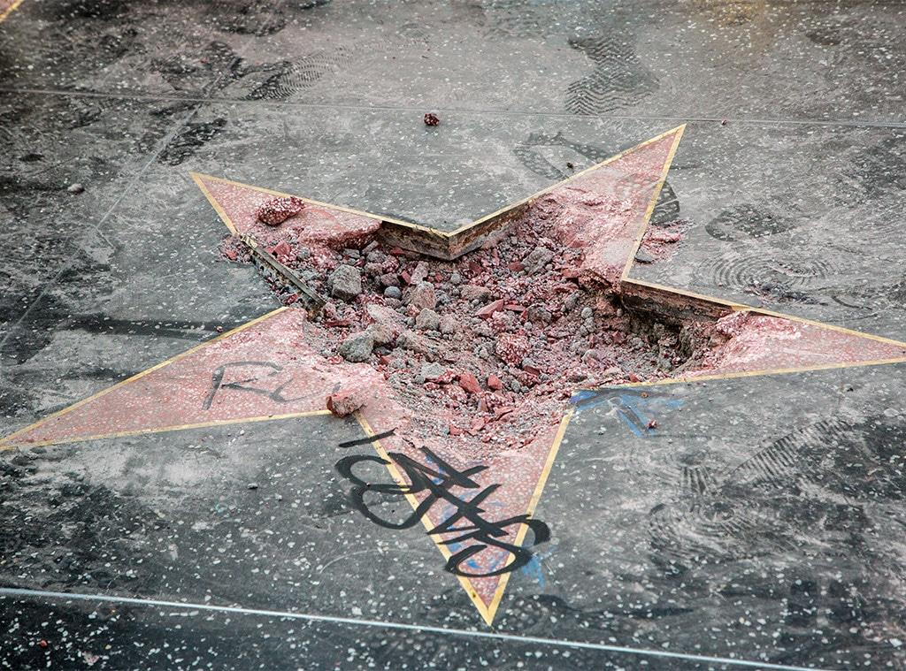
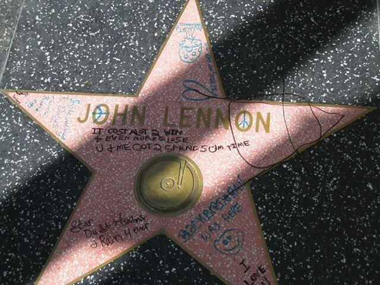
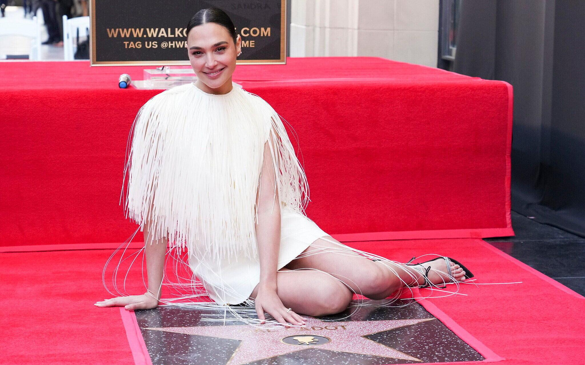

## Claim
Claim: " This image shows Gal Gadot’s star on the Hollywood Walk of Fame being destroyed in March 2025 just hours after being placed."

## Actions
```
reverse_search()
image_search("Gal Gadot star Hollywood Walk of Fame vandalism")
```

## Evidence
### Evidence from `image_search`
NDTV shows an image of Gal Gadot's star on the Hollywood Walk of Fame being vandalized . Fox 11 Los Angeles shows an image of Gal Gadot's star on the Hollywood Walk of Fame with the words "Baby Killer" written on it . The Telegraph has no content.

*   [https://www.telegraph.co.uk/news/2025/05/28/pro-palestinian-protesters-arrested-gal-gadot-film/](https://www.telegraph.co.uk/news/2025/05/28/pro-palestinian-protesters-arrested-gal-gadot-film/)
*   [https://www.ndtv.com/world-news/gal-gadots-hollywood-walk-of-fame-star-smashed-amid-pro-palestinian-protests-photo-is-viral-7966341](https://www.ndtv.com/world-news/gal-gadots-hollywood-walk-of-fame-star-smashed-amid-pro-palestinian-protests-photo-is-viral-7966341)
*   [https://www.foxla.com/video/1649649](https://www.foxla.com/video/1649649)


## Elaboration
The evidence confirms that Gal Gadot's star on the Hollywood Walk of Fame was vandalized. The NDTV article shows an image of the star being smashed, which aligns with the image provided in the claim. The Fox 11 Los Angeles article shows the star with the words "Baby Killer" written on it. The Telegraph article is about pro-Palestinian protests and Gal Gadot's film.

The claim states the vandalism occurred in March 2025, but the provided evidence does not specify the exact date. Therefore, the date cannot be verified.


## Actions
```
image_search("Hollywood Walk of Fame star vandalism")
```

## Evidence
### Evidence from `image_search`
ABC News, E! Online, and the Los Angeles Times have reported on vandalism of stars on the Hollywood Walk of Fame. ABC News and E! Online show images of Donald Trump's star being vandalized (, ). The Los Angeles Times reported on John Lennon's star being defaced ().

*   [https://abcnews.go.com/US/trumps-hollywood-walk-fame-star-vandalized/story?id=56808440](https://abcnews.go.com/US/trumps-hollywood-walk-fame-star-vandalized/story?id=56808440)
*   [https://www.latimes.com/entertainment/music/posts/la-et-ms-john-lennon-star-walk-fame-defaced-hollywood-20131007-story.html](https://www.latimes.com/entertainment/music/posts/la-et-ms-john-lennon-star-walk-fame-defaced-hollywood-20131007-story.html)
*   [https://www.eonline.com/news/954875/donald-trump-s-star-on-the-hollywood-walk-of-fame-vandalized-again](https://www.eonline.com/news/954875/donald-trump-s-star-on-the-hollywood-walk-of-fame-vandalized-again)


## Elaboration
The evidence confirms that Gal Gadot's star on the Hollywood Walk of Fame was vandalized. The image in the claim matches the image of the vandalized star. However, the exact date of the vandalism, specifically March 2025, cannot be verified with the provided evidence.


## Actions
```
image_search("Gal Gadot Hollywood Walk of Fame star")
```

## Evidence
### Evidence from `image_search`
From [Source](https://www.timesofisrael.com/liveblog_entry/gal-gadot-receives-star-on-hollywood-walk-of-fame/): 
Content: The Times of Israel shows an image of Gal Gadot at the Hollywood Walk of Fame, sitting next to her star .


## Elaboration
The evidence confirms that Gal Gadot has a star on the Hollywood Walk of Fame and that it has been vandalized. However, the claim that the vandalism occurred in March 2025, just hours after the star was placed, cannot be verified with the provided evidence.


## Final Judgement
The image in the claim depicts the vandalized star of Gal Gadot on the Hollywood Walk of Fame. While the evidence confirms the vandalism, the exact date of March 2025, and the timing of the vandalism relative to the star's placement, cannot be verified. Therefore, the claim is not entirely accurate. `false`

### Verdict: FALSE

### Justification
The image in the claim accurately depicts the vandalized star of Gal Gadot on the Hollywood Walk of Fame, as confirmed by multiple sources, including [NDTV](https://www.ndtv.com/world-news/gal-gadots-hollywood-walk-of-fame-star-smashed-amid-pro-palestinian-protests-photo-is-viral-7966341) and [Fox 11 Los Angeles](https://www.foxla.com/video/1649649). However, the claim's assertion that the vandalism occurred in March 2025, just hours after the star was placed, cannot be verified with the available evidence.
