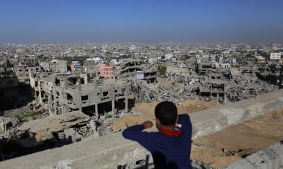
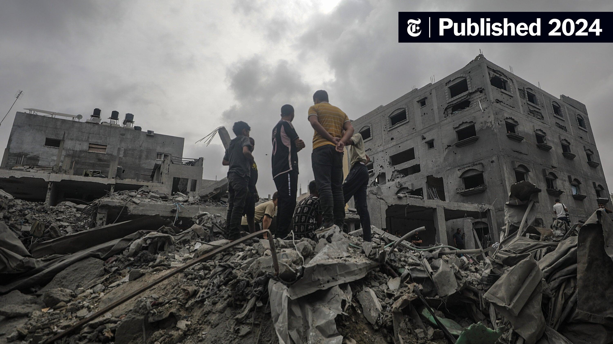
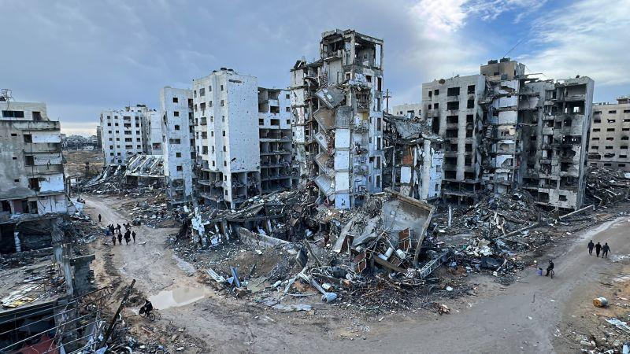
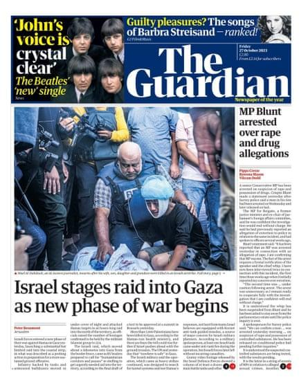
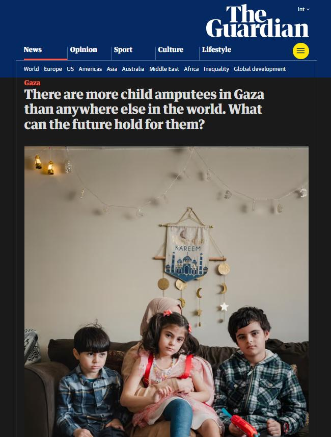

## Claim
Claim: "The Guardian published an article with the headline: 'Gaza will rise from the ashes to become a city of the future to rival Bradford.'"

## Actions
```
image_search("The Guardian Gaza city of the future Bradford")
```

## Evidence
### Evidence from `image_search`
The Guardian published an article about the future of Gaza on July 28, 2016 (). The New York Times published an image in 2024 showing the destruction in Gaza ().

CNN also contains an image of destroyed buildings ().


## Elaboration
The evidence confirms that The Guardian published an article about the future of Gaza. However, the evidence does not provide the headline of the article. Therefore, the claim cannot be fully verified.


## Actions
```
image_search("The Guardian article Gaza future Bradford")
```

## Evidence
### Evidence from `image_search`
The Guardian published an article on October 27, 2023, with the headline "Israel stages raid into Gaza as new phase of war begins" (). Another article's headline is "There are more child amputees in Gaza than anywhere else in the world. What can the future hold for them?" ().


## Elaboration
The new evidence provides two headlines from The Guardian. However, neither of them matches the claim. The first headline is "Israel stages raid into Gaza as new phase of war begins," and the second is "There are more child amputees in Gaza than anywhere else in the world. What can the future hold for them?".


## Final Judgement
The Guardian did publish articles about Gaza, but the provided evidence does not confirm the specific headline mentioned in the claim. The search results show different headlines related to Gaza.

`false`

### Verdict: FALSE

### Justification
The Guardian has published articles about Gaza, but the provided evidence does not confirm the specific headline "Gaza will rise from the ashes to become a city of the future to rival Bradford." The search results show different headlines related to Gaza, such as "Israel stages raid into Gaza as new phase of war begins" and "There are more child amputees in Gaza than anywhere else in the world. What can the future hold for them?"
