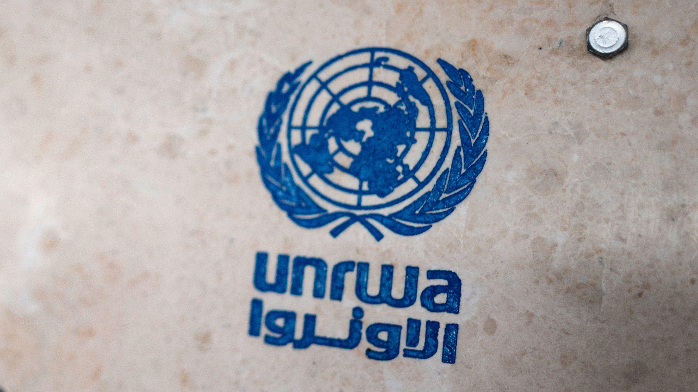
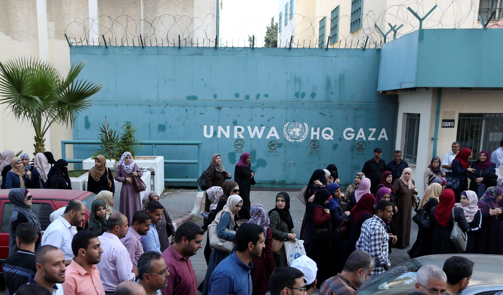
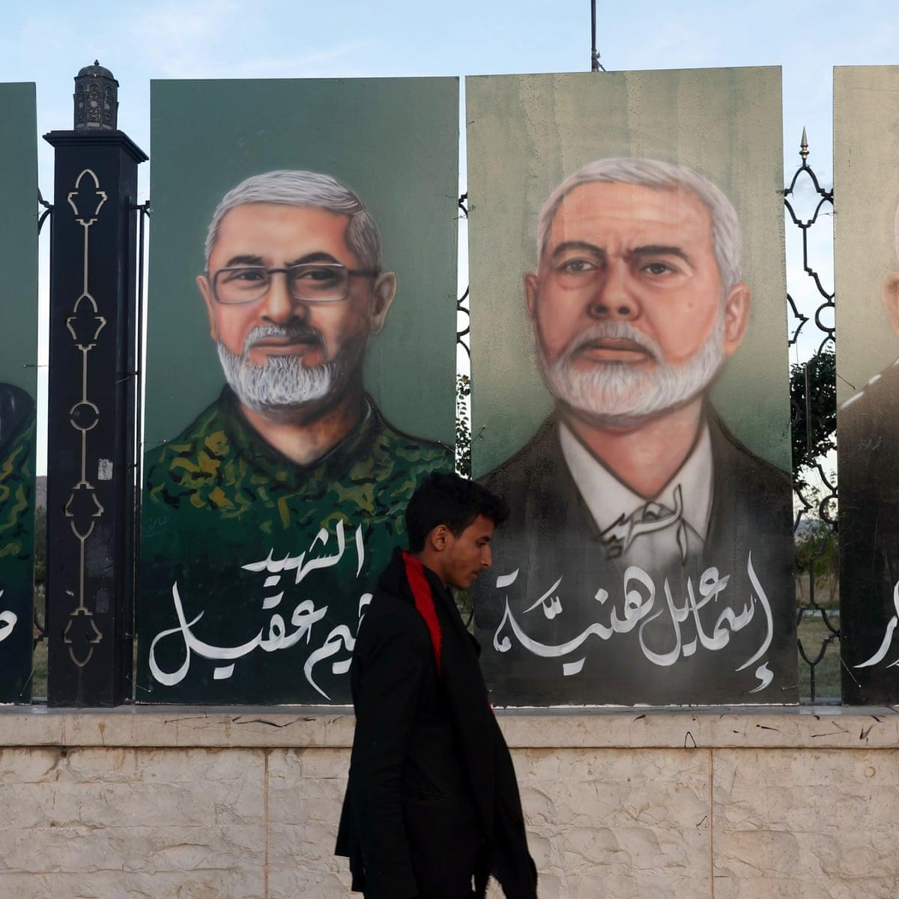
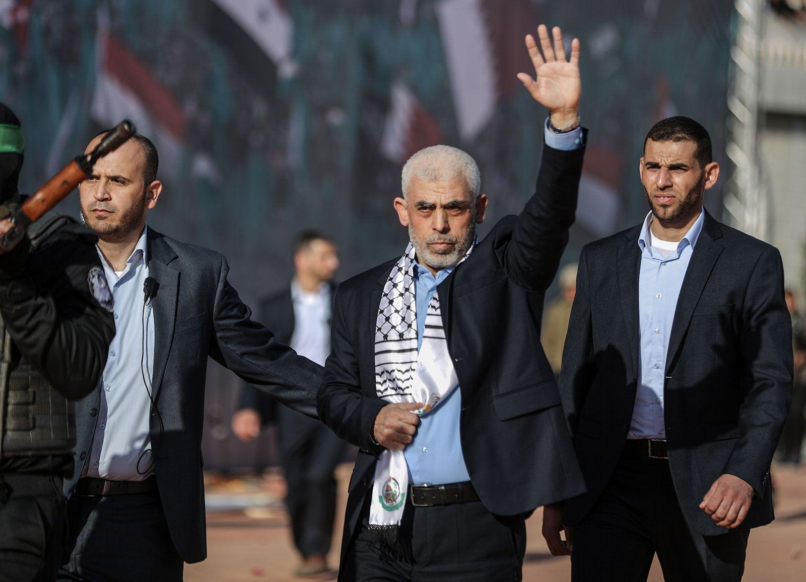

## Claim
Claim: " This image shows a screenshot of the X profile of UNRWA which has placed a black band over its profile photo in mourning for the death of Yahya Sinwar, Hamas leader in the Gaza Strip, in October 2024."

## Actions
```
image_search("UNRWA X profile")
```

## Evidence
### Evidence from `image_search`
The CNN article discusses UNRWA.  The dfrlab.org search result shows an image of the UNRWA HQ in Gaza. 

The provided sources do not contain information about the UNRWA X profile or the claim that it placed a black band over its profile photo in mourning for the death of Yahya Sinwar.


## Elaboration
The evidence does not support the claim. The search results provide images related to UNRWA, but they do not show the UNRWA X profile or any mourning for Yahya Sinwar.


## Actions
```
image_search("UNRWA X profile Yahya Sinwar mourning")
```

## Evidence
### Evidence from `image_search`
The search results include articles about Yahya Sinwar, including one from The Guardian ([https://www.theguardian.com/world/2024/oct/17/yahya-sinwar-hamas-gaza-netanyahu-israel-war](https://www.theguardian.com/world/2024/oct/17/yahya-sinwar-hamas-gaza-netanyahu-israel-war)) and a Britannica article ([https://www.britannica.com/biography/Yahya-Sunwar](https://www.britannica.com/biography/Yahya-Sunwar)). The Guardian article includes an image of portraits, and the Britannica article includes a photograph of Yahya Sinwar. , 


## Elaboration
The new evidence still does not support the claim. The search results provide articles and images related to Yahya Sinwar, but they do not show the UNRWA X profile or any mourning for Yahya Sinwar. The provided articles discuss Yahya Sinwar's biography and the context of the conflict, but they do not mention UNRWA's X profile.


## Final Judgement
The initial search did not provide any evidence to support the claim. The second search also did not provide any evidence to support the claim. The evidence does not show that UNRWA's X profile placed a black band over its profile photo in mourning for the death of Yahya Sinwar.

`false`

### Verdict: FALSE

### Justification
The claim is false. Multiple image searches were conducted to verify the claim, but no evidence was found to support it. The searches provided information about UNRWA and Yahya Sinwar, but did not show the UNRWA X profile with a black band in mourning.
