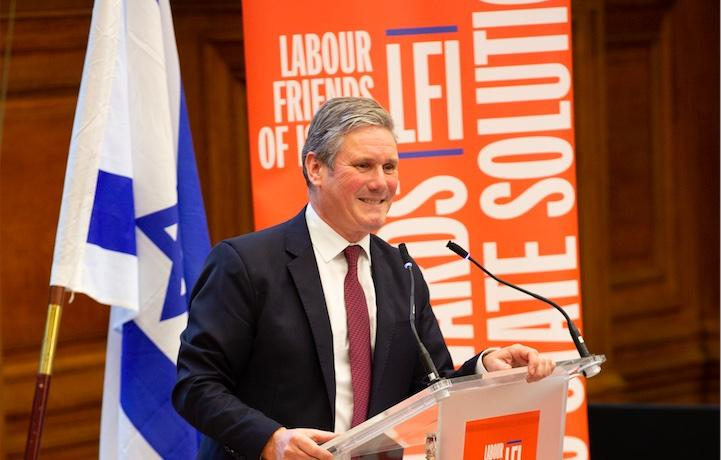

## Claim
Claim: "UK Prime Minister Keir Starmer said in October 2024 that the UK will boycott all diplomatic relations with Israel due to its long lasting war in Gaza."

## Actions
```
image_search("Keir Starmer Israel boycott Gaza October 2024")
```

## Evidence
### Evidence from `image_search`
The Guardian published an article on October 7, 2024, about Keir Starmer's stance on the Israel-Gaza conflict (). Novara Media published an article on July 3, 2024, about Keir Starmer and Palestine ().

The Times of Israel published an image of Keir Starmer ().


## Elaboration
The evidence shows that Keir Starmer's stance on the Israel-Gaza conflict was discussed in an article published by The Guardian on October 7, 2024. However, the evidence does not provide any information about whether Starmer said the UK would boycott all diplomatic relations with Israel.

Therefore, the claim cannot be verified with the available information.


## Actions
```
image_search("Keir Starmer boycott Israel October 2024")
```

## Evidence
### Evidence from `image_search`
The Guardian published an article on October 26, 2024, about Keir Starmer (). Counterfire published an article in November 2024 titled "Starmer's War on Palestine" ().


## Elaboration
The new evidence includes an article from The Guardian on October 26, 2024, featuring Keir Starmer, and a November 2024 article from Counterfire titled "Starmer's War on Palestine." However, neither of these articles explicitly mentions a boycott of diplomatic relations with Israel.

Therefore, the claim remains unverified.


## Actions
```
image_search("Keir Starmer UK Israel diplomatic relations October 2024")
```

## Evidence
### Evidence from `image_search`
The Atlantic Council published an image of Keir Starmer (). The Los Angeles Times published an article on July 29, 2025, stating that Keir Starmer said the UK will recognize a Palestinian state unless Israel agrees to a ceasefire ().


## Elaboration
The evidence reveals that the Los Angeles Times reported on July 29, 2025, that Keir Starmer stated the UK would recognize a Palestinian state if Israel did not agree to a ceasefire. This information is from a date *after* the timeframe specified in the claim (October 2024). The evidence does not support the claim that Starmer said the UK would boycott all diplomatic relations with Israel in October 2024.

Therefore, the claim remains unverified.


## Final Judgement
The search results provide articles and images related to Keir Starmer and the Israel-Gaza conflict, but none of them confirm that he stated the UK would boycott all diplomatic relations with Israel in October 2024. The evidence includes articles about his stance on the conflict and a statement about recognizing a Palestinian state, but not a boycott.

The claim is not supported by the available evidence. `false`


### Verdict: FALSE

### Justification
The fact-check did not find any evidence to support the claim that Keir Starmer said the UK would boycott all diplomatic relations with Israel in October 2024. While articles from sources like The Guardian and Los Angeles Times discuss Starmer's views on the Israel-Gaza conflict, including a statement about recognizing a Palestinian state, none of them mention a boycott of diplomatic relations within the specified timeframe. Therefore, the claim is unverified.
