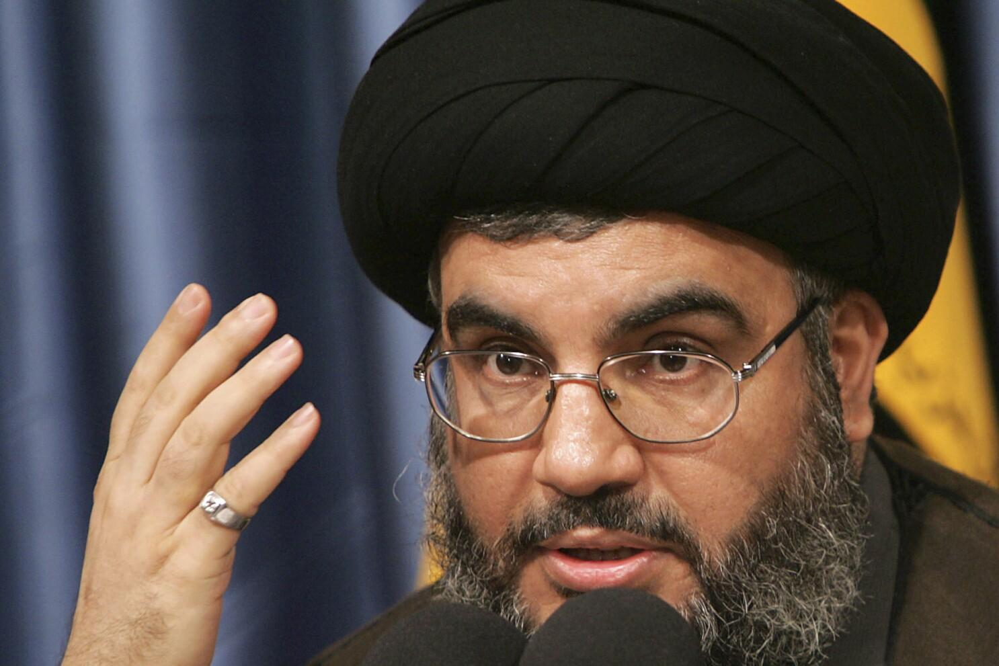

## Claim
Claim: " This image shows the remains of Nasrallah's ring after being killed in an Israeli airstrike in Beirut on September 28, 2024."

## Actions
```
reverse_search()
image_search("Nasrallah ring after airstrike")
```

## Evidence
### Evidence from `reverse_search`
The image in the claim () appears in multiple sources. These sources, including Khabaronline.ir ([https://www.khabaronline.ir/news/1890386/%D8%B9%DA%A9%D8%B3%DB%8C-%D8%AA%D9%84%D8%AE-%D8%A7%D8%B2-%D8%A7%D9%86%DA%AF%D8%B4%D8%AA%D8%B1-%D8%A8%D8%B1%D8%AC%D8%A7%DB%8C-%D9%85%D8%A7%D9%86%D8%AF%D9%87-%D8%A7%D8%B2-%D8%B3%D8%B1%D8%AF%D8%A7%D8%B1-%D8%B2%D8%A7%D9%87%D8%AF%DB%8C-%D8%A8%D8%B9%D8%AF-%D8%A7%D8%B2-%D8%B4%D9%87%D8%A7%D8%AF%D8%AA-%D9%87%D8%AF%DB%8C%D9%87](https://www.khabaronline.ir/news/1890386/%D8%B9%DA%A9%D8%B3%DB%8C-%D8%AA%D9%84%D8%AE-%D8%A7%D8%B2-%D8%A7%D9%86%DA%AF%D8%B4%D8%AA%D8%B1-%D8%A8%D8%B1%D8%AC%D8%A7%DB%8C-%D9%85%D8%A7%D9%86%D8%AF%D9%87-%D8%A7%D8%B2-%D8%B3%D8%B1%D8%AF%D8%A7%D8%B1-%D8%B2%D8%A7%D9%87%D8%AF%DB%8C-%D8%A8%D8%B9%D8%AF-%D8%A7%D8%B2-%D8%B4%D9%87%D8%A7%D8%AF%D8%AA-%D9%87%D8%AF%DB%8C%D9%87)), etemadonline.com ([https://www.etemadonline.com/%D8%A8%D8%AE%D8%B4-%D8%B3%DB%8C%D8%A7%D8%B3%DB%8C-9/655901-%D8%A7%D9%86%DA%AF%D8%B4%D8%AA%D8%B1-%D8%A7%D9%87%D8%AF%D8%A7%DB%8C%DB%8C-%D8%B4%D9%87%DB%8C%D8%AF%D8%B2%D8%A7%D9%87%D8%AF%DB%8C-%D8%AD%D9%85%D9%84%D9%87-%D8%A7%D8%B3%D8%B1%D8%A7%D8%A6%DB%8C%D9%84](https://www.etemadonline.com/%D8%A8%D8%AE%D8%B4-%D8%B3%DB%8C%D8%A7%D8%B3%DB%8C-9/655901-%D8%A7%D9%86%DA%AF%D8%B4%D8%AA%D8%B1-%D8%A7%D9%87%D8%AF%D8%A7%DB%8C%DB%8C-%D8%B4%D9%87%DB%8C%D8%AF%D8%B2%D8%A7%D9%87%D8%AF%DB%8C-%D8%AD%D9%85%D9%84%D9%87-%D8%A7%D8%B3%D8%B1%D8%A7%D8%A6%DB%8C%D9%84)), and 598.ir ([https://www.598.ir/fa/news/535490/%D8%AA%D8%B5%D9%88%DB%8C%D8%B1%DB%8C-%D8%A7%D8%B2-%D8%A7%D9%86%DA%AF%D8%B4%D8%AA%D8%B1-%D8%B4%D9%87%DB%8C%D8%AF-%D8%B2%D8%A7%D9%87%D8%AF%DB%8C](https://www.598.ir/fa/news/535490/%D8%AA%D8%B5%D9%88%DB%8C%D8%B1%DB%8C-%D8%A7%D8%B2-%D8%A7%D9%86%DA%AF%D8%B4%D8%AA%D8%B1-%D8%B4%D9%87%DB%8C%D8%AF-%D8%B2%D8%A7%D9%87%D8%AF%DB%8C)), identify the image as the remains of a ring belonging to Sardar Mohammad Reza Zahedi, who was killed in an Israeli airstrike in Damascus. The image was published around April 1-3, 2024.


### Evidence from `image_search`
The Associated Press ([https://apnews.com/article/obituary-nasrallah-lebanon-israel-2da3789a02fd4e2e88511a7f59174d19](https://apnews.com/article/obituary-nasrallah-lebanon-israel-2da3789a02fd4e2e88511a7f59174d19)) and ABC News ([https://abcnews.go.com/International/hezbollah-leader-hassan-nasrallah-killed-beirut-airstrikes/story?id=114310729](https://abcnews.go.com/International/hezbollah-leader-hassan-nasrallah-killed-beirut-airstrikes/story?id=114310729)) both show images of Nasrallah wearing a ring. WUNC.org ([https://www.wunc.org/2024-09-28/hezbollah-confirms-its-top-leader-was-killed-after-israeli-airstrikes](https://www.wunc.org/2024-09-28/hezbollah-confirms-its-top-leader-was-killed-after-israeli-airstrikes)) confirms that Hezbollah's top leader was killed after Israeli airstrikes.

  


## Elaboration
The claim is not supported by the evidence. The image in the claim shows the remains of a ring belonging to Sardar Mohammad Reza Zahedi, not Nasrallah. The image was published around April 2024, while the claim mentions September 28, 2024.


## Final Judgement
The image in the claim is of a ring belonging to Sardar Mohammad Reza Zahedi, not Nasrallah. The image was published in April 2024, not September 2024.

`false`

### Verdict: FALSE

### Justification
The image depicts the remains of a ring belonging to Sardar Mohammad Reza Zahedi, not Nasrallah, as claimed. The image was published in April 2024, contradicting the claim's date of September 28, 2024. The evidence from reverse image search ([https://www.khabaronline.ir/news/1890386/%D8%B9%DA%A9%D8%B3%DB%8C-%D8%AA%D9%84%D8%AE-%D8%A7%D8%B2-%D8%A7%D9%86%DA%AF%D8%B4%D8%AA%D8%B1-%D8%A8%D8%B1%D8%AC%D8%A7%DB%8C-%D9%85%D8%A7%D9%86%D8%AF%D9%87-%D8%A7%D8%B2-%D8%B3%D8%B1%D8%AF%D8%A7%D8%B1-%D8%B2%D8%A7%D9%87%D8%AF%DB%8C-%D8%A8%D8%B9%D8%AF-%D8%A7%D8%B2-%D8%B4%D9%87%D8%A7%D8%AF%D8%AA-%D9%87%D8%AF%DB%8C%D9%87](https://www.khabaronline.ir/news/1890386/%D8%B9%DA%A9%D8%B3%DB%8C-%D8%AA%D9%84%D8%AE-%D8%A7%D8%B2-%D8%A7%D9%86%DA%AF%D8%B4%D8%AA%D8%B1-%D8%A8%D8%B1%D8%AC%D8%A7%DB%8C-%D9%85%D8%A7%D9%86%D8%AF%D9%87-%D8%A7%D8%B2-%D8%B3%D8%B1%D8%AF%D8%A7%D8%B1-%D8%B2%D8%A7%D9%87%D8%AF%DB%8C-%D8%A8%D8%B9%D8%AF-%D8%A7%D8%B2-%D8%B4%D9%87%D8%A7%D8%AF%D8%AA-%D9%87%D8%AF%DB%8C%D9%87)) confirms this.
