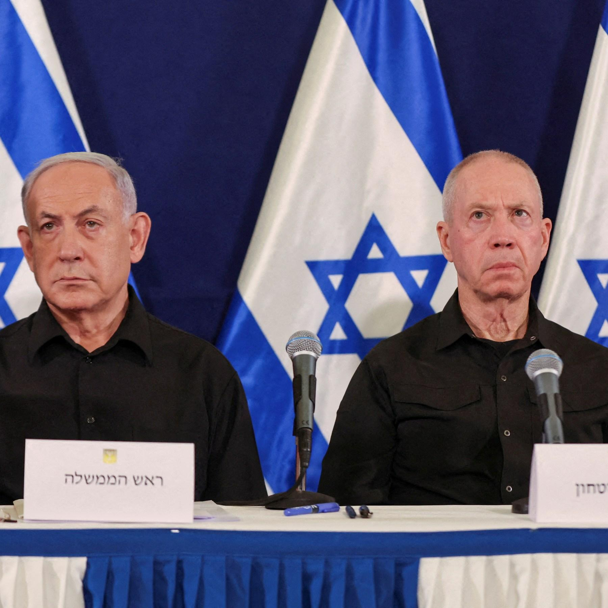

## Claim
Claim: "Gallant, a retired military general and a member of Prime Minister Benjamin Netanyahu’s war cabinet, was killed in the Iranian attack on Israel on October 1, 2024."

## Actions
```
image_search("Yoav Gallant October 1 2024")
```

## Evidence
### Evidence from `image_search`
Reuters published an article on October 8, 2024, stating that Israeli Defense Minister Yoav Gallant postponed a visit to Washington (). Al Jazeera published an article about Benjamin Netanyahu firing Yoav Gallant, including an image of Netanyahu and Gallant ().

An NPR article, published on November 5, 2024, features an image of Yoav Gallant ().


## Elaboration
The evidence indicates that Yoav Gallant was alive after October 1, 2024. Reuters reported on October 8, 2024, that he postponed a visit, and an NPR article from November 5, 2024, also features an image of him. The claim that he was killed on October 1, 2024, is therefore false.


## Final Judgement
The evidence shows that Yoav Gallant was alive after October 1, 2024, as he was mentioned in news articles published on October 8 and November 5, 2024. This contradicts the claim that he was killed on October 1, 2024.

`false`


### Verdict: FALSE

### Justification
The claim is false. Evidence from Reuters and NPR, published after October 1, 2024, shows that Yoav Gallant was alive after the alleged date of his death.
