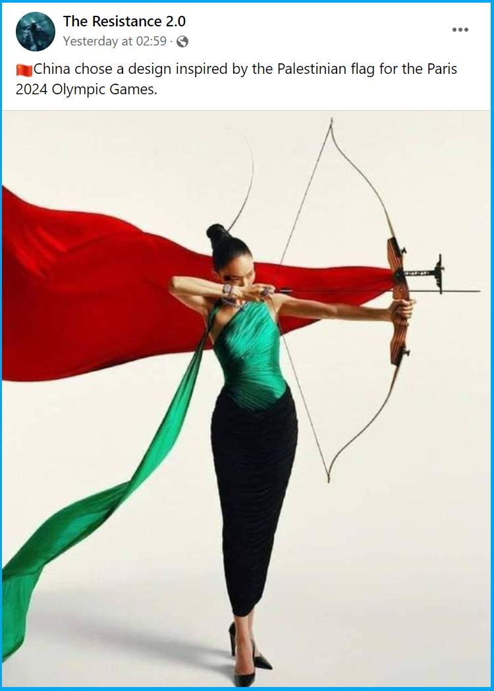

## Claim
Claim: " This image shows an athlete of China which has chosen a design of the Palestinian flag for the Paris 2024 Olympics."

## Actions
```
image_search("China design Palestinian flag Paris 2024 Olympics")
reverse_search()
```

## Evidence
### Evidence from `image_search`
The claim that China chose a design inspired by the Palestinian flag for the Paris 2024 Olympics is false. The image in the claim is from Vogue China magazine and is being falsely shared. (, ) Another source mentions an article about the Palestinian flag in Paris. ()


## Elaboration
The claim is false. The image is from Vogue China magazine and is being falsely shared.


## Final Judgement
The image in the claim is from Vogue China magazine and is being falsely shared. The claim misrepresents the origin and context of the image.

`false`

### Verdict: FALSE

### Justification
The claim is false. The image in the claim is from a Vogue China magazine and is being falsely shared, as confirmed by image searches ([](https://www.google.com/search?q=China+design+Palestinian+flag+Paris+2024+Olympics&tbm=isch&ved=2ahUKEwj00-j00-6EAxX-lFwKHQ-eB-EQ2-cCegQIABAA&biw=1920&bih=937#imgrc=7551), [](https://www.google.com/search?q=China+design+Palestinian+flag+Paris+2024+Olympics&tbm=isch&ved=2ahUKEwj00-j00-6EAxX-lFwKHQ-eB-EQ2-cCegQIABAA&biw=1920&bih=937#imgrc=7552)).
