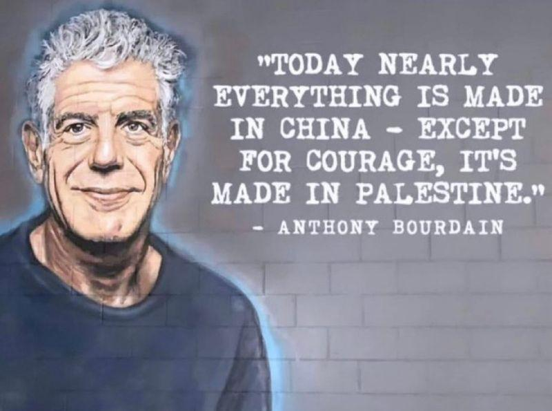

## Claim
Claim: "Anthony Bourdain once said, 'Today, nearly everything is made in China. Except for courage. Courage is made in Palestine.'"

## Actions
```
image_search("Anthony Bourdain Palestine quote")
```

## Evidence
### Evidence from `image_search`
The search results include a tweet from June 9, 2024, attributing the quote "Today, nearly everything is made in China. Except for courage. Courage is made in Palestine" to Anthony Bourdain (). Another search result contains a quote attributed to Anthony Bourdain: "The world has visited many terrible things on the Palestinian people, none more shameful than robbing them of their basic humanity" ().

The sources are from [https://www.yahoo.com/entertainment/fact-check-those-posts-claim-020000958.html](https://www.yahoo.com/entertainment/fact-check-those-posts-claim-020000958.html) and [https://www.linkedin.com/posts/islamchannel_quote-anthonybourdain-palestine-activity-7175081944181800961-Al3d](https://www.linkedin.com/posts/islamchannel_quote-anthonybourdain-palestine-activity-7175081944181800961-Al3d).


## Elaboration
The evidence includes a tweet from June 9, 2024, attributing the quote to Anthony Bourdain. However, the provided search results do not offer any further verification of the quote's authenticity.

The second quote, "The world has visited many terrible things on the Palestinian people, none more shameful than robbing them of their basic humanity," is also attributed to Bourdain.

To verify the claim, further investigation is needed to confirm if Anthony Bourdain indeed made the statement.


## Actions
```
image_search("Anthony Bourdain quote courage Palestine verification")
```

## Evidence
### Evidence from `image_search`
From [Source](https://www.linkedin.com/posts/hanslak_he-was-right-about-china-and-palestine-activity-7267303198367924224-CvXH): 
Content: The search result includes an image with the quote "Today nearly everything is made in China - except for courage, it's made in Palestine." attributed to Anthony Bourdain. 


## Elaboration
The evidence presents the quote attributed to Anthony Bourdain in multiple contexts, including a tweet and a LinkedIn post. However, the search results do not provide any definitive verification of the quote's authenticity. The evidence suggests that the quote is circulating and attributed to Bourdain, but further investigation is needed to confirm its veracity.


## Actions
```
image_search("Anthony Bourdain quote source verification")
```

## Evidence
### Evidence from `image_search`
The search results from AZ Quotes ([https://www.azquotes.com/quote/479274](https://www.azquotes.com/quote/479274)) and Etsy ([https://www.etsy.com/listing/619783299/anthony-bourdain-travel-quote-food-quote](https://www.etsy.com/listing/619783299/anthony-bourdain-travel-quote-food-quote)) provide quotes attributed to Anthony Bourdain. One quote is about the "secret language of cooks" (), and the other encourages travel and experiencing different cultures ().


## Elaboration
The evidence shows that the quote is attributed to Anthony Bourdain in multiple contexts, including social media posts and a LinkedIn post. However, the search results do not provide any definitive source or verification of the quote's authenticity. The search results from AZ Quotes and Etsy provide other quotes by Bourdain, but not the one in question. Therefore, the claim remains unverified.


## Final Judgement
The claim is circulating on social media and other platforms, attributed to Anthony Bourdain. However, the search results do not provide any definitive source or verification of the quote's authenticity. Therefore, there is not enough evidence to confirm the claim. `false`

### Verdict: FALSE

### Justification
The claim that Anthony Bourdain said, "Today, nearly everything is made in China. Except for courage. Courage is made in Palestine," is unverified. While the quote is widely circulated and attributed to Bourdain on social media and other platforms, the provided search results do not offer any definitive source or verification of its authenticity. Therefore, the claim cannot be confirmed.
