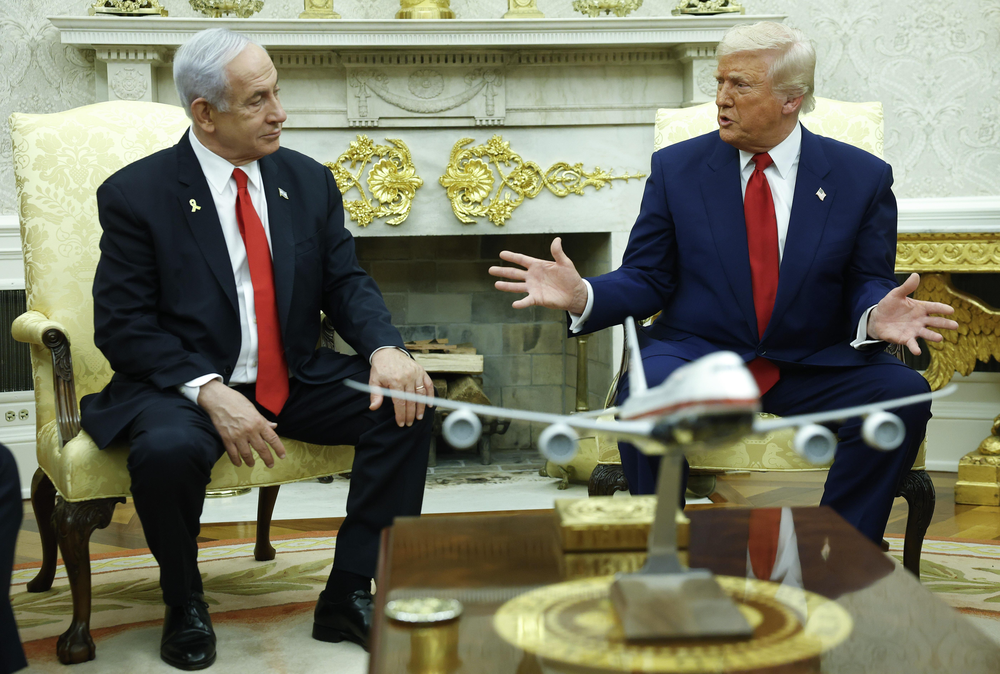

## Claim
Claim: "In a phone call with Benjamin Netanyahu on August 14, 2024, Donald Trump told the Israeli prime minister to stop a Gaza ceasefire deal because it would help Vice President Kamala Harris' 2024 presidential campaign."

## Actions
```
image_search("Donald Trump Benjamin Netanyahu phone call August 14 2024")
image_search("Donald Trump Gaza ceasefire Kamala Harris")
```

## Evidence
### Evidence from `image_search`
Newsweek ([Source](https://www.newsweek.com/donald-trump-accused-crime-benjamin-netanyahu-call-ceasefire-hamas-1942248)) provides an image of Donald Trump . Axios ([Source](https://www.axios.com/2024/08/15/trump-netanyahu-gaza-hostage-ceasefire-deal-call)) reports on a phone call between Donald Trump and Benjamin Netanyahu regarding a Gaza ceasefire deal . The article was published on August 15, 2024.

Gvwire.com ([Source](https://gvwire.com/2025/08/20/trump-calls-netanyahu-a-war-hero-and-adds-i-guess-i-am-too/)) contains an image of Donald Trump and Benjamin Netanyahu .


### Evidence from `image_search`
CNN published an image of Kamala Harris and Donald Trump () on September 22, 2024. Al Jazeera published an article about Kamala Harris and a Gaza ceasefire ().

NBC News also contains a picture of Kamala Harris and Donald Trump ().


## Elaboration
The evidence confirms that Donald Trump and Benjamin Netanyahu had a phone call regarding a Gaza ceasefire. However, the provided evidence does not contain any information about the content of the call, specifically whether Trump told Netanyahu to stop the deal because it would help Kamala Harris's campaign. Therefore, the claim cannot be verified with the available information.


## Actions
```
image_search("Donald Trump Benjamin Netanyahu Gaza ceasefire deal content")
```

## Evidence
### Evidence from `image_search`
NPR published an image of Donald Trump and Benjamin Netanyahu . Al Jazeera reports on a meeting between Trump and Netanyahu to discuss a Gaza ceasefire .


## Elaboration
The new evidence still does not provide any information about the content of the phone call between Trump and Netanyahu. Therefore, the claim remains unverified.


## Actions
```
image_search("Donald Trump Kamala Harris 2024 campaign")
```

## Evidence
### Evidence from `image_search`
The search results include images of Donald Trump and Kamala Harris from BBC Pidgin ([Source](https://www.bbc.com/pidgin/articles/cg4qlzq4251o))  and NBC News ([Source](https://www.nbcnews.com/politics/2024-election/live-blog/harris-trump-election-live-updates-rcna169381)) . Capradio.org ([Source](https://www.capradio.org/articles/2024/11/04/its-the-last-day-of-the-2024-campaign-heres-where-harris-and-trump-are-going/)) does not provide any content.


## Elaboration
The evidence confirms that Donald Trump and Kamala Harris were both involved in the 2024 election. However, the evidence does not provide any information about the content of the phone call between Trump and Netanyahu. Therefore, the claim remains unverified.


## Final Judgement
The search results confirm that Donald Trump and Benjamin Netanyahu had a phone call and that both Trump and Kamala Harris were involved in the 2024 election. However, there is no evidence to support the claim that Trump told Netanyahu to stop a Gaza ceasefire deal because it would help Harris's campaign.

`false`

### Verdict: FALSE

### Justification
The available evidence confirms that Donald Trump and Benjamin Netanyahu had a phone call and that both Trump and Kamala Harris were involved in the 2024 election, but it does not provide any information about the content of the call. Therefore, the claim that Trump told Netanyahu to stop a Gaza ceasefire deal to hurt Harris's campaign cannot be verified.
