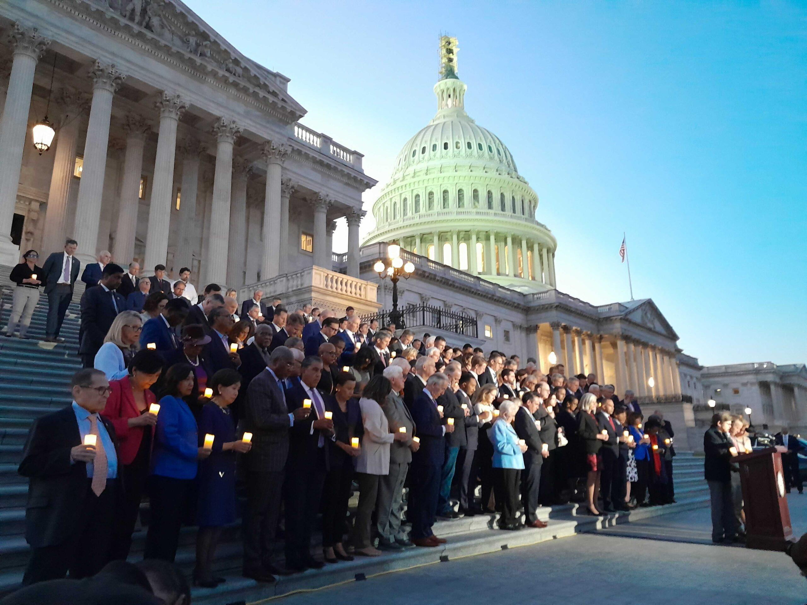
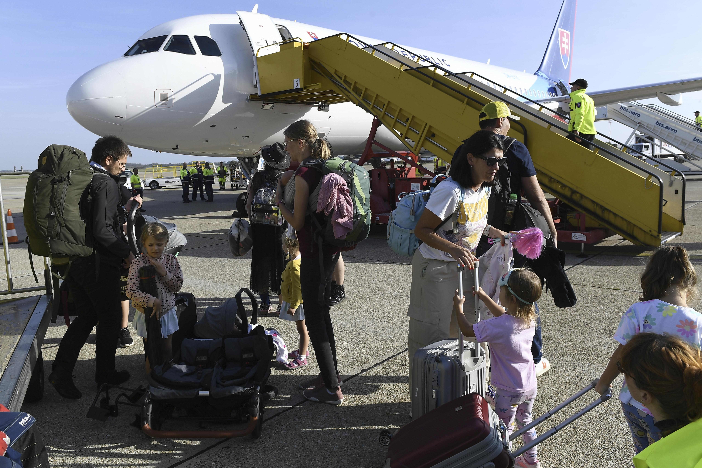

## Claim
Claim: "As the tensions between Israel and Hezbollah escalate in October, 2024, the U.S. government is offering Americans loans to pay for flights out of Lebanon while they have been flying Israeli citizens out of Israel on chartered flights for a year 'on US taxpayers' dime."

## Actions
```
image_search("US government loans Americans flights Lebanon October 2024")
image_search("US chartered flights Israeli citizens October 2023 - October 2024")
```

## Evidence
### Evidence from `image_search`
From [Source](https://www.foxbusiness.com/lifestyle/us-embassy-lebanon-urges-americans-book-any-ticket-available-few-remaining-departing-flights): 
Content: The Fox Business article includes an image of people with luggage. 


### Evidence from `image_search`
The Missouri Independent ([Source](https://missouriindependent.com/2023/10/13/with-violence-raging-in-israel-u-s-citizens-to-be-flown-out-on-charters/)), the Idaho Capital Sun ([Source](https://idahocapitalsun.com/2023/10/12/with-violence-raging-in-israel-u-s-citizens-to-be-flown-out-on-charters/)), and Politico ([Source](https://www.politico.com/news/2023/10/12/charter-flights-israel-americans-nsc-00121241)) all published articles in October 2023 regarding charter flights for U.S. citizens out of Israel.   


## Elaboration
The evidence indicates that in October 2023, the U.S. government arranged charter flights to evacuate U.S. citizens from Israel due to escalating violence. The Fox Business article shows an image of people with luggage, which may suggest an evacuation. However, the provided evidence does not mention the U.S. government offering loans to Americans for flights out of Lebanon in October 2024, nor does it confirm that the charter flights for U.S. citizens from Israel were "on US taxpayers' dime."

The claim's veracity is partially supported by the evidence of charter flights for U.S. citizens from Israel in October 2023. However, the evidence does not support the claim regarding loans for flights from Lebanon in October 2024 or the financial details of the Israeli evacuation flights.

To fully verify the claim, I need information about the U.S. government's actions regarding flights from Lebanon in October 2024 and the funding source for the charter flights from Israel.


## Actions
```
image_search("US funding charter flights Israel October 2023")
```

## Evidence
### Evidence from `image_search`
In October 2023, Reuters reported on the first U.S. charter flight from Israel landing in Athens ([https://www.reuters.com/world/first-us-charter-flight-out-israel-lands-athens-official-says-2023-10-13/](https://www.reuters.com/world/first-us-charter-flight-out-israel-lands-athens-official-says-2023-10-13/)). The Minnesota Reformer also published an article in October 2023 about charter flights for U.S. citizens out of Israel ([https://minnesotareformer.com/2023/10/12/u-s-citizens-to-be-flown-out-of-israel-out-on-charters/](https://minnesotareformer.com/2023/10/12/u-s-citizens-to-be-flown-out-of-israel-out-on-charters/)). , 


## Elaboration
The evidence confirms that the U.S. government organized charter flights to evacuate U.S. citizens from Israel in October 2023. However, the evidence does not specify the funding source for these flights. The claim that the flights were "on US taxpayers' dime" is therefore not directly supported by the evidence. The evidence also does not mention any loans offered to Americans for flights out of Lebanon in October 2024.

Therefore, the claim is partially supported regarding the charter flights from Israel in October 2023, but the financial details and the information about Lebanon in October 2024 are not supported by the evidence.


## Final Judgement
The evidence confirms that the U.S. government organized charter flights to evacuate U.S. citizens from Israel in October 2023. However, the evidence does not specify the funding source for these flights, nor does it mention any loans offered to Americans for flights out of Lebanon in October 2024. Therefore, the claim is partially supported regarding the charter flights from Israel in October 2023, but the financial details and the information about Lebanon in October 2024 are not supported by the evidence. `false`

### Verdict: FALSE

### Justification
The claim is partially supported. Evidence confirms the U.S. government organized charter flights to evacuate U.S. citizens from Israel in October 2023, as reported by Reuters ([https://www.reuters.com/world/first-us-charter-flight-out-israel-lands-athens-official-says-2023-10-13/](https://www.reuters.com/world/first-us-charter-flight-out-israel-lands-athens-official-says-2023-10-13/)) and the Minnesota Reformer ([https://minnesotareformer.com/2023/10/12/u-s-citizens-to-be-flown-out-of-israel-out-on-charters/](https://minnesotareformer.com/2023/10/12/u-s-citizens-to-be-flown-out-of-israel-out-on-charters/)). However, the evidence does not specify the funding source for these flights, nor does it support the claim regarding loans for flights from Lebanon in October 2024.
