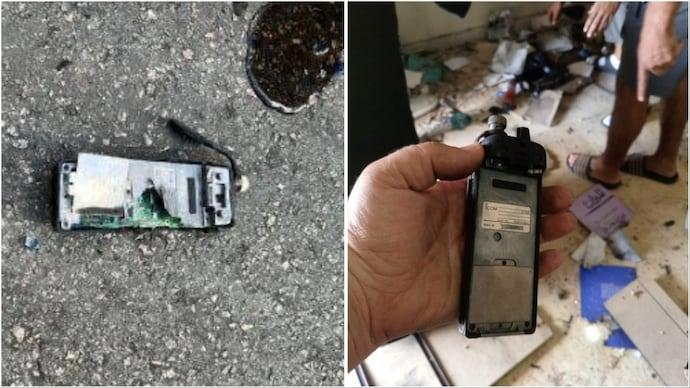
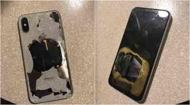
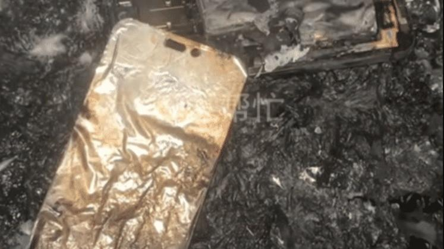

## Claim
Claim: " This image shows an Iphone that exploded during the pager attacks on Hezbollah devices in Lebanon in September 2024, blowing up random people."

## Actions
```
reverse_search()
image_search("iphone explosion lebanon september 2024")
```

## Evidence
### Evidence from `reverse_search`
The image 

### Evidence from `image_search`
From [Source](https://www.indiatoday.in/world/story/hezbollah-devices-explode-lebanon-pager-blasts-beirut-israel-2602266-2024-09-18): 
Content: India Today reports on explosions in Lebanon involving Hezbollah devices in September 2024. 


## Elaboration
The evidence indicates that there were explosions involving Hezbollah devices in Lebanon in September 2024. However, the provided image search results do not show any images of exploded iPhones. The India Today article ([https://www.indiatoday.in/world/story/hezbollah-devices-explode-lebanon-pager-blasts-beirut-israel-2602266-2024-09-18](https://www.indiatoday.in/world/story/hezbollah-devices-explode-lebanon-pager-blasts-beirut-israel-2602266-2024-09-18)) shows images of exploded pagers, not iPhones.

Therefore, the claim that the image shows an iPhone that exploded during the pager attacks is not supported by the evidence. More information is needed to verify the claim.


## Actions
```
image_search("exploded iphone lebanon september 2024")
```

## Evidence
### Evidence from `image_search`
The Times of Israel ([https://www.timesofisrael.com/hezbollah-device-explosions-mainly-hurt-group-psychologically-analysts-say/](https://www.timesofisrael.com/hezbollah-device-explosions-mainly-hurt-group-psychologically-analysts-say/)) and NBC News ([https://www.nbcnews.com/news/world/pager-new-device-explosions-lebanon-hezbollah-rcna171637](https://www.nbcnews.com/news/world/pager-new-device-explosions-lebanon-hezbollah-rcna171637)) report on explosions in Lebanon involving Hezbollah devices in September 2024.  


## Elaboration
The new evidence from the image search confirms the occurrence of explosions in Lebanon in September 2024, as reported by The Times of Israel ([https://www.timesofisrael.com/hezbollah-device-explosions-mainly-hurt-group-psychologically-analysts-say/](https://www.timesofisrael.com/hezbollah-device-explosions-mainly-hurt-group-psychologically-analysts-say/)) and NBC News ([https://www.nbcnews.com/news/world/pager-new-device-explosions-lebanon-hezbollah-rcna171637](https://www.nbcnews.com/news/world/pager-new-device-explosions-lebanon-hezbollah-rcna171637)). However, these sources do not mention or show any images of exploded iPhones.

Therefore, the claim that the image shows an iPhone that exploded during the pager attacks remains unsupported by the evidence.


## Actions
```
image_search("iphone explosion damage analysis")
```

## Evidence
### Evidence from `image_search`
Digit.in reports on an iPhone 14 Pro Max explosion that caused severe burns ([https://www.digit.in/news/mobile-phones/iphone-14-pro-max-explosion-leaves-woman-with-severe-burns-sparks-safety-concerns.html](https://www.digit.in/news/mobile-phones/iphone-14-pro-max-explosion-leaves-woman-with-severe-burns-sparks-safety-concerns.html)) . The Indian Express reports on an iPhone X exploding while upgrading to iOS 12.1 ([https://indianexpress.com/article/technology/mobile-tabs/apple-iphone-x-explodes-while-upgrading-to-ios-12-1-claims-user-5446191/](https://indianexpress.com/article/technology/mobile-tabs/apple-iphone-x-explodes-while-upgrading-to-ios-12-1-claims-user-5446191/)) . India Today reports on an iPhone 14 Pro Max that allegedly exploded while a woman was sleeping ([https://www.indiatoday.in/technology/news/story/woman-alleges-her-iphone-14-pro-max-exploded-while-she-was-sleeping-apple-looking-into-it-2629027-2024-11-06](https://www.indiatoday.in/technology/news/story/woman-alleges-her-iphone-14-pro-max-exploded-while-she-was-sleeping-apple-looking-into-it-2629027-2024-11-06)) .


## Elaboration
The evidence shows that iPhones have exploded in the past, as reported by Digit.in ([https://www.digit.in/news/mobile-phones/iphone-14-pro-max-explosion-leaves-woman-with-severe-burns-sparks-safety-concerns.html](https://www.digit.in/news/mobile-phones/iphone-14-pro-max-explosion-leaves-woman-with-severe-burns-sparks-safety-concerns.html)), The Indian Express ([https://indianexpress.com/article/technology/mobile-tabs/apple-iphone-x-explodes-while-upgrading-to-ios-12-1-claims-user-5446191/](https://indianexpress.com/article/technology/mobile-tabs/apple-iphone-x-explodes-while-upgrading-to-ios-12-1-claims-user-5446191/)), and India Today ([https://www.indiatoday.in/technology/news/story/woman-alleges-her-iphone-14-pro-max-exploded-while-she-was-sleeping-apple-looking-into-it-2629027-2024-11-06](https://www.indiatoday.in/technology/news/story/woman-alleges-her-iphone-14-pro-max-exploded-while-she-was-sleeping-apple-looking-into-it-2629027-2024-11-06)). However, none of the provided sources mention or show an iPhone exploding during the pager attacks in Lebanon in September 2024.

Therefore, the claim remains unsupported by the evidence.


## Final Judgement
The image search results confirm that iPhones have exploded in the past, and there were explosions in Lebanon in September 2024. However, there is no evidence to support the claim that the image shows an iPhone that exploded during the pager attacks in Lebanon.

`false`

### Verdict: FALSE

### Justification
The claim is unsupported. While there were explosions in Lebanon in September 2024, and iPhones have exploded in the past, there is no evidence to connect the image to the pager attacks or to an iPhone explosion during that time, as confirmed by sources like [India Today](https://www.indiatoday.in/world/story/hezbollah-devices-explode-lebanon-pager-blasts-beirut-israel-2602266-2024-09-18).
