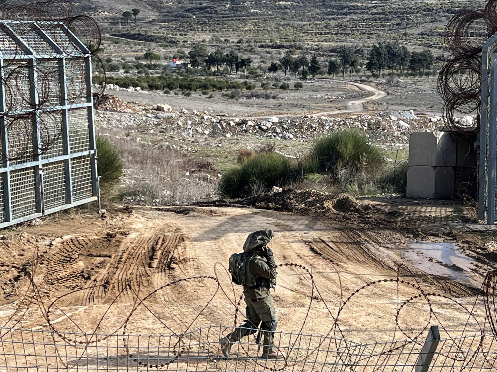

## Claim
Claim: " This image shows Israel bombing the surroundings of Southern Damascus in February 2025, destroying its last remaining army depots."

## Actions
```
reverse_search()
image_search("Israel bombing Damascus February 2025")
```

## Evidence
### Evidence from `reverse_search`
The image in the claim () appears in an article from Alghad News, published on December 2, 2023, reporting on an Israeli air attack on Damascus. The Syrian Ministry of Defense announced the details of the attack. The exact image was also found on a website with the title: الصحفي محمد العويد في مقابلة مع درعا 24: جزء من وظيفة الإعلام أن يلعب ... from Daraa 24, published in January 2025.

The article from Daraa 24 ([https://daraa24.org/%D8%A7%D9%84%D8%B5%D8%AD%D9%81%D9%8A-%D9%85%D8%AD%D9%85%D8%AF-%D8%A7%D9%84%D8%B9%D9%88%D9%8A%D8%AF-%D9%81%D9%8A-%D9%85%D9%82%D8%A7%D8%A8%D9%84%D8%A9-%D9%85%D8%B9-%D8%AF%D8%B1%D8%B9%D8%A7-24/](https://daraa24.org/%D8%A7%D9%84%D8%B5%D8%AD%D9%81%D9%8A-%D9%85%D8%AD%D9%85%D8%AF-%D8%A7%D9%84%D8%B9%D9%88%D9%8A%D8%AF-%D9%81%D9%8A-%D9%85%D9%82%D8%A7%D8%A8%D9%84%D8%A9-%D9%85%D8%B9-%D8%AF%D8%B1%D8%B9%D8%A7-24/)) features an interview with a journalist and does not contain the image. The Alghad News article ([https://www.alghad.tv/%D8%A3%D8%AE%D8%A8%D8%A7%D8%B1-%D8%A7%D9%84%D8%BA%D8%AF/news/%D9%88%D8%B2%D8%A7%D8%B1%D8%A9-%D8%A7%D9%84%D8%AF%D9%81%D8%A7%D8%B9-%D8%A7%D9%84%D8%B3%D9%88%D8%B1%D9%8A%D8%A9-%D8%AA%D9%83%D8%B4%D9%81-%D8%AA%D9%81%D8%A7%D8%B5%D9%8A%D9%84-%D8%A7%D9%84%D8%B9%D8%AF%D9%88%D8%A7%D9%86-%D8%A7%D9%84%D8%AC%D9%88%D9%8A-%D8%A7%D9%84%D8%A5%D8%B3%D8%B1%D8%A7%D8%A6%D9%8A%D9%84%D9%8A-%D8%B9%D9%84%D9%89-%D8%AF%D9%85%D8%B4%D9%82](https://www.alghad.tv/%D8%A3%D8%AE%D8%A8%D8%A7%D8%B1-%D8%A7%D9%84%D8%BA%D8%AF/news/%D9%88%D8%B2%D8%A7%D8%B1%D8%A9-%D8%A7%D9%84%D8%AF%D9%81%D8%A7%D8%B9-%D8%A7%D9%84%D8%B3%D9%88%D8%B1%D9%8A%D8%A9-%D8%AA%D9%83%D8%B4%D9%81-%D8%AA%D9%81%D8%A7%D8%B5%D9%8A%D9%84-%D8%A7%D9%84%D8%B9%D8%AF%D9%88%D8%A7%D9%86-%D8%A7%D9%84%D8%AC%D9%88%D9%8A-%D8%A7%D9%84%D8%A5%D8%B3%D8%B1%D8%A7%D8%A6%D9%8A%D9%84%D9%8A-%D8%B9%D9%84%D9%89-%D8%AF%D9%85%D8%B4%D9%82)) reports on an Israeli air attack on Damascus.


### Evidence from `image_search`
The Los Angeles Times published an article on July 16, 2025, about unrest in Sweida, Syria, including an image of an explosion (). Al Jazeera reports on Israel bombing military targets in southern Syria outside Damascus in February 2025 (). The search result from twz.com contains an image of an explosion ().

*   [https://www.latimes.com/world-nation/story/2025-07-16/syria-sweida-unrest](https://www.latimes.com/world-nation/story/2025-07-16/syria-sweida-unrest)
*   [https://www.aljazeera.com/news/2025/2/26/israel-bombs-military-targets-in-southern-syria-outside-damascus](https://www.aljazeera.com/news/2025/2/26/israel-bombs-military-targets-in-southern-syria-outside-damascus)
*   [https://www.twz.com/news-features/israel-strikes-at-the-heart-of-syrias-military-command-in-dramatic-escalation](https://www.twz.com/news-features/israel-strikes-at-the-heart-of-syrias-military-command-in-dramatic-escalation)


## Elaboration
The claim is partially supported by the evidence. The image in the claim was used in an article about an Israeli air attack on Damascus. Al Jazeera reported on Israel bombing military targets in southern Syria outside Damascus in February 2025. However, the evidence does not confirm that the image shows the destruction of the last remaining army depots.


## Final Judgement
The claim is partially supported by the evidence. The image was used in an article about an Israeli air attack on Damascus. Al Jazeera reported on Israel bombing military targets in southern Syria outside Damascus in February 2025. However, the evidence does not confirm that the image shows the destruction of the last remaining army depots. Therefore, the claim is not entirely accurate. `false`

### Verdict: FALSE

### Justification
The image in the claim was used in an article about an Israeli air attack on Damascus in December 2023, as reported by Alghad News ([https://www.alghad.tv/%D8%A3%D8%AE%D8%A8%D8%A7%D8%B1-%D8%A7%D9%84%D8%BA%D8%AF/news/%D9%88%D8%B2%D8%A7%D8%B1%D8%A9-%D8%A7%D9%84%D8%AF%D9%81%D8%A7%D8%B9-%D8%A7%D9%84%D8%B3%D9%88%D8%B1%D9%8A%D8%A9-%D8%AA%D9%83%D8%B4%D9%81-%D8%AA%D9%81%D8%A7%D8%B5%D9%8A%D9%84-%D8%A7%D9%84%D8%B9%D8%AF%D9%88%D8%A7%D9%86-%D8%A7%D9%84%D8%AC%D9%88%D9%8A-%D8%A7%D9%84%D8%A5%D8%B3%D8%B1%D8%A7%D8%A6%D9%8A%D9%84%D9%8A-%D8%B9%D9%84%D9%89-%D8%AF%D9%85%D8%B4%D9%82](https://www.alghad.tv/%D8%A3%D8%AE%D8%A8%D8%A7%D8%B1-%D8%A7%D9%84%D8%BA%D8%AF/news/%D9%88%D8%B2%D8%A7%D8%B1%D8%A9-%D8%A7%D9%84%D8%AF%D9%81%D8%A7%D8%B9-%D8%A7%D9%84%D8%B3%D9%88%D8%B1%D9%8A%D8%A9-%D8%AA%D9%83%D8%B4%D9%81-%D8%AA%D9%81%D8%A7%D8%B5%D9%8A%D9%84-%D8%A7%D9%84%D8%B9%D8%AF%D9%88%D8%A7%D9%86-%D8%A7%D9%84%D8%AC%D9%88%D9%8A-%D8%A7%D9%84%D8%A5%D8%B3%D8%B1%D8%A7%D8%A6%D9%8A%D9%84%D9%8A-%D8%B9%D9%84%D9%89-%D8%AF%D9%85%D8%B4%D9%82)). Al Jazeera also reported on Israeli bombings in southern Syria outside Damascus in February 2025. However, the evidence does not confirm the destruction of the last remaining army depots.
