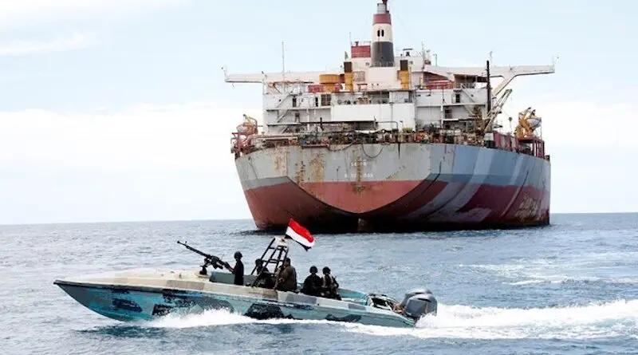

## Claim
Claim: "The Huthi rebels announced the final cessation of their military operations in international waters after Trump won the 2024 US presidential election."

## Actions
```
image_search("Huthi rebels military operations international waters Trump 2024")
```

## Evidence
### Evidence from `image_search`
The Associated Press published an article that includes an image of military aircraft on an aircraft carrier (). The Washington Post published an article about the Houthis (). The Los Angeles Times published an article on January 17, 2024, about the U.S. putting Yemen's Houthi rebels back on the list of specially designated global terrorists, which includes an image of armed Houthi rebels ().

The articles can be found here: [Source](https://apnews.com/article/trump-yemen-houthis-rebels-attack-airstrike-11b0e080b3982542dd621338a7b18afd), [Source](https://www.washingtonpost.com/world/2024/06/22/yemen-houthis-red-sea-us-military/), and [Source](https://www.latimes.com/world-nation/story/2024-01-17/u-s-puts-yemens-houthis-rebels-back-on-list-of-specially-designated-global-terrorists).


## Elaboration
The evidence includes articles and images related to the Houthi rebels and their activities. However, none of the provided sources mention the cessation of military operations in international waters or connect it to Trump's potential 2024 election victory.

The Los Angeles Times article from January 17, 2024, predates the 2024 election, indicating that the U.S. government was already taking actions related to the Houthis before the election.

To verify the claim, information is needed about the Houthis' military operations, their cessation, and the specific timing of such cessation in relation to the 2024 US presidential election.


## Actions
```
image_search("Huthi rebels cease military operations international waters 2024")
```

## Evidence
### Evidence from `image_search`
AOL published a fact-check article that includes an image of armed Houthi rebels (). Al Jazeera published an article on January 23, 2024, about Houthi attacks in the Red Sea, disrupting maritime trade (). India Shipping News reported on the Houthi rebels halting military operations against most ships in the Red Sea, including an image of a ship and a boat with armed people ().

The articles can be found here: [Source](https://www.aol.com/fact-check-no-houthis-not-140600882.html), [Source](https://www.aljazeera.com/news/2024/2/22/houthis-order-ban-on-israel-us-and-uk-linked-ships-in-the-red-sea), and [Source](https://indiashippingnews.com/houthi-rebels-to-halt-military-operations-against-most-ships-in-red-sea/).


## Elaboration
The evidence indicates that the Houthis have been involved in military operations in international waters, specifically in the Red Sea, as recently as January 2024. However, one source mentions that the Houthis halted military operations against most ships in the Red Sea.

The provided sources do not mention the cessation of military operations being linked to Trump's potential 2024 election victory. Therefore, the claim cannot be verified with the available information.


## Actions
```
image_search("Huthi rebels Trump 2024 election cease military operations")
```

## Evidence
### Evidence from `image_search`
The Associated Press published an article that includes an image of Donald Trump (). Fox News published an article that includes an image of armed Houthi rebels and Donald Trump (). ABC News published an article that includes an image of military aircraft on an aircraft carrier (). None of the articles mention the cessation of military operations by the Houthi rebels in relation to Trump's potential 2024 election victory.


## Elaboration
The evidence does not support the claim. While the search results include images of Donald Trump and the Houthi rebels, none of the articles mention the cessation of military operations by the Houthi rebels in international waters in connection to Trump's potential 2024 election victory. The available information is insufficient to verify the claim.


## Final Judgement
The fact-check reveals that while the Houthis have been involved in military operations in international waters, and there are articles about Trump, there is no evidence to support the claim that the Houthis announced the final cessation of their military operations in international waters after Trump won the 2024 US presidential election.

`false`

### Verdict: FALSE

### Justification
The fact-check found no evidence to support the claim that the Houthis ceased military operations in international waters after Trump's potential 2024 election victory. While the Houthis have been involved in military actions, and there are articles about Trump, no sources link the cessation of operations to the election.
