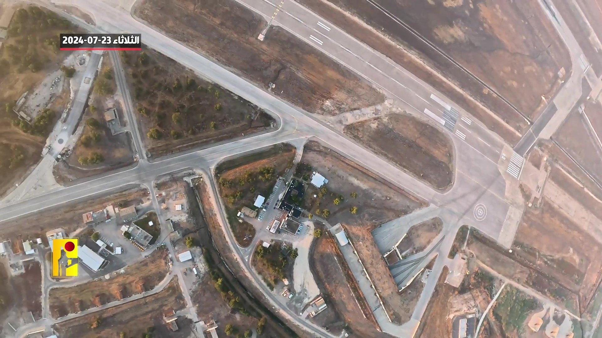
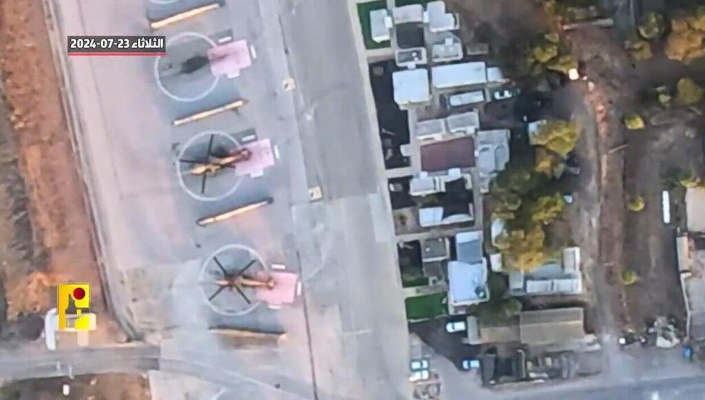
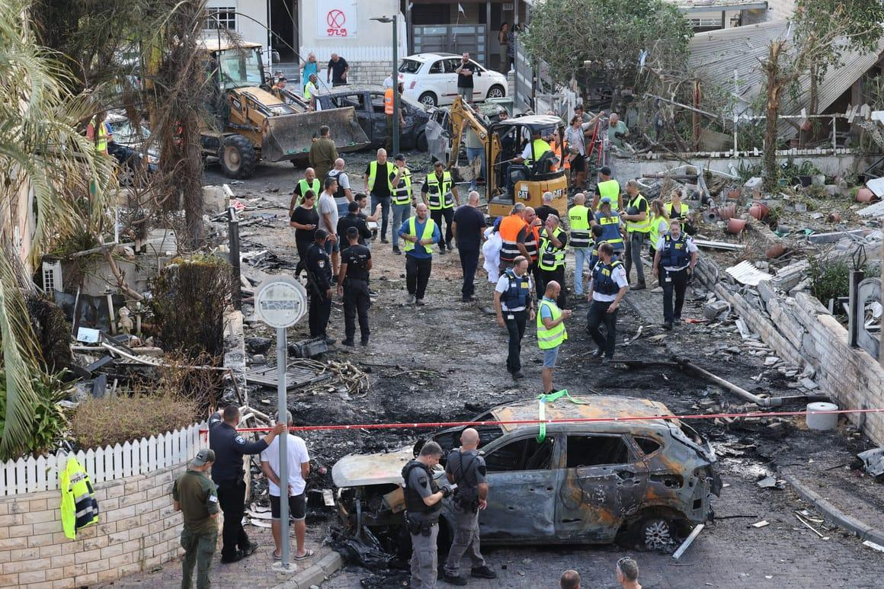
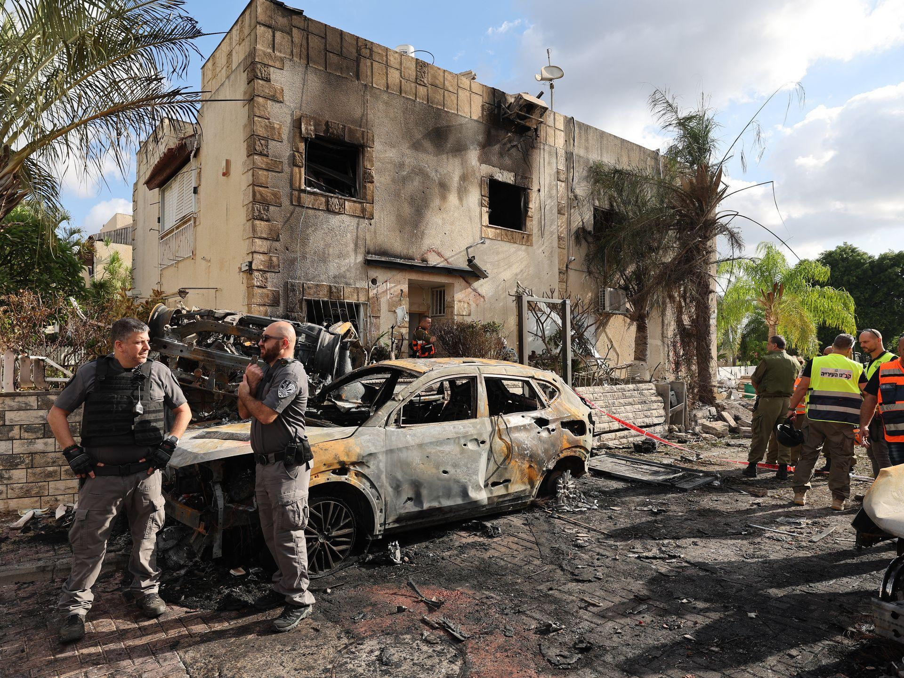

## Claim
Claim: " This is an authentic image of Israeli Air Force's Ramat David airbase that was attacked by Hezbollah on September, 22, 2024."

## Actions
```
reverse_search()
image_search("Ramat David airbase attack")
```

## Evidence
### Evidence from `reverse_search`
The image 

### Evidence from `image_search`
The Times of Israel published drone footage of Ramat David airbase. () Ynetnews published an image of helicopters on July 23, 2024. ()


## Elaboration
The evidence includes drone footage and an image of helicopters at Ramat David airbase. However, there is no evidence to support the claim that the image depicts an attack on the airbase. The provided images do not show any signs of damage or destruction.

The claim states that the image is authentic, but the evidence does not confirm this. More information is needed to verify the claim.


## Actions
```
image_search("Ramat David airbase")
```

## Evidence
No new evidence found.

## Elaboration
The evidence includes drone footage and an image of helicopters at Ramat David airbase. However, there is no evidence to support the claim that the image depicts an attack on the airbase. The provided images do not show any signs of damage or destruction.

The claim states that the image is authentic, but the evidence does not confirm this. More information is needed to verify the claim.


## Actions
```
image_search("Hezbollah attack Ramat David airbase September 2024")
```

## Evidence
### Evidence from `image_search`
Politico.eu published an article about a Hezbollah rocket attack, including an image of the aftermath. [https://www.politico.eu/article/hezbollah-launches-revenge-rocket-attack-against-israeli-base/](https://www.politico.eu/article/hezbollah-launches-revenge-rocket-attack-against-israeli-base/) () Axios reports that Hezbollah launched medium-range rockets into Israel in September 2024. [https://www.axios.com/2024/09/21/hezbollah-launches-medium-range-rockets-israel](https://www.axios.com/2024/09/21/hezbollah-launches-medium-range-rockets-israel) () The Institute for the Study of War and Critical Threats published a map showing attacks into Northern Israel from Lebanon on September 22, 2024, indicating a three-wave rocket attack by Lebanese Hezbollah targeting an IDF airbase near Haifa. [https://www.understandingwar.org/backgrounder/iran-update-september-22-2024](https://www.understandingwar.org/backgrounder/iran-update-september-22-2024) ()


## Elaboration
The evidence confirms that Hezbollah launched a rocket attack targeting an IDF airbase near Haifa on September 22, 2024. However, the provided images of the aftermath of the attack do not match the image in the claim. The image in the claim shows a burning aircraft, while the other images show damage to buildings and vehicles.

The claim is therefore not supported by the evidence.


## Final Judgement
The evidence indicates that Hezbollah launched a rocket attack on an IDF airbase near Haifa on September 22, 2024. However, the image provided in the claim does not match the images of the aftermath of the attack. Therefore, the claim is not factually accurate. `false`

### Verdict: FALSE

### Justification
The claim is false. While there was a Hezbollah rocket attack on an IDF airbase near Haifa on September 22, 2024, the image provided in the claim does not depict the aftermath of that attack. The evidence includes reports of the attack and images of the damage, which do not match the image in the claim.
