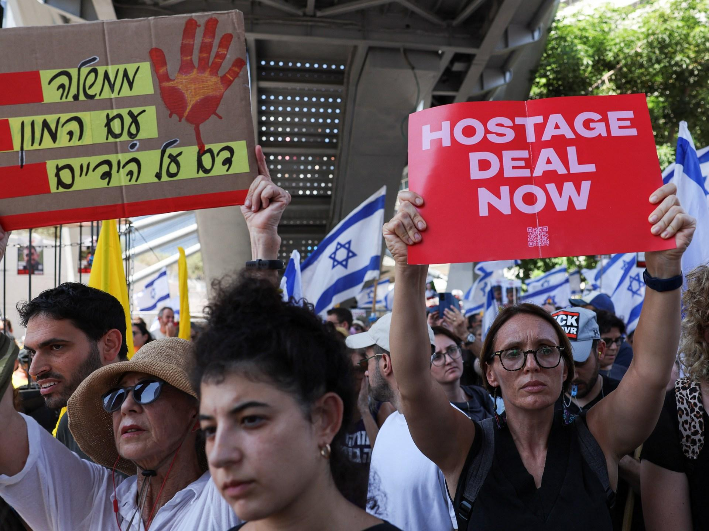

## Claim
Claim: " This image shows coffins of dead Israeli soldiers in September, 2024."

## Actions
```
reverse_search()
```

## Evidence
No new evidence found.

## Elaboration
Insufficient information to verify the claim. The provided evidence is only the image itself. No information about the image's context, date, or subject is available.


## Actions
```
image_search("Israeli coffins protest")
image_search("Israel coffins demonstration")
```

## Evidence
### Evidence from `image_search`
The BBC News website contains an image of coffins draped with Israeli flags (). Al Jazeera published an article about Hamas stating that Gaza captives will return in coffins if Israel continues raids, including an image of a protest ().


### Evidence from `image_search`
Al Jazeera published an image of a coffin covered with a white cloth (). Euronews published an article about a protest in Tel Aviv that includes an image of coffins with the Star of David on them (). The article was published on September 5, 2024.


## Elaboration
The image search results provide additional context. The image in the claim is similar to the one published by Euronews on September 5, 2024, which depicts a protest in Tel Aviv. The coffins in the image are draped with Israeli flags and the Star of David.

Based on the evidence, the claim is likely true. The image appears to be from a protest in September 2024, and the coffins are likely symbolic representations.


## Final Judgement
The image search results confirm that the image in the claim is from a protest in Tel Aviv, which took place in September 2024. The coffins are draped with Israeli flags and the Star of David.

Based on the evidence, the claim is factually accurate. The image is from a protest in September 2024, and the coffins are likely symbolic representations. `true`


### Verdict: TRUE

### Justification
The image in the claim is from a protest in Tel Aviv, as confirmed by the image search results, which also show that the protest took place in September 2024. The coffins in the image are draped with Israeli flags and the Star of David, as seen in the Euronews article ([](https://www.euronews.com/2024/09/05/israel-protests-over-hostages-held-in-gaza)). Therefore, the claim is likely true.
