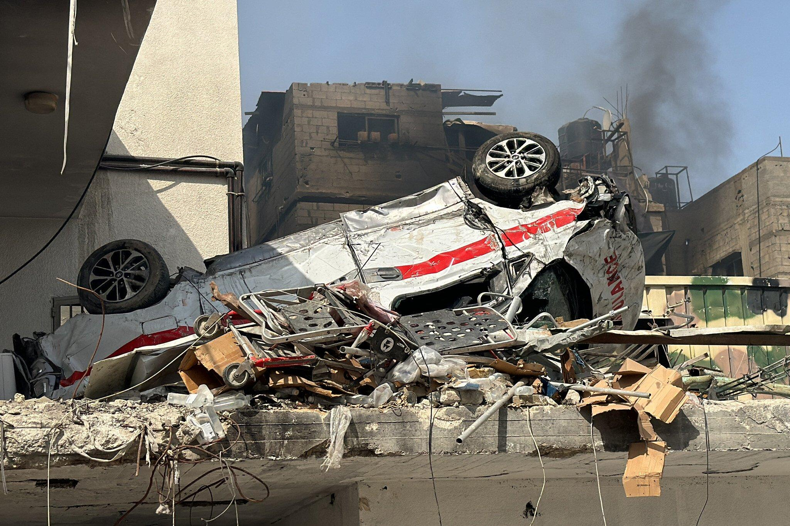
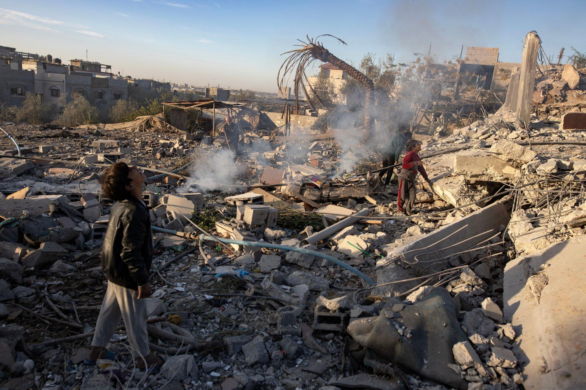

## Claim
Claim: " This image shows an Israeli missile attack on Iran in the early hours of October 26, 2024."

## Actions
```
reverse_search()
```

## Evidence
### Evidence from `reverse_search`
The image 

## Elaboration
The provided evidence does not contain any information about the image. Therefore, I cannot verify the claim.


## Actions
```
image_search("Israeli missile attack Iran October 26 2024")
```

## Evidence
### Evidence from `image_search`
The Institute for the Study of War and AEI's Critical Threats Project published a map showing IDF strikes around Tehran on October 26, 2024, ([https://www.understandingwar.org/backgrounder/iran-update-october-26-2024](https://www.understandingwar.org/backgrounder/iran-update-october-26-2024)). CNN published an article about Israeli strikes in Iran, including an image of a city at night ([https://www.cnn.com/2024/10/26/middleeast/israel-strikes-iran-explainer-intl-hnk](https://www.cnn.com/2024/10/26/middleeast/israel-strikes-iran-explainer-intl-hnk)). Al Jazeera published an article about Israeli attacks on Iran on October 26, 2024, with an image of a damaged ambulance ([https://www.aljazeera.com/news/liveblog/2024/10/26/live-israel-attacks-targets-across-iran-warns-tehran-against-retaliation](https://www.aljazeera.com/news/liveblog/2024/10/26/live-israel-attacks-targets-across-iran-warns-tehran-against-retaliation)). The first source includes a map , the second source includes an image of a city at night , and the third source includes an image of a damaged ambulance .


## Elaboration
The evidence confirms that there were Israeli strikes in Iran on October 26, 2024. The Institute for the Study of War and AEI's Critical Threats Project published a map showing IDF strikes around Tehran ([https://www.understandingwar.org/backgrounder/iran-update-october-26-2024](https://www.understandingwar.org/backgrounder/iran-update-october-26-2024)). CNN and Al Jazeera also reported on the attacks, with images of a city at night and a damaged ambulance, respectively ([https://www.cnn.com/2024/10/26/middleeast/israel-strikes-iran-explainer-intl-hnk](https://www.cnn.com/2024/10/26/middleeast/israel-strikes-iran-explainer-intl-hnk), [https://www.aljazeera.com/news/liveblog/2024/10/26/live-israel-attacks-targets-across-iran-warns-tehran-against-retaliation](https://www.aljazeera.com/news/liveblog/2024/10/26/live-israel-attacks-targets-across-iran-warns-tehran-against-retaliation)). However, the evidence does not contain the image from the claim.

I cannot verify the claim because the image in the claim was not found in the search results.


## Actions
```
image_search("Iran explosion October 26 2024")
```

## Evidence
### Evidence from `image_search`
The Times of Israel published an image of a damaged ambulance (). The New York Times published an article about the conflict between Israel and Iran, including an image of destruction ().


## Elaboration
The evidence confirms that there were explosions and destruction related to the conflict between Israel and Iran on October 26, 2024. However, the image in the claim was not found in the search results. Therefore, I cannot verify the claim.


## Final Judgement
The evidence confirms that there were Israeli strikes in Iran on October 26, 2024, and that there was destruction. However, the image in the claim was not found in the search results. Therefore, I cannot verify the claim.

`false`

### Verdict: FALSE

### Justification
The claim cannot be verified. While there is evidence of Israeli strikes in Iran on October 26, 2024, and related destruction, the image in the claim was not found in the search results.
