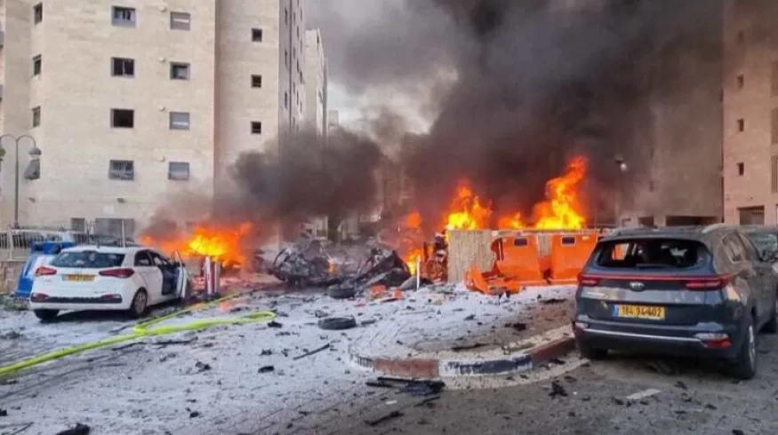
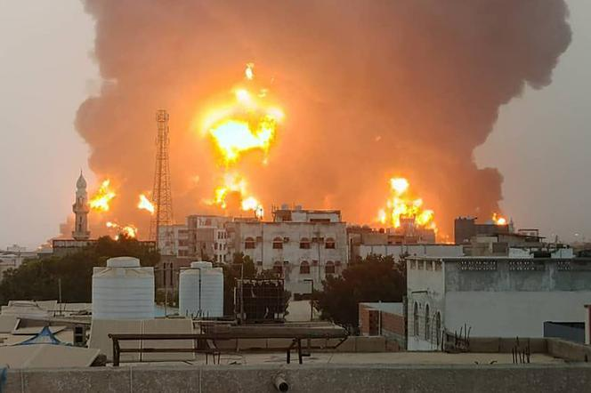
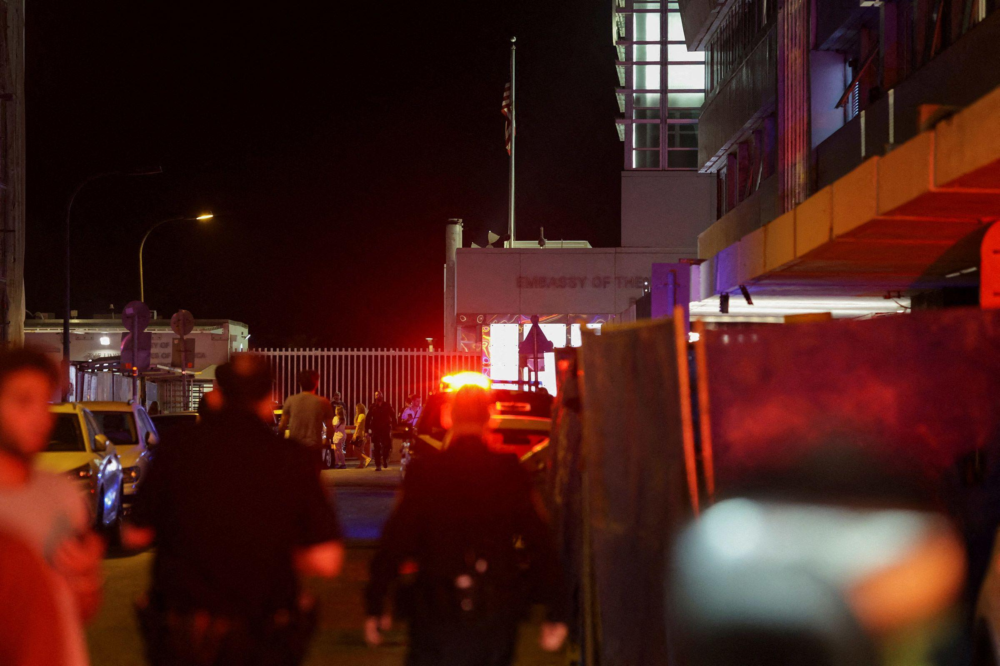
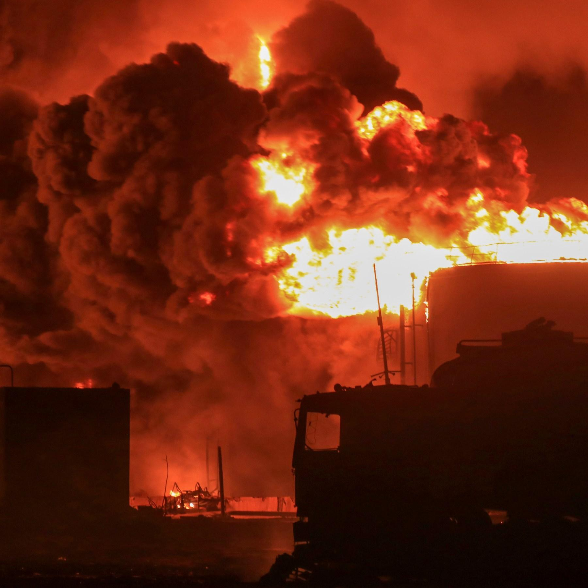
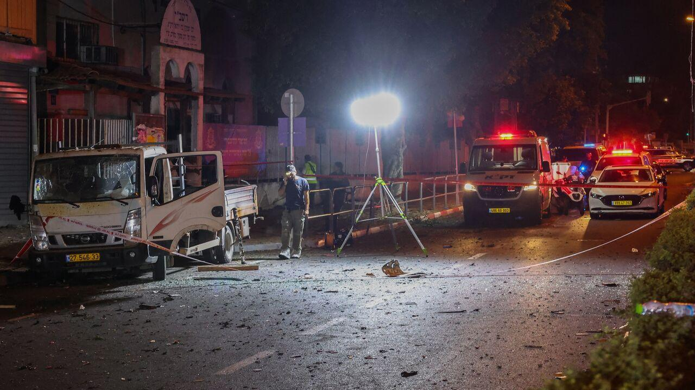

## Claim
Claim: " This image shows the aftermath of a Houthi attack on Tel Aviv, Israel, in July 2024."

## Actions
```
reverse_search()
geolocate()
image_search("Houthi attack Tel Aviv July 2024")
```

## Evidence
### Evidence from `reverse_search`
The image () appears in multiple articles. One article from LBC Group ([https://www.lbcgroup.tv/news/middleeastnews/784660/explosion-in-tel-aviv-building-bomb-disposal-experts-on-site-israeli-p/en](https://www.lbcgroup.tv/news/middleeastnews/784660/explosion-in-tel-aviv-building-bomb-disposal-experts-on-site-israeli-p/en)) describes an explosion in Tel Aviv, Israel, with bomb disposal experts on the scene, published on July 19, 2024. Another article from The Times of Israel ([https://www.timesofisrael.com/liveblog-october-7-2023/](https://www.timesofisrael.com/liveblog-october-7-2023/)) discusses a Hamas attack on Israel, published on October 7, 2023.

An article from India.com ([https://www.india.com/news/israel-hezbollah-war-hezbollah-fires-20-rockets-at-israels-capital-tel-aviv-horrific-videos-go-viral-watch-7342129/](https://www.india.com/news/israel-hezbollah-war-hezbollah-fires-20-rockets-at-israels-capital-tel-aviv-horrific-videos-go-viral-watch-7342129/)) reports on Hezbollah firing rockets at Tel Aviv, published on October 22, 2024.


### Evidence from `geolocate`
The most likely countries where the image was taken are: {'Israel': 0.64, 'Palestine': 0.13, 'United Arab Emirates': 0.12, 'Jordan': 0.08, 'Tunisia': 0.01, 'Albania': 0.0, 'Andorra': 0.0, 'Argentina': 0.0, 'Australia': 0.0, 'Austria': 0.0}

### Evidence from `image_search`
Le Monde published an article on July 20, 2024, about an Israeli army bombing of Hodeida, Yemen, after a drone attack on Tel Aviv (). CNN reports on an explosion near the US Embassy in Tel Aviv (). Al Jazeera published an article on July 21, 2024, about Israeli and Houthi attacks amid the war on Gaza ().

The articles discuss attacks and explosions in Tel Aviv and the surrounding areas, including the US Embassy. The sources are: [Le Monde](https://www.lemonde.fr/en/international/article/2024/07/20/israeli-army-bombs-yemen-city-of-hodeida-after-drone-attack-on-tel-aviv_6691733_4.html), [CNN](https://www.cnn.com/2024/07/19/middleeast/israel-tel-aviv-explosion-us-embassy-intl-hnk), and [Al Jazeera](https://www.aljazeera.com/news/2024/7/21/everything-to-know-about-israeli-and-houthi-attacks-amid-war-on-gaza).


## Elaboration
The image (

## Actions
```
image_search("Tel Aviv explosion July 2024")
```

## Evidence
### Evidence from `image_search`
From [Source](https://www.al-monitor.com/originals/2024/08/hamas-islamic-jihad-claim-responsibility-tel-aviv-explosion-what-we-know): 
Content: Al-Monitor published an article about an explosion in Tel Aviv, with Hamas and Islamic Jihad claiming responsibility. The article includes an image of the aftermath of the explosion. 


## Elaboration
The claim that the image shows a Houthi attack on Tel Aviv in July 2024 is not directly supported by the evidence. While the evidence confirms an explosion in Tel Aviv in July 2024, the cause is not specified as a Houthi attack. The evidence mentions a drone attack on Tel Aviv, but it does not specify who was responsible. Additionally, the image search results show that Hamas and Islamic Jihad claimed responsibility for an explosion in Tel Aviv.

Therefore, the claim is not supported by the evidence.


## Final Judgement
The evidence indicates that there was an explosion in Tel Aviv in July 2024, but the cause is not confirmed as a Houthi attack. The image search results show that Hamas and Islamic Jihad claimed responsibility for an explosion in Tel Aviv.

`false`

### Verdict: FALSE

### Justification
The image depicts an explosion in Tel Aviv, Israel, in July 2024. While there were explosions in Tel Aviv during that time, the evidence does not support the claim that it was a Houthi attack. Instead, sources like [Al-Monitor](https://www.al-monitor.com/originals/2024/08/hamas-islamic-jihad-claim-responsibility-tel-aviv-explosion-what-we-know) report that Hamas and Islamic Jihad claimed responsibility for an explosion in Tel Aviv.
