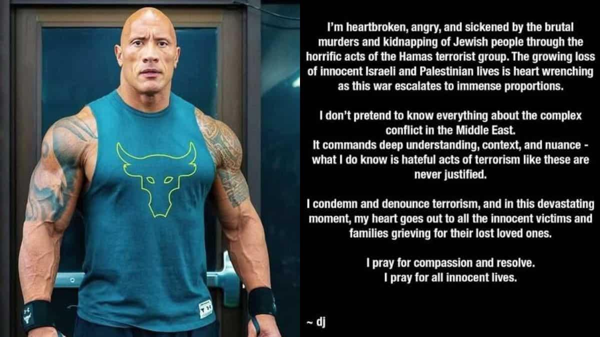

## Claim
Claim: " This is an authentic image of Dwayne Johnson waring the Israeli flag in support of Israel."

## Actions
```
reverse_search()
image_search("Dwayne Johnson Israel flag")
```

## Evidence
### Evidence from `image_search`
The search results include a WIONews article featuring Dwayne Johnson's statement on the Israel-Hamas conflict (), an article from Euronews about Dwayne Johnson (), and a Yahoo News article fact-checking a fake image of Dwayne Johnson (). The Yahoo News article specifically addresses a fabricated image of Dwayne Johnson.

The sources do not provide any information about the authenticity of the image in the claim ().


## Elaboration
The evidence suggests that there is a fake image of Dwayne Johnson circulating. The search results include a Yahoo News article that fact-checks a fabricated image of Dwayne Johnson. However, the evidence does not confirm or deny the authenticity of the image in the claim.

Therefore, the claim cannot be verified with the available information.


## Actions
```
image_search("Dwayne Johnson Israel support fake")
```

## Evidence
### Evidence from `image_search`
From [Source](https://mythdetector.com/en/dwayne-johnson-about-israel/): 
Content: The Myth Detector published an article about a fabricated quote attributed to Dwayne Johnson, which was accompanied by an image of the Israeli flag. 


## Elaboration
The evidence indicates that a fabricated quote attributed to Dwayne Johnson was circulating, accompanied by an image of the Israeli flag. This suggests that the image in the claim could be part of a fabricated context.

Based on the evidence, the claim is likely false.


## Final Judgement
The search results indicate that there are fabricated images and quotes circulating about Dwayne Johnson and Israel. The Myth Detector published an article about a fabricated quote attributed to Dwayne Johnson, which was accompanied by an image of the Israeli flag. This suggests that the image in the claim is likely fabricated.

`false`

### Verdict: FALSE

### Justification
The image of Dwayne Johnson wearing the Israeli flag is likely fabricated. A search revealed that a fabricated quote attributed to Johnson was circulating with an image of the Israeli flag, as reported by the Myth Detector ([Source](https://mythdetector.com/en/dwayne-johnson-about-israel/)).
