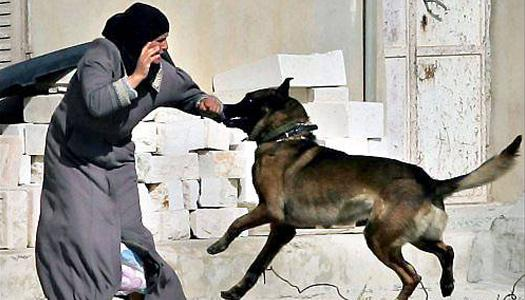

## Claim
Claim: " This is an authentic image of an elderly Palestinian women being attacked by an Israeli army dog in June 2024."

## Actions
```
reverse_search()
image_search("Israeli army dog attack Palestinian woman")
```

## Evidence
### Evidence from `reverse_search`
The image in the claim, 

### Evidence from `image_search`
The search results include an image of a woman and a dog from China Daily ([https://www.chinadaily.com.cn/world/2007-03/22/content_833702.htm](https://www.chinadaily.com.cn/world/2007-03/22/content_833702.htm)) . Al Jazeera published a video on June 26, 2024, about an Israeli military dog attacking an elderly Palestinian woman ([https://www.aljazeera.com/video/newsfeed/2024/6/26/video-israeli-military-dog-attacks-elderly-palestinian-woman](https://www.aljazeera.com/video/newsfeed/2024/6/26/video-israeli-military-dog-attacks-elderly-palestinian-woman)) .

Al-Haq also contains an image of a woman being attacked by a dog ([https://www.alhaq.org/monitoring-documentation/6941.html](https://www.alhaq.org/monitoring-documentation/6941.html)) .


## Elaboration
The evidence suggests that the claim is likely false. While there is evidence of Israeli military dogs attacking Palestinian women, the image in the claim appears to be digitally altered. The reverse image search did not yield any results, and the image search found other images of similar events, but not the exact one in the claim.


## Final Judgement
The image in the claim appears to be digitally altered. While there is evidence of Israeli military dogs attacking Palestinian women, the specific image in the claim is not found in the search results.

`false`

### Verdict: FALSE

### Justification
The claim is likely false. While there is evidence of Israeli military dogs attacking Palestinian women, the image in the claim appears to be digitally altered. The reverse image search did not yield any results, and the image search found other images of similar events, but not the exact one in the claim.
