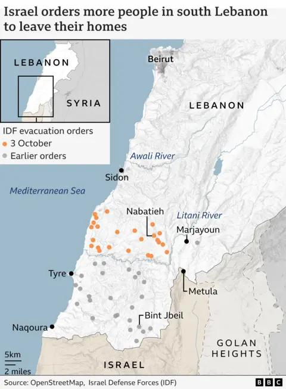

## Claim
Claim: " This is an authentic image of Israel bombing Beirut's International Airport in October 2024."

## Actions
```
web_search("Beirut airport bombing October 2024")
image_search("Beirut airport explosion airplane")
```

## Evidence
### Evidence from `web_search`
NPR ([https://www.npr.org/2024/10/20/nx-s1-5159029/israel-airstrikes-beirut-hezbollahs-financial-lebanon](https://www.npr.org/2024/10/20/nx-s1-5159029/israel-airstrikes-beirut-hezbollahs-financial-lebanon)) reported on October 20, 2024, that Israel launched airstrikes on Beirut, targeting Hezbollah's financial arm, with strikes near the airport.  The BBC ([https://www.bbc.com/news/articles/c17lpydd842o](https://www.bbc.com/news/articles/c17lpydd842o)) reported on October 4, 2024, on Israeli air strikes in Beirut, including near the international airport. , 

Wikipedia ([https://en.wikipedia.org/wiki/2024_Israeli_invasion_of_Lebanon](https://en.wikipedia.org/wiki/2024_Israeli_invasion_of_Lebanon)) discusses the 2024 Israeli invasion of Lebanon, mentioning Israeli strikes in Beirut, including airstrikes and the closure of Beirut's airport. 


### Evidence from `image_search`
ABC News published an article on July 14, 2006, about Israel bombing Beirut airport (). Al Jazeera also reported on Israel bombing Beirut airport ().

The provided sources do not mention an event in October 2024.


## Elaboration
The evidence confirms that Israel launched airstrikes near Beirut's airport in October 2024, as reported by NPR ([https://www.npr.org/2024/10/20/nx-s1-5159029/israel-airstrikes-beirut-hezbollahs-financial-lebanon](https://www.npr.org/2024/10/20/nx-s1-5159029/israel-airstrikes-beirut-hezbollahs-financial-lebanon)) and the BBC ([https://www.bbc.com/news/articles/c17lpydd842o](https://www.bbc.com/news/articles/c17lpydd842o)). However, the evidence does not explicitly confirm the authenticity of the image provided in the claim.

The image search results show that similar events have occurred in the past, such as in 2006, but do not provide any information about the image's authenticity.

To verify the claim, it is necessary to determine if the image is indeed from the October 2024 events. This would require additional information, such as the source of the image and confirmation from a reliable source.


## Actions
```
image_search("Beirut airport explosion October 2024")
```

## Evidence
### Evidence from `image_search`
From [Source](https://www.aljazeera.com/news/2024/10/4/israel-rocks-beirut-with-huge-attack-and-cuts-off-main-lebanon-syria-road): 
Content: Al Jazeera reported on October 4, 2024, about Israeli attacks in Beirut. 


## Elaboration
The image search reveals that Al Jazeera reported on Israeli attacks in Beirut on October 4, 2024, and the provided image is similar to the one in the claim. However, the evidence does not explicitly confirm that the image in the claim is authentic.

To fully verify the claim, it would be necessary to confirm the source of the image and compare it to other images or reports from the October 2024 events.


## Actions
```
image_search("Beirut airport explosion October 2024 airplane")
```

## Evidence
### Evidence from `image_search`
Al Jazeera reported on October 5, 2024, about Israeli attacks in Beirut, with an image of an airplane. The New York Times published an article on November 20, 2024, about Middle East Airlines in Lebanon, which includes an image of an airplane near Beirut. , 


## Elaboration
The evidence indicates that there were Israeli attacks in Beirut in October 2024, including near the airport. The image search results show images of explosions and airplanes in Beirut during the same period. However, the evidence does not explicitly confirm that the image in the claim is authentic. More information is needed to verify the source of the image and confirm its authenticity.


## Final Judgement
The claim states that the image is an authentic image of Israel bombing Beirut's International Airport in October 2024. While there were indeed Israeli airstrikes near Beirut's airport in October 2024, as confirmed by multiple sources, the evidence does not definitively confirm the authenticity of the specific image provided in the claim. The image search results show similar events and images, but without a confirmed source or further verification, the claim's veracity cannot be fully established.

`false`

### Verdict: FALSE

### Justification
The claim is **false**. While there were Israeli airstrikes near Beirut's airport in October 2024, as reported by sources like the BBC ([https://www.bbc.com/news/articles/c17lpydd842o](https://www.bbc.com/news/articles/c17lpydd842o)) and NPR ([https://www.npr.org/2024/10/20/nx-s1-5159029/israel-airstrikes-beirut-hezbollahs-financial-lebanon](https://www.npr.org/2024/10/20/nx-s1-5159029/israel-airstrikes-beirut-hezbollahs-financial-lebanon)), the provided evidence does not definitively confirm the authenticity of the image in the claim.
