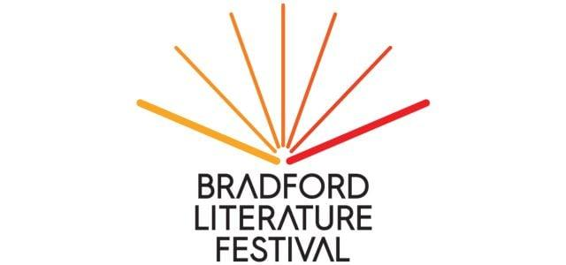

## Claim
Claim: "The Guardian published an article with the headline: 'Gaza will rise from the ashes to become a city of the future to rival Bradford.'"

## Actions
```
web_search("The Guardian Gaza city of the future Bradford")
```

## Evidence
### Evidence from `web_search`
The Guardian published an article titled "The Guardian view on Gaza’s future: Israel should end the killing" on August 20, 2025, discussing the ongoing conflict. ([https://www.theguardian.com/commentisfree/2025/aug/20/the-guardian-view-on-gazas-future-israel-should-end-the-killing-its-allies-must-not-remain-complicit](https://www.theguardian.com/commentisfree/2025/aug/20/the-guardian-view-on-gazas-future-israel-should-end-the-killing-its-allies-must-not-remain-complicit))

The BBC published an article on July 6, 2025, about Bradford's year as the 2025 UK City of Culture, mentioning various events. ([https://www.bbc.co.uk/news/articles/czdv0lv8pgeo](https://www.bbc.co.uk/news/articles/czdv0lv8pgeo)) The Bradford Literature Festival includes an event called "Gaza 2040: Then, Now, the Future". ([https://www.bradfordlitfest.co.uk/event/gaza-2040-imagining-the-future/](https://www.bradfordlitfest.co.uk/event/gaza-2040-imagining-the-future/)) , , , , , , , , , , 


## Elaboration
The evidence does not support the claim. While The Guardian published an article about Gaza, and the BBC reported on Bradford's City of Culture status, neither article contains the headline stated in the claim. The Bradford Literature Festival includes an event called "Gaza 2040: Then, Now, the Future," which suggests a connection between Gaza and Bradford, but not in the way the claim suggests.

The claim's veracity cannot be confirmed with the provided evidence.


## Final Judgement
The search results do not show that The Guardian published an article with the headline in the claim. Therefore, the claim is not supported by the evidence. `false`

### Verdict: FALSE

### Justification
The claim is false. While The Guardian published an article about Gaza ([https://www.theguardian.com/commentisfree/2025/aug/20/the-guardian-view-on-gazas-future-israel-should-end-the-killing-its-allies-must-not-remain-complicit](https://www.theguardian.com/commentisfree/2025/aug/20/the-guardian-view-on-gazas-future-israel-should-end-the-killing-its-allies-must-not-remain-complicit)) and the BBC reported on Bradford's City of Culture status ([https://www.bbc.co.uk/news/articles/czdv0lv8pgeo](https://www.bbc.co.uk/news/articles/czdv0lv8pgeo)), neither article contains the headline stated in the claim.
