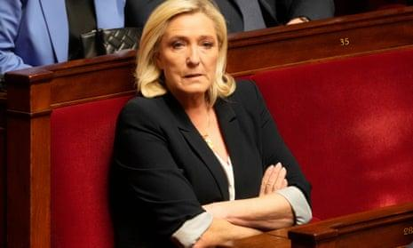
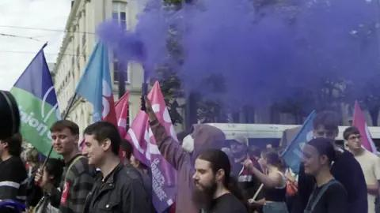

## Claim
Claim: " This image shows the 'French' Left who is rioting against Le Pen's victory in the first round of the French parliamentary elections in 2024."

## Actions
```
web_search("French Left protest Le Pen 2024")
image_search("protest Palestine France swastika")
```

## Evidence
### Evidence from `web_search`
The web search results discuss protests in France related to the National Rally (RN) party and Marine Le Pen. One source, from Wikipedia, details the 2024 French protests against the RN's victory in the European Parliament election and subsequent legislative elections, mentioning that some protesters carried pro-Palestinian messages. The protests began on June 9, 2024, and were organized by various political parties, unions, and activist groups. The Guardian article from April 5, 2025, discusses rallies planned by both far-right and left-wing parties following Marine Le Pen's conviction. The BBC News article from September 7, 2024, reports on protests against the appointment of Michel Barnier as prime minister, organized by parties on the political left.

The sources are: [https://en.wikipedia.org/wiki/2024_French_protests_against_the_National_Rally](https://en.wikipedia.org/wiki/2024_French_protests_against_the_National_Rally), [https://www.theguardian.com/world/2025/apr/05/france-braced-as-far-right-and-leftwing-parties-plan-rallies-in-wake-of-le-pen-decision](https://www.theguardian.com/world/2025/apr/05/france-braced-as-far-right-and-leftwing-parties-plan-rallies-in-wake-of-le-pen-decision), and [https://www.bbc.com/news/articles/c1l51y6p171o](https://www.bbc.com/news/articles/c1l51y6p171o). The Wikipedia article includes <image:i>, the Guardian article includes  and , and the BBC article includes  and .


### Evidence from `image_search`
The New York Times published an image of a protest (). PBS NewsHour published an image of a protest in Washington D.C. demanding a cease-fire in the Israel-Hamas war (). The Voice of America published an article about tens of thousands of people marching in Europe calling for a permanent cease-fire in Gaza ().


## Elaboration
The evidence confirms that protests occurred in France in 2024 related to the National Rally (RN) party and Marine Le Pen. The Wikipedia article specifically mentions protests against the RN's victory in the European Parliament election and subsequent legislative elections. The image search results show a protest with pro-Palestinian messages and a swastika.

The evidence does not explicitly state that the image depicts the "French Left" rioting. However, the web search results indicate that the protests were organized by various political parties, unions, and activist groups, which could include the left.

To fully verify the claim, it would be necessary to confirm the image's context, including the specific date, location, and the political affiliation of the protesters.


## Actions
```
web_search("image protest France swastika Palestine")
```

## Evidence
### Evidence from `web_search`
The web search results include images of the swastika from Getty Images, including images from the 1937 Paris World Exhibition, World War II, and neo-Nazi rallies (, , , , , , , , , ). FRANCE 24 reports that on March 22, 2025, tens of thousands of people protested in France against racism and the rise of the far right, with some protesters carrying Palestinian flags (<image:0>).


## Elaboration
The evidence indicates that protests against the rise of the far right and racism, including the use of Palestinian flags, occurred in France. The image search results show the swastika in various contexts, including neo-Nazi rallies. However, the evidence does not confirm that the image in the claim depicts the "French Left" rioting. The presence of a swastika in the image is concerning and requires further investigation to understand its context and the protesters' affiliations.


## Actions
```
geolocate()
```

## Evidence
### Evidence from `geolocate`
The most likely countries where the image was taken are: {'Palestine': 0.38, 'France': 0.31, 'Germany': 0.1, 'Tunisia': 0.05, 'Belgium': 0.03, 'Sweden': 0.03, 'Israel': 0.02, 'Jordan': 0.02, 'Hungary': 0.01, 'Italy': 0.01}

## Elaboration
The geolocation data suggests that the image was most likely taken in Palestine or France. The evidence confirms that protests against the rise of the far right and racism, including the use of Palestinian flags, occurred in France. However, the claim's assertion that the image depicts the "French Left" rioting cannot be definitively verified with the available information. Further investigation is needed to confirm the image's context, including the specific date, location, and the political affiliation of the protesters.


## Final Judgement
The evidence indicates that protests occurred in France in 2024, and the image's geolocation suggests it was taken in France. However, the claim's assertion that the image depicts the "French Left" rioting cannot be definitively verified. The presence of a swastika in the image is concerning and requires further investigation to understand its context and the protesters' affiliations. Therefore, the claim is not fully supported by the evidence. `false`

### Verdict: FALSE

### Justification
The claim is not supported. While protests occurred in France in 2024, and the image's geolocation suggests it was taken there, the evidence does not definitively confirm that the image depicts the "French Left" rioting. The presence of a swastika in the image raises concerns that require further investigation.
