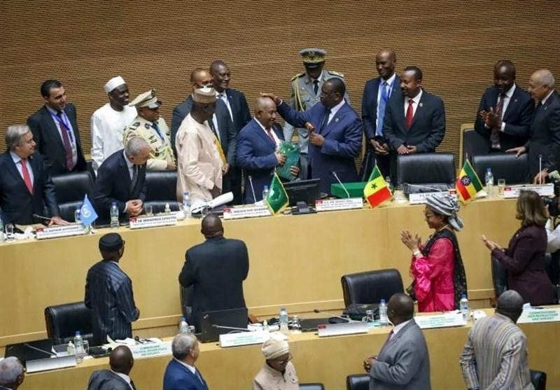

## Claim
Claim: "Ethiopia has expelled Israel's ambassador in April 2025."

## Actions
```
web_search("Ethiopia Israel ambassador expelled April 2025")
```

## Evidence
### Evidence from `web_search`
Multiple sources report that Israel's ambassador to Ethiopia, Avraham Neguise, was expelled from an African Union conference in Addis Ababa on April 7, 2025. The conference focused on the Rwandan genocide. The expulsion occurred after member states refused to participate alongside him.

The sources include articles from the Tasnim News Agency ([https://www.tasnimnews.com/en/news/2025/04/07/3286985/israeli-ambassador-removed-from-african-union-meeting](https://www.tasnimnews.com/en/news/2025/04/07/3286985/israeli-ambassador-removed-from-african-union-meeting)), Anadolu Agency ([https://www.aa.com.tr/en/africa/israeli-ambassador-to-ethiopia-expelled-from-rwanda-genocide-conference/3530926](https://www.aa.com.tr/en/africa/israeli-ambassador-to-ethiopia-expelled-from-rwanda-genocide-conference/3530926)), and peoplesdispatch.org ([https://peoplesdispatch.org/2025/04/08/israeli-diplomat-booted-from-au-conference-on-rwandan-genocide/](https://peoplesdispatch.org/2025/04/08/israeli-diplomat-booted-from-au-conference-on-rwandan-genocide/)).  <image:0> 


## Elaboration
The evidence indicates that Israel's ambassador to Ethiopia, Avraham Neguise, was expelled from an African Union conference in Addis Ababa on April 7, 2025, not expelled by Ethiopia. The conference was focused on the Rwandan genocide. The expulsion occurred because member states refused to participate alongside him.

The claim is therefore inaccurate.


## Final Judgement
The search results confirm that Israel's ambassador to Ethiopia was expelled from an African Union conference in Addis Ababa in April 2025. However, the expulsion was not by Ethiopia, but rather from the conference itself due to the refusal of member states to participate alongside him.

The claim is demonstrably false because the ambassador was not expelled by Ethiopia. `false`


### Verdict: FALSE

### Justification
Multiple sources, including the Tasnim News Agency ([https://www.tasnimnews.com/en/news/2025/04/07/3286985/israeli-ambassador-removed-from-african-union-meeting](https://www.tasnimnews.com/en/news/2025/04/07/3286985/israeli-ambassador-removed-from-african-union-meeting)) and Anadolu Agency ([https://www.aa.com.tr/en/africa/israeli-ambassador-to-ethiopia-expelled-from-rwanda-genocide-conference/3530926](https://www.aa.com.tr/en/africa/israeli-ambassador-to-ethiopia-expelled-from-rwanda-genocide-conference/3530926)), report that Israel's ambassador to Ethiopia was expelled from an African Union conference in Addis Ababa in April 2025. However, the expulsion was from the conference itself, not by Ethiopia.
