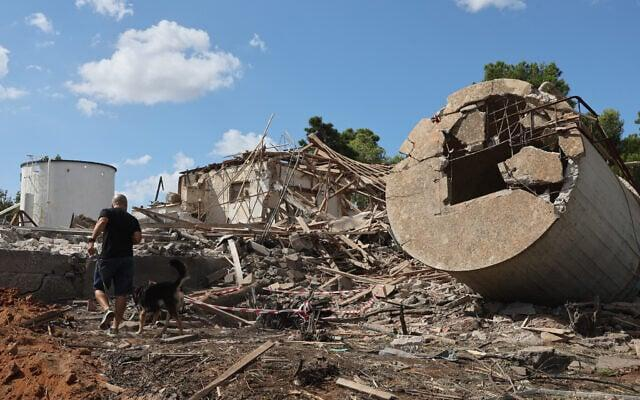

## Claim
Claim: "Gallant, a retired military general and a member of Prime Minister Benjamin Netanyahu’s war cabinet, was killed in the Iranian attack on Israel on October 1, 2024."

## Actions
```
web_search("Gallant killed Iranian attack October 1 2024")
```

## Evidence
### Evidence from `web_search`
NPR published an article on November 5, 2024, stating that Benjamin Netanyahu fired Defense Minister Yoav Gallant and replaced him with Israel Katz. The article mentions an Iranian missile attack (, , , ). The Times of Israel reported on an Iranian missile attack on Israel on October 1, 2024, and mentions damage to civilian structures (, ). Defense Minister Yoav Gallant stated that the attack "didn’t even scratch” the Israeli Air Force’s capabilities.

The Guardian published an article on October 23, 2024, discussing the Israeli Defence Minister Yoav Gallant's statements regarding a planned strike on Iran (). The article mentions an Iranian missile attack on October 1, which was a reprisal for Israel’s killing of the Hezbollah leader, Hassan Nasrallah.


## Elaboration
The evidence indicates that Yoav Gallant was the Defense Minister and made statements after the Iranian attack on October 1, 2024. The NPR article from November 5, 2024, states that Gallant was fired and replaced by Israel Katz. The Guardian article from October 23, 2024, also mentions Gallant.

Since Gallant was alive and making statements after the attack, and was later fired, the claim that he was killed in the attack is false.


## Final Judgement
The evidence shows that Yoav Gallant was alive after the Iranian attack on October 1, 2024, and was later fired from his position. Therefore, the claim that he was killed in the attack is demonstrably false. `false`

### Verdict: FALSE

### Justification
The claim is false. Evidence from multiple sources, including an article from NPR, indicates that Yoav Gallant was alive after the Iranian attack on October 1, 2024, and was later fired from his position as Defense Minister.
