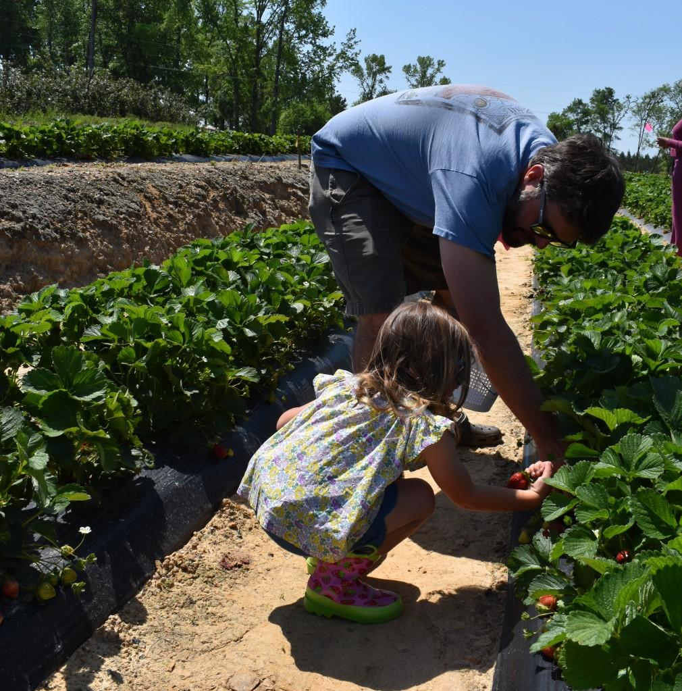

## Claim
Claim: " This image shows the youngest victim of the Hezbollah rocket that murdered 12 children playing soccer in Israel on July 27, 2024."

## Actions
```
web_search("Hezbollah rocket Israel July 27 2024")
image_search("child strawberry field")
```

## Evidence
### Evidence from `web_search`
On July 27, 2024, a rocket attack occurred in the Israeli-occupied Golan Heights, resulting in casualties. A Wikipedia article ([https://en.wikipedia.org/wiki/Timeline_of_the_Israel%E2%80%93Hezbollah_conflict_(27_July_2024_%E2%80%93_16_September_2024)](https://en.wikipedia.org/wiki/Timeline_of_the_Israel%E2%80%93Hezbollah_conflict_(27_July_2024_%E2%80%93_16_September_2024))) mentions that a Hezbollah rocket struck a soccer field in Majdal Shams, killing 12 children. Reuters ([https://www.reuters.com/world/middle-east/nine-people-killed-rocket-hits-football-pitch-israeli-occupied-golan-israel-2024-07-27/](https://www.reuters.com/world/middle-east/nine-people-killed-rocket-hits-football-pitch-israeli-occupied-golan-israel-2024-07-27/)) also reported on the attack, stating that 12 people, including children, were killed.

Al Jazeera ([https://www.aljazeera.com/news/2024/7/27/israel-says-10-killed-in-rocket-attack-on-occupied-golan-heights](https://www.aljazeera.com/news/2024/7/27/israel-says-10-killed-in-rocket-attack-on-occupied-golan-heights)) reported at least 12 deaths and 30 injuries. Israel accused Hezbollah, but Hezbollah denied responsibility. 

### Evidence from `image_search`
The search results include images of children in strawberry fields. One image is from [thekitchn.com](https://www.thekitchn.com/strawberry-picking-with-kids-267547) . Another image is from [istockphoto.com](https://www.istockphoto.com/photos/child-strawberry-picking) .


## Elaboration
The evidence confirms that a rocket attack on July 27, 2024, in the Israeli-occupied Golan Heights, resulted in the death of children. However, the image search results show images of children in strawberry fields, which contrasts with the context of the rocket attack.

The claim states that the image shows the youngest victim of the attack. There is no information in the provided evidence to support this. Therefore, the claim cannot be verified.

To verify the claim, information is needed to connect the image to the victims of the rocket attack. This would require identifying the child in the image and confirming their death in the attack.


## Actions
```
image_search("Malak child strawberry field")
```

## Evidence
### Evidence from `image_search`
From [Source](https://scgrower.com/2025/05/15/may-grower-spotlight-gurosik-berry-plantation/): 
Content: The search result from scgrower.com shows an image of a child picking strawberries in a field. 


## Elaboration
The new image search results do not provide any information to verify the claim. The search results show images of children in strawberry fields, but none of them are related to the rocket attack. The claim cannot be verified.


## Final Judgement
The evidence confirms a rocket attack on July 27, 2024, in the Israeli-occupied Golan Heights, resulting in the death of children. However, the image search results show images of children in strawberry fields, which contrasts with the context of the rocket attack. The claim states that the image shows the youngest victim of the attack. There is no information in the provided evidence to support this.

`false`

### Verdict: FALSE

### Justification
The claim is false. While a rocket attack on July 27, 2024, in the Israeli-occupied Golan Heights, resulted in the death of children, the image provided does not depict a victim of the attack. The image search results show children in strawberry fields, and there is no evidence to connect the image to the attack.
