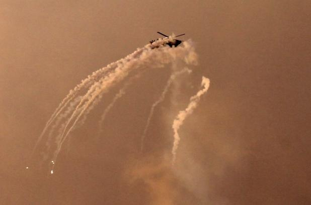

## Claim
Claim: " This image shows an Israeli helicopter shot down by Hezbollah amid clashes in Southern Lebanon on November 23, 2024."

## Actions
```
image_search("helicopter smoke trail flares")
geolocate()
```

## Evidence
### Evidence from `image_search`
The search results include images of helicopters deploying flares. One image from Shutterstock shows a navy SH-60B helicopter shooting flares (). Another image from iStockphoto depicts a helicopter deploying flares (). Alamy also provides an image of an AH-64D Apache helicopter with flares ().

The images show helicopters deploying flares, but do not provide any information about the claim.


### Evidence from `geolocate`
The most likely countries where the image was taken are: {'United Arab Emirates': 0.22, 'Israel': 0.15, 'Bangladesh': 0.09, 'India': 0.08, 'Pakistan': 0.05, 'Nigeria': 0.04, 'Bhutan': 0.03, 'Greenland': 0.03, 'Indonesia': 0.03, 'Ukraine': 0.03}

## Elaboration
The image search confirms that helicopters deploy flares, which is consistent with the image in the claim. The geolocation data suggests that the image could have been taken in Israel. However, the evidence does not confirm that the helicopter was shot down by Hezbollah or that the image was taken on November 23, 2024.

More information is needed to verify the claim. Specifically, information about the helicopter's identity, the circumstances of the event, and the date is missing.


## Actions
```
web_search("Hezbollah Israeli helicopter clashes Lebanon")
web_search("Israeli helicopter shot down Lebanon November 2024")
```

## Evidence
### Evidence from `web_search`
The 2006 Lebanon War involved clashes between Israel and Hezbollah, with one Israeli helicopter shot down during the conflict ([https://en.wikipedia.org/wiki/2006_Lebanon_War](https://en.wikipedia.org/wiki/2006_Lebanon_War)). Recent reports from October 2024 detail intense clashes between Hezbollah and the Israeli army in southern Lebanon, including attempts by Israeli helicopters to evacuate injured soldiers ([https://shafaq.com/en/World/Intense-clashes-between-Hezbollah-and-Israeli-army-in-southern-Lebanon](https://shafaq.com/en/World/Intense-clashes-between-Hezbollah-and-Israeli-army-in-southern-Lebanon)). Another article from October 2024 discusses clashes, including Hezbollah destroying Israeli tanks ([https://www.middleeasteye.net/news/lebanon-hezbollah-engaged-clashes-israeli-forces-infiltrating-south](https://www.middleeasteye.net/news/lebanon-hezbollah-engaged-clashes-israeli-forces-infiltrating-south)). <image:i>, <image:j>, <image:k>, , 


### Evidence from `web_search`
PesaCheck fact-checked a post claiming an Israeli helicopter was shot down in southern Lebanon, stating the image actually shows an Israeli helicopter shooting flares over the Gaza Strip in March 2019, as reported by The Times of Israel and credited to Mohammed Abed/AFP. ([https://pesacheck.org/missing-context-this-image-is-not-of-an-israeli-helicopter-shot-down-in-southern-lebanon-cc0e6543a1f2](https://pesacheck.org/missing-context-this-image-is-not-of-an-israeli-helicopter-shot-down-in-southern-lebanon-cc0e6543a1f2)) NewsMobile also fact-checked a misleading claim about an Israeli helicopter being shot down in Lebanon, confirming the image shows an Israeli helicopter deploying flares over the Gaza Strip on March 25, 2019. ([https://www.newsmobile.in/nm-fact-checker/fact-check-post-claiming-israeli-helicopter-shot-down-in-lebanon-is-misleading/](https://www.newsmobile.in/nm-fact-checker/fact-check-post-claiming-israeli-helicopter-shot-down-in-lebanon-is-misleading/))

The Times of Israel reported that on November 2, 2024, an Israeli Air Force attack helicopter shot down a Hezbollah drone in the Binyamina area, south of Haifa. ([https://www.timesofisrael.com/liveblog_entry/footage-shows-hezbollah-drone-from-lebanon-being-shot-down-by-iaf-helicopter-south-of-haifa/](https://www.timesofisrael.com/liveblog_entry/footage-shows-hezbollah-drone-from-lebanon-being-shot-down-by-iaf-helicopter-south-of-haifa/)) The image in the claim () is not of an Israeli helicopter shot down in Southern Lebanon.


## Elaboration
The claim is false. The image in the claim is not of an Israeli helicopter shot down in Southern Lebanon. Fact-checkers have identified the image as showing an Israeli helicopter deploying flares over the Gaza Strip in March 2019.


## Final Judgement
The image depicts an Israeli helicopter deploying flares over the Gaza Strip in March 2019, not being shot down in Southern Lebanon on November 23, 2024. Therefore, the claim is demonstrably false. `false`

### Verdict: FALSE

### Justification
The claim is false. The image shows an Israeli helicopter deploying flares over the Gaza Strip in March 2019, not being shot down in Southern Lebanon on November 23, 2024, as confirmed by fact-checks from [PesaCheck](https://pesacheck.org/missing-context-this-image-is-not-of-an-israeli-helicopter-shot-down-in-southern-lebanon-cc0e6543a1f2) and [NewsMobile](https://www.newsmobile.in/nm-fact-checker/fact-check-post-claiming-israeli-helicopter-shot-down-in-lebanon-is-misleading/).
