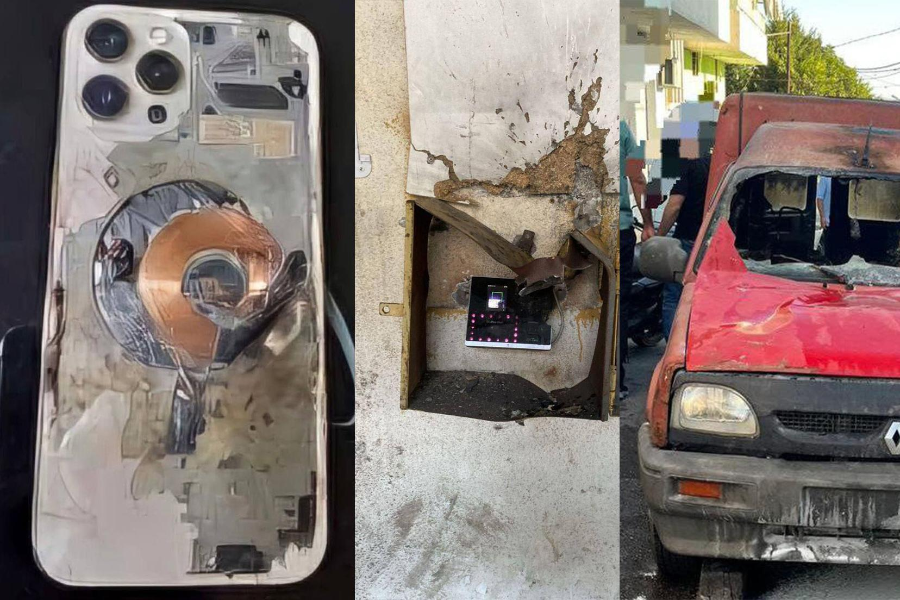

## Claim
Claim: " This image shows an Iphone that exploded during the pager attacks on Hezbollah devices in Lebanon in September 2024, blowing up random people."

## Actions
```
image_search("exploded iphone lebanon hezbollah")
```

## Evidence
### Evidence from `image_search`
The search results include an image of an exploded iPhone (, ). India Today reports on explosions of Hezbollah devices in Lebanon in September 2024 (). DW.com states that the claim is false.

The claim is about an iPhone that exploded during the pager attacks on Hezbollah devices in Lebanon in September 2024, blowing up random people ().


## Elaboration
The evidence includes an image of an exploded iPhone and reports of explosions of Hezbollah devices in Lebanon in September 2024. However, DW.com states that the claim is false.


## Final Judgement
The claim is about an iPhone exploding during pager attacks on Hezbollah devices in Lebanon. While there are reports of explosions and an image of an exploded iPhone, the claim is marked as false by DW.com. Therefore, the claim is not factually accurate. `false`

### Verdict: FALSE

### Justification
The claim is false. While there are reports of explosions of Hezbollah devices in Lebanon in September 2024 and an image of an exploded iPhone, the claim is marked as false by DW.com.
