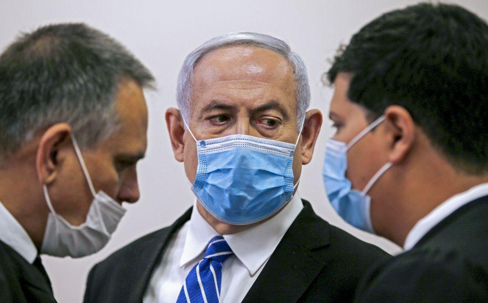
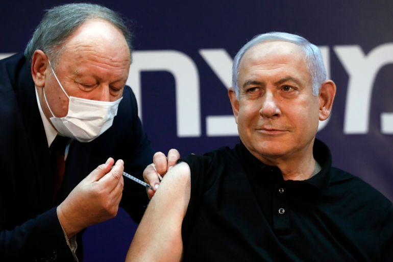
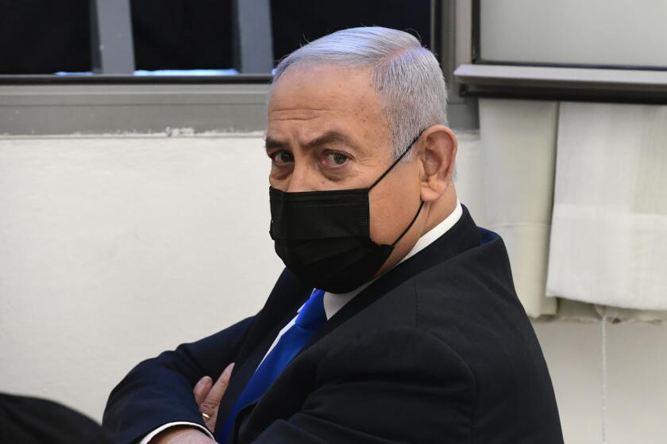

## Claim
Claim: " This is an authentic image of Benjamin Netanyahu being hospitalized in Tel Aviv in November 2024 due to a serious health issue."

## Actions
```
image_search("Benjamin Netanyahu hospitalized Tel Aviv November 2024")
```

## Evidence
### Evidence from `image_search`
The Guardian reports that Benjamin Netanyahu was taken to the hospital (). CNN reports that Benjamin Netanyahu underwent a successful prostate operation (). Politico reports that Benjamin Netanyahu was discharged from the hospital ().

The provided sources are from The Guardian ([https://www.theguardian.com/world/2023/jul/15/benjamin-netanyahu-taken-to-hospital-israel](https://www.theguardian.com/world/2023/jul/15/benjamin-netanyahu-taken-to-hospital-israel)), CNN ([https://www.cnn.com/2024/12/29/middleeast/netanyahu-prostate-operation-successful-intl-latam](https://www.cnn.com/2024/12/29/middleeast/netanyahu-prostate-operation-successful-intl-latam)), and Politico ([https://www.politico.com/news/2023/07/16/israel-netanyahu-discharged-hospital-00106491](https://www.politico.com/news/2023/07/16/israel-netanyahu-discharged-hospital-00106491)).


## Elaboration
The evidence indicates that Benjamin Netanyahu was hospitalized and underwent a successful prostate operation. However, the provided sources do not mention the specific image or the circumstances described in the claim. The Guardian reported that Netanyahu was taken to the hospital, CNN reported on a successful prostate operation, and Politico reported on his discharge.

The claim states that the image is authentic and depicts Netanyahu in Tel Aviv in November 2024 due to a serious health issue. The provided evidence does not confirm the image's authenticity, the location, the date, or the reason for hospitalization.

Therefore, there is insufficient information to verify the claim.


## Actions
```
image_search("Benjamin Netanyahu hospital bed")
```

## Evidence
No new evidence found.

## Elaboration
The evidence does not contain any information about the image in the claim. The search results mention Netanyahu's hospitalization and a prostate operation, but they do not provide any details about the image or the circumstances described in the claim.

Therefore, the claim cannot be verified.


## Actions
```
image_search("Benjamin Netanyahu hospital mask")
```

## Evidence
### Evidence from `image_search`
The search results include images of Benjamin Netanyahu wearing a mask, including one from [The Strategist](https://www.aspistrategist.org.au/netanyahus-poisoned-legacy/) (), one from [Al Jazeera](https://www.aljazeera.com/news/2020/12/19/netanyahu-gets-covid-vaccine-starts-israel-rollout) (), and one from the [Los Angeles Times](https://www.latimes.com/world-nation/story/2022-10-06/israel-benjamin-netanyahu-leaves-hospital-overnight-stay) (). The Al Jazeera article reports on Netanyahu receiving a COVID-19 vaccine, and the Los Angeles Times article discusses Netanyahu's hospital stay.


## Elaboration
The evidence shows images of Benjamin Netanyahu wearing masks in various contexts, including a hospital stay. However, none of the images match the one in the claim. The search results do not confirm the image's authenticity, the location (Tel Aviv), the date (November 2024), or the reason for hospitalization as stated in the claim.

Therefore, the claim cannot be verified.


## Final Judgement
The fact-check reveals that while Benjamin Netanyahu has been hospitalized and has worn masks, there is no evidence to support the specific image, date, location, or reason for hospitalization mentioned in the claim. The search results do not confirm the image's authenticity or the details provided in the claim. Therefore, the claim is not factually accurate. `false`

### Verdict: FALSE

### Justification
The claim is not supported by the evidence. While Benjamin Netanyahu has been hospitalized and has been seen wearing masks, there is no evidence to confirm the authenticity of the image, the specific date (November 2024), the location (Tel Aviv), or the reason for hospitalization as stated in the claim. The search results from sources like The Guardian, CNN, and Politico do not provide any information about the image or the circumstances described in the claim.
