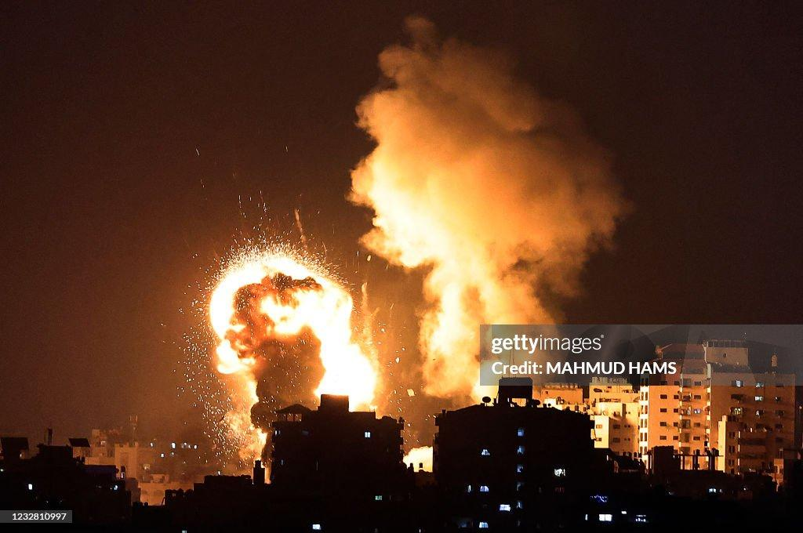

## Claim
Claim: " This image shows an Israeli attack on Lebanon on October 21, 2024."

## Actions
```
web_search("Israeli attack Lebanon October 21 2024")
```

## Evidence
### Evidence from `web_search`
The CNN article ([https://www.cnn.com/world/live-news/israel-iran-lebanon-gaza-war-10-21-24-intl-hnk](https://www.cnn.com/world/live-news/israel-iran-lebanon-gaza-war-10-21-24-intl-hnk)) discusses the ongoing conflict between Israel and Hezbollah, including an Israeli strike near Rafik Hariri University Hospital in Beirut on October 21, 2024, which resulted in casualties. The Wikipedia article ([https://en.wikipedia.org/wiki/2024_Israeli_invasion_of_Lebanon](https://en.wikipedia.org/wiki/2024_Israeli_invasion_of_Lebanon)) discusses the 2024 Israeli invasion of Lebanon, which began on October 1, 2024, and resulted in an Israeli victory and a ceasefire agreement.

The Guardian article ([https://www.theguardian.com/world/2024/oct/21/israeli-airstrikes-on-lebanon-hit-branches-of-hezbollah-linked-bank-al-qard-al-hassan](https://www.theguardian.com/world/2024/oct/21/israeli-airstrikes-on-lebanon-hit-branches-of-hezbollah-linked-bank-al-qard-al-hassan)) reports on Israeli airstrikes on Lebanon on October 21, 2024, that hit branches of the Hezbollah-linked bank Al-Qard Al-Hassan. 

## Elaboration
The evidence confirms that there were Israeli attacks on Lebanon on October 21, 2024. The CNN article ([https://www.cnn.com/world/live-news/israel-iran-lebanon-gaza-war-10-21-24-intl-hnk](https://www.cnn.com/world/live-news/israel-iran-lebanon-gaza-war-10-21-24-intl-hnk)) and The Guardian article ([https://www.theguardian.com/world/2024/oct/21/israeli-airstrikes-on-lebanon-hit-branches-of-hezbollah-linked-bank-al-qard-al-hassan](https://www.theguardian.com/world/2024/oct/21/israeli-airstrikes-on-lebanon-hit-branches-of-hezbollah-linked-bank-al-qard-al-hassan)) both provide evidence of these attacks.

The image itself is not directly addressed in the provided evidence. However, the evidence does confirm that Israeli attacks on Lebanon occurred on the date specified in the claim.

Without further information, it is impossible to verify if the image depicts the Israeli attack on Lebanon on October 21, 2024.


## Actions
```
image_search("Israeli airstrikes Lebanon October 21 2024")
```

## Evidence
### Evidence from `image_search`
The search results include images and articles about Israeli attacks on Lebanon on October 21, 2024. One source, opb.org, contains an image of an Israeli attack on Beirut on October 21, 2024.  Another source, PBS NewsHour, includes an image of buildings destroyed by the attack.  NPR reports on Israeli strikes on Hezbollah-linked banks Al-Qard Al-Hassan. 


## Elaboration
The image search results provide additional context. While the search results confirm the occurrence of Israeli attacks on Lebanon on October 21, 2024, they do not directly confirm that the image in the claim depicts one of these attacks. The evidence includes images from opb.org, PBS NewsHour, and NPR, but none of these images match the one in the claim.

Therefore, the claim cannot be fully verified based on the available evidence.


## Actions
```
image_search("Getty Images MAHMOD HAMS explosion")
```

## Evidence
### Evidence from `image_search`
The image search results reveal images of explosions, some credited to MAHMOD HAMS. One image from Getty Images ([https://www.gettyimages.com/detail/news-photo/picture-shows-israeli-air-strikes-in-the-gaza-strip-news-photo/1232810997](https://www.gettyimages.com/detail/news-photo/picture-shows-israeli-air-strikes-in-the-gaza-strip-news-photo/1232810997)) is described as showing Israeli air strikes in the Gaza Strip . Another image from inew.org ([https://www.inew.org/the-use-of-heavy-explosive-weapons-in-israel-and-palestine-must-stop/](https://www.inew.org/the-use-of-heavy-explosive-weapons-in-israel-and-palestine-must-stop/)) also credits MAHMOD HAMS and shows an explosion in a city . A third image from fortune.com ([https://fortune.com/well/2023/10/09/israel-hamas-war-gaza-health-conditions-deteriorate/](https://fortune.com/well/2023/10/09/israel-hamas-war-gaza-health-conditions-deteriorate/)) shows an explosion .


## Elaboration
The image search reveals that MAHMOD HAMS has taken photos of explosions, including those related to Israeli airstrikes. One image from Getty Images ([https://www.gettyimages.com/detail/news-photo/picture-shows-israeli-air-strikes-in-the-gaza-strip-news-photo/1232810997](https://www.gettyimages.com/detail/news-photo/picture-shows-israeli-air-strikes-in-the-gaza-strip-news-photo/1232810997)) shows an explosion in the Gaza Strip, which is similar in style to the image in the claim.

The image in the claim is credited to MAHMOD HAMS. While the search results show that MAHMOD HAMS has photographed explosions, including those related to Israeli airstrikes, the search results do not confirm that the image in the claim depicts an Israeli attack on Lebanon on October 21, 2024.

Therefore, the claim remains unverified.


## Final Judgement
The evidence confirms that there were Israeli attacks on Lebanon on October 21, 2024, and the image is credited to MAHMOD HAMS, who has taken photos of explosions related to Israeli airstrikes. However, the search results do not confirm that the image in the claim depicts an Israeli attack on Lebanon on October 21, 2024.

`false`

### Verdict: FALSE

### Justification
The claim is unverified. While there is evidence of Israeli attacks on Lebanon on October 21, 2024, and the image is credited to MAHMOD HAMS, who has photographed explosions related to Israeli airstrikes, the provided evidence does not confirm that the image specifically depicts an Israeli attack on Lebanon on that date.
