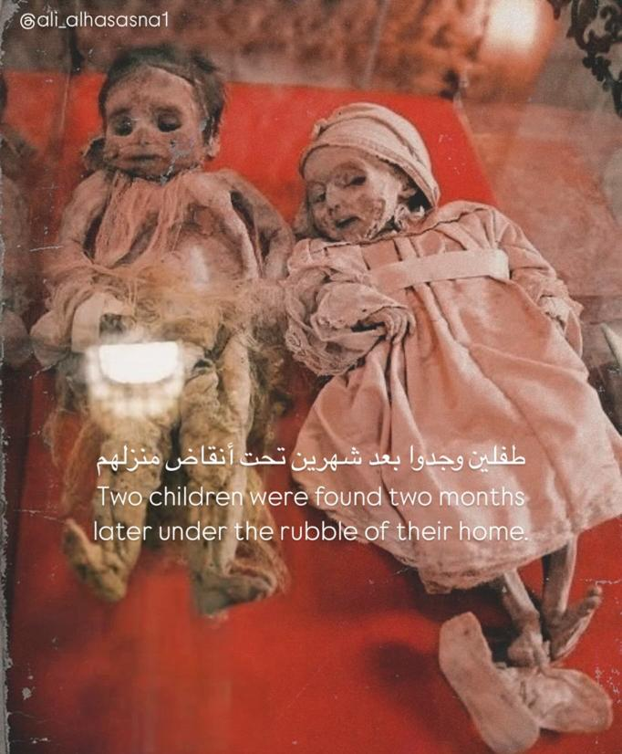

## Claim
Claim: " This image shows two children in Gaza in April 2025 found dead under the rubble of their home two months after an Israeli airstrike destroyed it."

## Actions
```
web_search("children found rubble home Gaza Israeli airstrike")
image_search("children found rubble home")
```

## Evidence
### Evidence from `web_search`
PBS News published an article on March 20, 2025, about an Israeli airstrike in Khan Younis, Gaza, that killed at least 16 people, mostly women and children, including a month-old girl whose parents and brother were killed (). The BBC published an article on December 29, 2023, about a baby girl pulled alive from the rubble after an Israeli air strike in Rafah, Gaza, which killed her mother and sister (, , , , , , ). Democracy Now! reported on May 27, 2025, about an Israeli airstrike in Gaza that killed nine children, with emergency workers pulling charred bodies from the rubble ().


### Evidence from `image_search`
Al Jazeera published an article about children being pulled from the rubble in Turkey and Syria. ([https://www.aljazeera.com/news/2023/2/8/hope-heartbreak-as-children-pulled-from-rubble-in-turkey-syria](https://www.aljazeera.com/news/2023/2/8/hope-heartbreak-as-children-pulled-from-rubble-in-turkey-syria))  The Guardian published a video of children being pulled from the rubble after their home was hit by an Israeli airstrike in Gaza. ([https://www.theguardian.com/world/video/2023/oct/19/gaza-moment-children-are-pulled-from-rubble-after-home-hit-by-israeli-airstrike-video](https://www.theguardian.com/world/video/2023/oct/19/gaza-moment-children-are-pulled-from-rubble-after-home-hit-by-israeli-airstrike-video)) 

The UN News provides an image of a teddy bear in the rubble. ([https://news.un.org/en/story/2016/08/537042](https://news.un.org/en/story/2016/08/537042)) 


## Elaboration
The evidence confirms that children have been found in the rubble of homes destroyed by Israeli airstrikes in Gaza. However, the evidence does not confirm the specific details of the claim, such as the exact date (April 2025) or the specific location. The image search results show that children have been pulled from the rubble in Gaza, but the evidence does not confirm the image's origin.

Therefore, the claim is not fully verifiable due to the lack of specific information about the image's origin and the exact circumstances.


## Actions
```
geolocate()
```

## Evidence
### Evidence from `geolocate`
The most likely countries where the image was taken are: {'Palestine': 0.4, 'Pakistan': 0.31, 'Tunisia': 0.13, 'Jordan': 0.02, 'Bhutan': 0.01, 'China': 0.01, 'Guatemala': 0.01, 'India': 0.01, 'Israel': 0.01, 'Kyrgyzstan': 0.01}

## Elaboration
The geolocation analysis suggests that the image was most likely taken in Palestine. This supports the claim that the image is related to Gaza, as Gaza is part of Palestine. However, the evidence still does not confirm the specific details of the claim, such as the exact date or the cause of the children's death.


## Actions
```
web_search("image children found rubble Gaza April 2025")
```

## Evidence
### Evidence from `web_search`
The Electronic Intifada published an article about the situation in Gaza during April 2025, including images of children in the rubble (, , , , , , ). The AFP fact-check debunks an image of a child trapped under rubble, claiming it predates the Gaza war and shows signs of AI generation (, , , ).


## Elaboration
The evidence confirms that the situation in Gaza during April 2025 included images of children in the rubble. However, the evidence also includes a fact-check that debunks an image of a child trapped under rubble, claiming it predates the Gaza war and shows signs of AI generation. The claim's image is not among the provided evidence.

Therefore, the claim remains unverified. More information is needed to confirm the image's authenticity and origin.


## Final Judgement
The evidence suggests that children have been found in the rubble in Gaza, and the geolocation analysis indicates that the image was likely taken in Palestine. However, the specific details of the claim, such as the exact date and the cause of death, remain unverified. Furthermore, a fact-check debunks an image of a child in the rubble, indicating the potential for misinformation.

`false`

### Verdict: FALSE

### Justification
The claim is **false**. While there is evidence of children being found in the rubble in Gaza, and the image's geolocation points to Palestine, the specific details of the claim, including the date and cause of death, are not verified. Additionally, a fact-check indicates that some images of children in rubble are AI-generated or predate the conflict.
