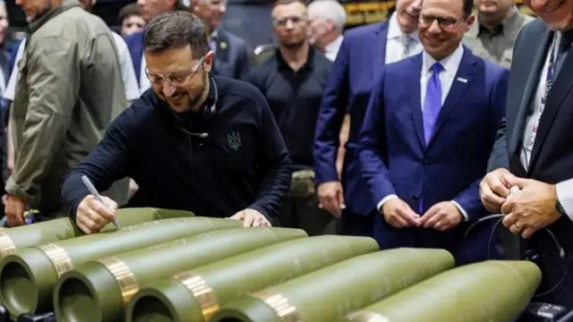
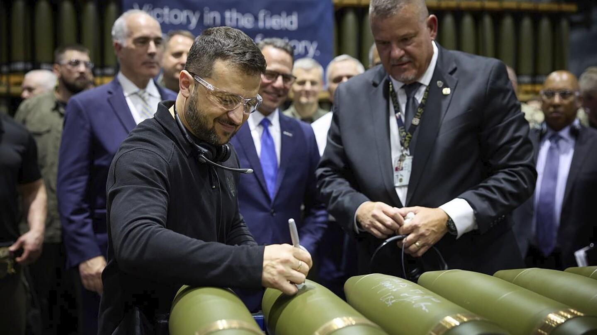

## Claim
Claim: " This image shows Ukrainian President Volodymyr Zelenskyy in March 2025 signing Israeli bombs intended for use against Palestinians in Gaza."

## Actions
```
web_search("Volodymyr Zelenskyy signing bombs")
image_search("Volodymyr Zelenskyy signing bombs")
```

## Evidence
### Evidence from `web_search`
The image shows Ukrainian President Volodymyr Zelenskyy signing artillery shells at a U.S. munitions factory, not Israeli bombs. The video was taken before February 2025 and the shells were intended for use in Ukraine's war with Russia, not Israel's war in Gaza. Zelenskyy visited the Scranton Army Ammunition Plant in Pennsylvania in September 2024, where he signed shells. ()

The Fox News article mentions that Pennsylvania Governor Josh Shapiro also signed the missile. (, , )


### Evidence from `image_search`
The BBC News website ([https://www.bbc.com/news/articles/c5y30244467o](https://www.bbc.com/news/articles/c5y30244467o)) and the Associated Press ([https://apnews.com/article/zelenskyy-johnson-ambassador-ukraine-biden-harris-trump-d81b0a055d99cfd4804b3f2c00915d09](https://apnews.com/article/zelenskyy-johnson-ambassador-ukraine-biden-harris-trump-d81b0a055d99cfd4804b3f2c00915d09)) both show images of Volodymyr Zelenskyy signing artillery shells.  


## Elaboration
The claim is false. The image shows Volodymyr Zelenskyy signing artillery shells at a U.S. munitions factory, not Israeli bombs. The shells were intended for use in Ukraine's war with Russia, not Israel's war in Gaza. The event took place in September 2024.


## Final Judgement
The claim is demonstrably false. The image shows Zelenskyy signing artillery shells in the U.S., not Israeli bombs. The shells were for Ukraine, not Gaza, and the event occurred in September 2024, not March 2025. `false`

### Verdict: FALSE

### Justification
The image depicts Ukrainian President Volodymyr Zelenskyy signing artillery shells at a U.S. munitions factory in September 2024, not Israeli bombs as claimed. The shells were intended for use in Ukraine's war with Russia, not in Gaza. This information is supported by sources such as the [BBC News](https://www.bbc.com/news/articles/c5y30244467o) and the Associated Press ([https://apnews.com/article/zelenskyy-johnson-ambassador-ukraine-biden-harris-trump-d81b0a055d99cfd4804b3f2c00915d09](https://apnews.com/article/zelenskyy-johnson-ambassador-ukraine-biden-harris-trump-d81b0a055d99cfd4804b3f2c00915d09)).
