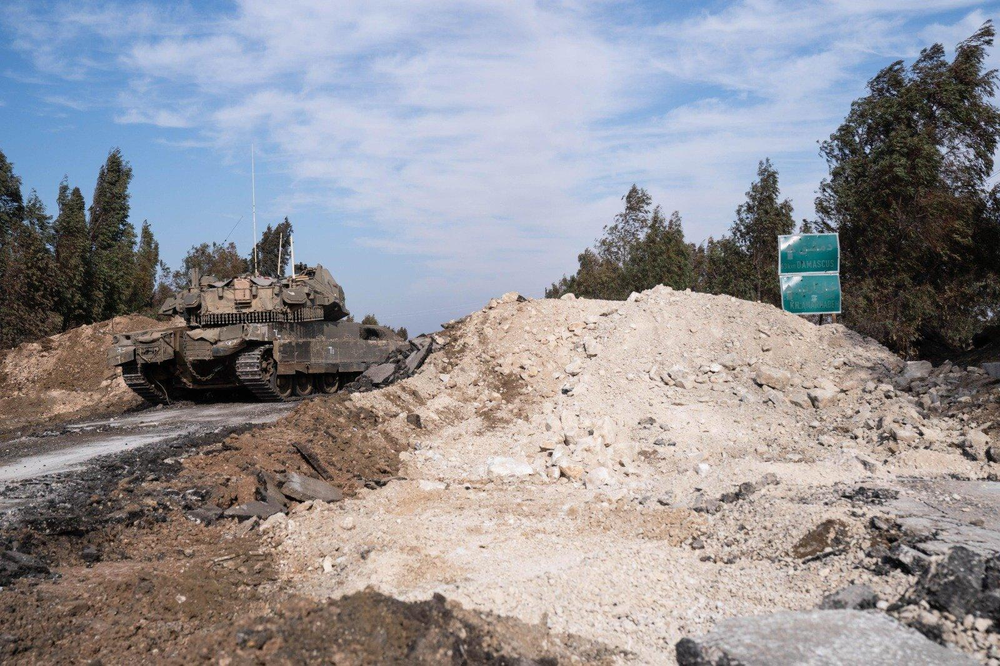

## Claim
Claim: " This image shows the Israeli army reaching Damascus in Syria in December 2024."

## Actions
```
web_search("Israeli army Damascus Syria")
image_search("Israeli tanks Damascus")
```

## Evidence
### Evidence from `web_search`
The provided web sources discuss Israeli airstrikes in Damascus, Syria. An Al Jazeera article from July 16, 2025, reports on strikes near the presidential palace and military headquarters, resulting in casualties and mentioning a ceasefire in Suwayda ([https://www.aljazeera.com/news/2025/7/16/israel-bombards-syrias-damascus-as-us-says-steps-agreed-to-end-violence](https://www.aljazeera.com/news/2025/7/16/israel-bombards-syrias-damascus-as-us-says-steps-agreed-to-end-violence)). CNN also reported on Israeli airstrikes in Damascus and the US involvement in ending clashes ([https://www.cnn.com/2025/07/16/middleeast/damascus-syria-airstrikes-intl](https://www.cnn.com/2025/07/16/middleeast/damascus-syria-airstrikes-intl)).

The BBC article discusses Israeli strikes on Damascus and government forces in southern Syria, in response to fighting in Suweida, with the Prime Minister of Israel stating they were working to save the Druze. The US agreed on steps to end the violence ([https://www.bbc.com/news/articles/cp90l77187zo](https://www.bbc.com/news/articles/cp90l77187zo)). The articles include images of soldiers and maps (, , , ).


### Evidence from `image_search`
The Times of Israel published an image of an Israeli tank near Damascus ([https://www.timesofisrael.com/liveblog_entry/report-israeli-tanks-reach-point-25km-from-damascus/](https://www.timesofisrael.com/liveblog_entry/report-israeli-tanks-reach-point-25km-from-damascus/)) . NDTV published a fact-check on December 10, 2024, determining the claim of Israeli tanks near Damascus to be false .

Al Jazeera published an article about Israel seizing a buffer zone in Syria's Golan Heights, including an image of an Israeli tank .


## Elaboration
The evidence indicates that the claim is false. The image search results include a fact-check from December 10, 2024, that labels a similar image of Israeli tanks as "FALSE." The web search results also mention Israeli airstrikes in Damascus in July 2025, but not the presence of tanks.


## Final Judgement
The claim that the image shows the Israeli army reaching Damascus in December 2024 is demonstrably false. A fact-check from December 10, 2024, specifically addresses a similar image of Israeli tanks and labels the claim as false. The web search results also do not support the claim of Israeli tanks reaching Damascus in December 2024.

`false`

### Verdict: FALSE

### Justification
The claim is false. While there were reports of Israeli airstrikes in Damascus in July 2025, and an image of an Israeli tank near Damascus was published by The Times of Israel, a fact-check from December 10, 2024, specifically debunked a similar claim about Israeli tanks near Damascus, labeling it as "FALSE" ([https://www.timesofisrael.com/liveblog_entry/report-israeli-tanks-reach-point-25km-from-damascus/](https://www.timesofisrael.com/liveblog_entry/report-israeli-tanks-reach-point-25km-from-damascus/)).
