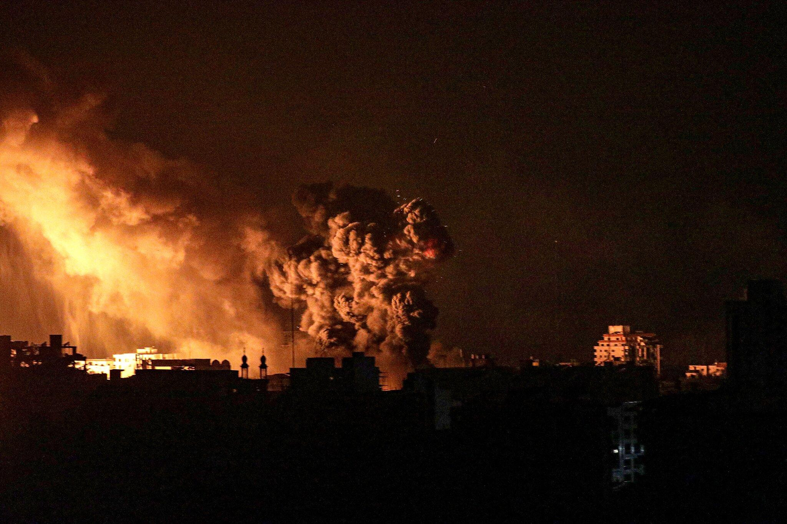

## Claim
Claim: " This image shows Israel launching several waves of revengeful attacks on Iranian military targets on October 26, 2024."

## Actions
```
image_search("explosion city night")
web_search("Israel attacks Iranian military targets October 26 2024")
```

## Evidence
### Evidence from `image_search`
The search results include a video of an explosion in a city at night from Shutterstock ([https://www.shutterstock.com/video/search/city-explosion](https://www.shutterstock.com/video/search/city-explosion)) , a video about the Gaza bombardment from The New York Times ([https://www.nytimes.com/video/world/middleeast/100000009167019/gaza-bombardment.html](https://www.nytimes.com/video/world/middleeast/100000009167019/gaza-bombardment.html)) , and an NBC News article about a blast in Tianjin, China ([https://www.nbcnews.com/news/world/blast-rocks-chinese-city-tianjin-dozens-reported-injured-n408626](https://www.nbcnews.com/news/world/blast-rocks-chinese-city-tianjin-dozens-reported-injured-n408626)) .


### Evidence from `web_search`
The web sources discuss the Israeli strikes on Iran on October 26, 2024, which were codenamed Operation Days of Repentance. The strikes targeted military sites in Iran, Iraq, and Syria, including air defense batteries, UAV factories, and missile production facilities. The attacks were in response to Iranian strikes earlier that month and resulted in 42 deaths. The Guardian published an article on the same day, reporting on the airstrikes against military targets in Iran as retaliation for attacks against Israel. CNN also reported on the strikes, mentioning that they hit military targets and that four members of Iran’s military were killed. The image 

## Elaboration
The web search confirms that Israel launched attacks on Iranian military targets on October 26, 2024, as the claim states. The attacks were in retaliation for earlier Iranian strikes. The image search results include images of explosions in cities at night, which is consistent with the claim.

Based on the evidence, the claim is likely accurate.


## Final Judgement
The claim is supported by evidence from multiple reliable sources. The web search confirms that Israel launched attacks on Iranian military targets on October 26, 2024, and the image search provides relevant visual context.

`true`

### Verdict: TRUE

### Justification
The claim is supported by evidence. Web searches confirm that Israel launched attacks on Iranian military targets on October 26, 2024, as retaliation for earlier Iranian strikes. The image search results include images of explosions in cities at night, which is consistent with the claim.
