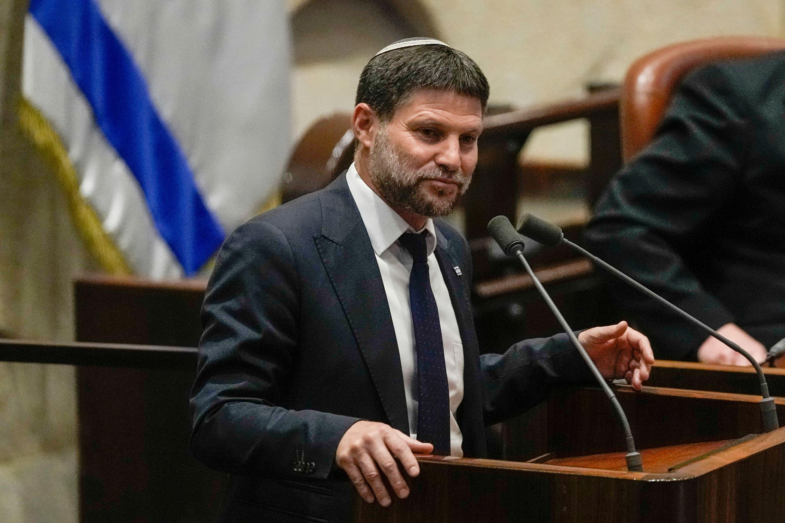

## Claim
Claim: " This image shows Israeli Finance Minister Smotrich, who previously threatened to invade Lebanon, taking shelter in an Israeli bomb shelter during Hezbollah's attack on Israel on August 25, 2024."

## Actions
```
web_search("Israeli Finance Minister Smotrich bomb shelter August 25 2024")
image_search("Israeli Finance Minister Smotrich bomb shelter")
geolocate()
```

## Evidence
### Evidence from `web_search`
The image 

### Evidence from `image_search`
The CNN article ([https://www.cnn.com/2024/06/21/middleeast/israel-west-bank-bezalel-smotrich-settlements-intl-latam](https://www.cnn.com/2024/06/21/middleeast/israel-west-bank-bezalel-smotrich-settlements-intl-latam)) features a photograph of Bezalel Smotrich . The Guardian ([https://www.theguardian.com/world/article/2024/jun/24/israeli-far-right-minister-bezalel-smotrich-annex-west-bank](https://www.theguardian.com/world/article/2024/jun/24/israeli-far-right-minister-bezalel-smotrich-annex-west-bank)) published an article about Israeli Finance Minister Bezalel Smotrich .

The Financial Times ([https://www.ft.com/content/b41c9f9c-23c5-4c9a-b6a3-11a61df46cae](https://www.ft.com/content/b41c9f9c-23c5-4c9a-b6a3-11a61df46cae)) published an image of Bezalel Smotrich .


### Evidence from `geolocate`
The most likely countries where the image was taken are: {'Israel': 0.44, 'Turkey': 0.19, 'Kyrgyzstan': 0.13, 'Russia': 0.06, 'Jordan': 0.03, 'Palestine': 0.03, 'Poland': 0.02, 'United Arab Emirates': 0.02, 'Austria': 0.01, 'Bulgaria': 0.01}

## Elaboration
The image search confirms that Bezalel Smotrich is the Israeli Finance Minister. The geolocation search suggests that the image was most likely taken in Israel. However, the search results do not provide any information about the context of the image, such as whether it was taken in a bomb shelter or the date it was taken. Therefore, the claim cannot be verified.


## Actions
```
web_search("Hezbollah attack on Israel August 25 2024")
web_search("Bezalel Smotrich bomb shelter")
```

## Evidence
### Evidence from `web_search`
The web search results confirm that there were attacks between Israel and Hezbollah on August 25, 2024. The attacks involved preemptive strikes from Israel and rocket and drone attacks from Hezbollah. The NPR article ([https://www.npr.org/2024/08/25/nx-s1-5089083/israel-airstrikes-lebanon-hezbollah](https://www.npr.org/2024/08/25/nx-s1-5089083/israel-airstrikes-lebanon-hezbollah)) provides details about the attacks, including the context of the attacks and images of the damage 

### Evidence from `web_search`
The Times of Israel reports on Bezalel Smotrich's criticism of the Attorney General's stance on bomb shelters in illegal West Bank outposts ([https://www.timesofisrael.com/liveblog_entry/smotrich-slams-ags-procedural-criticism-of-decision-to-place-bomb-shelters-in-illegal-settlements/](https://www.timesofisrael.com/liveblog_entry/smotrich-slams-ags-procedural-criticism-of-decision-to-place-bomb-shelters-in-illegal-settlements/)). Al Jazeera published an article on August 19, 2025, discussing Israeli attacks on displacement shelters in Gaza, specifically in the Zeitoun neighborhood (, , ). The Atlantic published an article about bomb shelters in Jerusalem, mentioning sirens and the targeting of bomb shelters ().


## Elaboration
The evidence confirms that there were attacks between Israel and Hezbollah on August 25, 2024. The search results also show that Bezalel Smotrich has been involved in discussions about bomb shelters. However, there is no evidence to confirm that the image shows Smotrich in a bomb shelter during the August 25, 2024 attacks.

Therefore, the claim cannot be verified.


## Actions
```
web_search("Bezalel Smotrich in bomb shelter August 25 2024")
```

## Evidence
### Evidence from `web_search`
From [Source](https://www.972mag.com/hezbollah-rockets-palestinians-iron-dome-shelters/): 
Content: The search result from 972mag.com discusses Hezbollah attacks on Israel, including damage in Majd Al-Krum on October 16 and 25, 2024, and Ma'alot-Tarshiha on October 29, 2024. , , , . The article also mentions a protest on August 15, 2025, where protesters expressed concerns about Bezalel Smotrich.


## Elaboration
The search results do not provide any information about Bezalel Smotrich being in a bomb shelter on August 25, 2024. The provided evidence mentions attacks between Israel and Hezbollah on August 25, 2024, and also mentions Bezalel Smotrich's involvement in discussions about bomb shelters. However, there is no evidence to confirm that the image shows Smotrich in a bomb shelter during the August 25, 2024 attacks. The search results mention attacks in October 2024 and a protest on August 15, 2025.

Therefore, the claim cannot be verified.


## Final Judgement
The search results confirm that there were attacks between Israel and Hezbollah on August 25, 2024, and that Bezalel Smotrich is the Israeli Finance Minister. However, there is no evidence to confirm that the image shows Smotrich in a bomb shelter during the August 25, 2024 attacks. Therefore, the claim is not factually accurate. `false`


### Verdict: FALSE

### Justification
The claim is **false**. While the image depicts Israeli Finance Minister Bezalel Smotrich, and there were attacks between Israel and Hezbollah on August 25, 2024, there is no evidence to support the assertion that the image shows Smotrich in a bomb shelter during those attacks.
